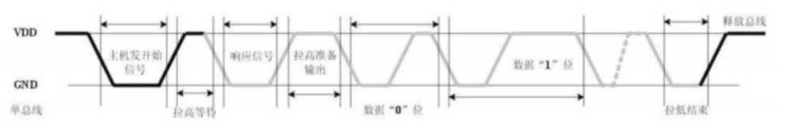
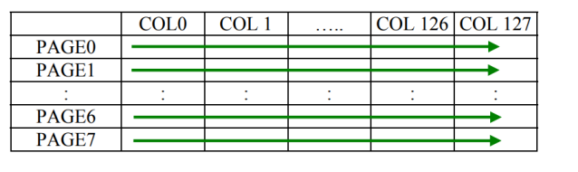
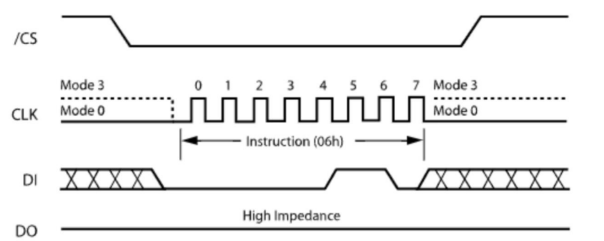
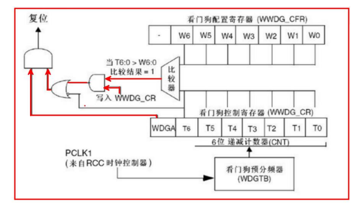

# 中断

比如 说正在打字 ，这个打字就相当于 while循环 ，不断在打字，此时有人==叫== 我去吃饭 ，而这个 ==叫== 就是中断，而此时 ==叫== 所代表的动作 是**吃饭**，当发现 **饭已经吃完时** ，需要回到正常的循环，就是==打字==。

## stm32 嵌套向量中断控制器（NVIC）

### 概述

NVIC（Nest Vector Interrupt Controller）：嵌套向量中断控制器

作用：管理中断嵌套，

核心任务：管理中断优先级。 

特点： 

- 68 个可屏蔽中断通道(不包含 16 个 Cortex-M3 的中断线)
- 16 个可编程的优先等级(使用了 4 位中断优先级)
- 低延迟的异常和中断处理 
- 电源管理控制 
- 系统控制寄存器的实现

### NVIC 的优先级

抢占优先级：必须先放下当前任务，立即去完成另外的任务。

响应优先级：不会立即打断当前任务，而是在合适的时候去处理 另外的任务

NVIC 给每个中断赋予抢占优先级和响应优先级。关系如下：

1.  拥有较高抢占优先级的中断可以打断抢占优先级较低的中断 
2.  若两个抢占优先级相同的中断同时挂起，则优先执行响应优先级较高的中断 
3.  若两个挂起的中断优先级都一致，则优先执行位于中断向量表中位置较高的 中断 
4.  响应优先级不会造成中断嵌套，也就是说中断嵌套是由抢占优先级决定的


每个中断源都需要被指定这两种优先级

Cortex-M3 核定义了 ==**8 个 bit**== 用于设置中 断源的优先级，这意味着理论上可以有 2^8 = 256 种不同的优先级设置

然而，在实际应用中，当系统中的中断源数量较少时，并不需要使用全部的 8 个 bit 来指定优先级。这样做可以节省资源并简化配置。

STM32 是基于 Cortex - M3 核的微控制器，在 STM32 中，中断优先级的设置只使用了 AIRCR（应用程序中断及复位控制寄存器）的**高四位**。这意味着 STM32 只用这高四位来确定中断的优先级。

### Cubemx 配置中断优先级


### 中断的具体行为

`参考手册：Cortex-M3 权威指南 CnR2（电子书）.pdf 第 9 章 `

当 CM3 开始==**响应**==一个中断时，会做如下动作：

1.  **入栈**： 响应异常的第一个动作，就是自动保存现场(也就是保存中断时当下的值)，依次把 8 个寄存器的值压入栈【也就是依次把 xPSR、PC, LR, R12 以 及 R3-R0 由硬件寄存器自动压入适当的堆栈中】 
2.  **取向量**：从向量表中找出对应的服务程序入口地址 
3.  选择堆栈指针 MSP(主堆栈) / PSP(进程堆栈)，更新堆栈指针 SP，更新链接 寄存器 LR，更新程序计数器 PC
   - SP：在入栈后会把堆栈指针更新到新的位置。在执行服务例程时，将由 MSP 负责对堆栈的访问。
   - PSR：更新 IPSR 位段的值为新响应的异常编号。
   - PC：在取向量完成后，PC 将指向服务例程的入口地址。
   - LR：在出入 ISR（Interrupt Service Routines）中断服务程序的时候，LR 的 值将得到更新（在异常进入时由系统计算并赋给 LR，并在异常返回时使用它）


==**异常/中断返回**==:

1. 当异常服务例程执行完毕后，需要恢复先前的系统状态，才能使被中断的程序得以 继续执行。 

==**异常/中断处理完成后，执行如下处理**==：

1. 出栈：恢复先前压入栈中的寄存器，堆栈 指针的值也改回先前的值 
2. 更新 NVIC 寄存器：伴随着异常的返回，它的活动位也 被硬件清除

### 外部中断/事件线路映像

注意：各个开发板的引脚 对应 可能与下图 ==不同==，具体见 开发板原理图


**注意**：

- 通过AFIO_EXTICRx配置GPIO线上的外部中断/事件，必须先使能AFIO时钟。
- 对于小容量、中容量和大容量的产品，参见6.3.7节:
- 对于互联型产品,参见7.3.7节。

另外四个EXTI线的连接方式如下:

- EXTI线16连接到PVD输出
- EXTI线17连接到RTC闹钟事件
- EXTl线18连接到USB唤醒事件
- EXTI线19连接到以太网唤醒事件(只适用于互联型产品)


### 中断相关 API 及数据结构

#### HAL_NVIC_SetPriority

函数功能：配置中断优先级，数字越低，中断优先级越高

```c
HAL_NVIC_SetPriority(IRQn_Type IRQn, uint32_t PreemptPriority, uint32_t SubPriority);

//例子：
HAL_NVIC_SetPriority(EXTI3_IRQn, 0, 0);
//参数IRQn为下列枚举值中的一个 ：
typedef enum
{
/****** Cortex-M3处理器异常数 
***************************************************/
NonMaskableInt_IRQn  	= -14, /*!< 2 不可屏蔽中断 */
HardFault_IRQn 			= -13, /*!< 3 Cortex-M3 硬故障中断 */
MemoryManagement_IRQn	= -12, /*!< 4 Cortex-M3 内存管理中断 */
BusFault_IRQn 			= -11, /*!< 5 Cortex-M3 总线故障中断 */
UsageFault_IRQn 		= -10, /*!< 6 Cortex-M3 使用故障中断 */
SVCall_IRQn 			= -5, /*!< 11 Cortex-M3 SV 调用中断 */
DebugMonitor_IRQn 		= -4, /*!< 12 Cortex-M3 调试监视器中断 */
PendSV_IRQn 			= -2, /*!< 14 Cortex-M3 Pend SV 中断 */
SysTick_IRQn 			= -1, /*!< 15 Cortex-M3 系统滴答定时器中断*/
    
    
/****** STM32特定的中断编号 
*********************************************************/
    
WWDG_IRQn 				= 0, /*!< 窗口看门狗中断 */
PVD_IRQn 				= 1, /*!< PVD 通过 EXTI 线检测中断 */
TAMPER_IRQn 			= 2, /*!< 篡改中断 */
RTC_IRQn				= 3, /*!< RTC 全局中断 */
FLASH_IRQn 				= 4, /*!< FLASH 全局中断 */
RCC_IRQn 				= 5, /*!< RCC 全局中断 */
EXTI0_IRQn 				= 6, /*!< EXTI 线 0 中断 */
EXTI1_IRQn 				= 7, /*!< EXTI 线 1 中断 */
EXTI2_IRQn 				= 8, /*!< EXTI 线 2 中断 */
EXTI3_IRQn 				= 9, /*!< EXTI 线 3 中断 */
EXTI4_IRQn 				= 10, /*!< EXTI 线 4 中断 */
DMA1_Channel1_IRQn 		= 11, /*!< DMA1 通道 1 全局中断 */
DMA1_Channel2_IRQn 		= 12, /*!< DMA1 通道 2 全局中断 */
DMA1_Channel3_IRQn 		= 13, /*!< DMA1 通道 3 全局中断 */
DMA1_Channel4_IRQn 		= 14, /*!< DMA1 通道 4 全局中断 */
DMA1_Channel5_IRQn 		= 15, /*!< DMA1 通道 5 全局中断 */
DMA1_Channel6_IRQn 		= 16, /*!< DMA1 通道 6 全局中断 */
DMA1_Channel7_IRQn 		= 17, /*!< DMA1 通道 7 全局中断 */
ADC1_2_IRQn 			= 18, /*!< ADC1 和 ADC2 全局中断 */
USB_HP_CAN1_TX_IRQn 	= 19, /*!< USB 设备高优先级或 CAN1 TX 中断*/
USB_LP_CAN1_RX0_IRQn 	= 20, /*!< USB 设备低优先级或 CAN1 RX0 中断*/
CAN1_RX1_IRQn 			= 21, /*!< CAN1 RX1 中断 */
CAN1_SCE_IRQn 			= 22, /*!< CAN1 SCE 中断 */
EXTI9_5_IRQn 			= 23, /*!< 外部线[9:5]中断 */
TIM1_BRK_IRQn 			= 24, /*!< TIM1 Break 中断 */
TIM1_UP_IRQn 			= 25, /*!< TIM1 Update 中断 */
TIM1_TRG_COM_IRQn 		= 26, /*!< TIM1 Trigger and Commutation 中断 */
TIM1_CC_IRQn 			= 27, /*!< TIM1 Capture Compare 中断 */
TIM2_IRQn 				= 28, /*!< TIM2 全局中断 */
TIM3_IRQn 				= 29, /*!< TIM3 全局中断 */
TIM4_IRQn 				= 30, /*!< TIM4 全局中断 */
I2C1_EV_IRQn 			= 31, /*!< I2C1 事件中断 */
I2C1_ER_IRQn 			= 32, /*!< I2C1 错误中断 */
I2C2_EV_IRQn 			= 33, /*!< I2C2 事件中断 */
I2C2_ER_IRQn 			= 34, /*!< I2C2 错误中断 */
SPI1_IRQn 				= 35, /*!< SPI1 全局中断 */
SPI2_IRQn				 = 36, /*!< SPI2 全局中断 */
USART1_IRQn 			= 37, /*!< USART1 全局中断 */
USART2_IRQn 			= 38, /*!< USART2 全局中断 */
USART3_IRQn 			= 39, /*!< USART3 全局中断 */
EXTI15_10_IRQn 			= 40, /*!< 外部线[15:10]中断 */
RTC_Alarm_IRQn 			= 41, /*!< RTC 闹钟通过 EXTI 线中断 */
USBWakeUp_IRQn 			= 42, /*!< USB 设备从待机状态通过 EXTI 线中断唤醒 */
TIM8_BRK_IRQn 			= 43, /*!< TIM8 Break 中断 */
TIM8_UP_IRQn 			= 44, /*!< TIM8 Update 中断 */
TIM8_TRG_COM_IRQn 		= 45, /*!< TIM8 Trigger and Commutation 中断 */
TIM8_CC_IRQn 			= 46, /*!< TIM8 Capture Compare 中断 */
ADC3_IRQn 				= 47, /*!< ADC3 全局中断 */
FSMC_IRQn 				= 48, /*!< FSMC 全局中断 */
SDIO_IRQn 				= 49, /*!< SDIO 全局中断 */
TIM5_IRQn 				= 50, /*!< TIM5 全局中断 */
SPI3_IRQn 				= 51, /*!< SPI3 全局中断 */
UART4_IRQn 				= 52, /*!< UART4 全局中断 */
UART5_IRQn 				= 53, /*!< UART5 全局中断 */
TIM6_IRQn 				= 54, /*!< TIM6 全局中断 */
TIM7_IRQn 				= 55, /*!< TIM7 全局中断 */
DMA2_Channel1_IRQn 		= 56, /*!< DMA2 通道 1 全局中断 */
DMA2_Channel2_IRQn 		= 57, /*!< DMA2 通道 2 全局中断 */
DMA2_Channel3_IRQn 		= 58, /*!< DMA2 通道 3 全局中断 */
DMA2_Channel4_5_IRQn 	= 59 /*!< DMA2 通道 4 和通道 5 全局中断 */
} IRQn_Type;
uint32_t PreemptPriority //抢占优先级，根据优先级分组确定。
uint32_t SubPriority) //响应优先级，根据优先级分组确定。
```

#### HAL_NVIC_EnableIRQ

注意:需要先设置中断，才能开启

函数功能：在 NVIC 中启用特定于设备的中断

```c
void HAL_NVIC_EnableIRQ(IRQn_Type IRQn)
/**
* 参数：
* IRQn - 外部中断号。可以是 IRQn_Type 枚举的成员
* （对于完整的 STM32 设备 IRQ 通道列表，请参阅相应的 CMSIS 设备文件，如
stm32f10xxx.h）。
* 返回值：无。
*/
```

#### HAL_NVIC_DisableIRQ

函数功能：在 NVIC 中禁用特定于设备的中断

```c
void HAL_NVIC_DisableIRQ(IRQn_Type IRQn)
/**
* 参数：
* IRQn - 外部中断号。可以是 IRQn_Type 枚举的成员
* （对于完整的 STM32 设备 IRQ 通道列表，请参阅相应的 CMSIS 设备文件，如
stm32f10xxx.h）。
* 返回值：无。
*/
```

## 按键中断

### 引脚模式


- **External Interrupt Mode with Rising Edge Trigger Detection**: 
  - 外部中断模式，上升沿触发检测：这种模式配置 GPIO 引脚在检测到上升沿时生成 中断，即当引脚上的电压水平从低（0）变为高（1）。 
- **External Interrupt Mode with Falling Edge Trigger Detection**: 
  - 外部中断模式，下降沿触发检测：在这种模式下，GPIO 引脚在检测到下降沿时生 成中断，即电压水平从高变低。
- **External Interrupt Mode with Rising/Falling Edge Trigger Detection**: 
  - 外部中断模式，上升/下降沿触发检测：这种模式使 GPIO 引脚能够在上升沿和下 降沿上都生成中断。
- **External Event Mode with Rising Edge Trigger Detection**: 
  - 外部事件模式，上升沿触发检测：类似于中断模式，这种模式检测上升沿，但不是 生成中断，而是触发一个事件。
- **External Event Mode with Falling Edge Trigger Detection**: 
  - 外部事件模式，下降沿触发检测：这种设置使 GPIO 引脚在检测到下降沿时触发事 件。 
- **External Event Mode with Rising/Falling Edge Trigger Detection**: 
  - 外部事件模式，上升/下降沿触发检测：这种模式在上升沿和下降沿都会触发事件。

### 上升沿和下降沿


### 中断服务函数

配置中断后，在MX_GPIO_Init函数中 会新增如下代码

```c
void MX_GPIO_Init(void)
{
//............
    
// 为 GPIOE 的第 4 引脚配置外部中断，设置中断优先级
HAL_NVIC_SetPriority(EXTI4_IRQn, 0, 0);
// 使能 GPIOE 的第 4 引脚的中断
HAL_NVIC_EnableIRQ(EXTI4_IRQn);
}
```

在 stm32f1xx_it.c 文件中，增加了 EXTI3 中断服务函数:


### HAL_GPIO_EXTI_IRQHandler()

函数功能：处理 GPIO 外部中断请求。

```c
void HAL_GPIO_EXTI_IRQHandler(uint16_t GPIO_Pin)
```

```c
/**
* 参数：
* GPIO_Pin - 指定连接到 EXTI 线的引脚。
* 
* 返回值：无。
*/
```

函数内部实现：

注意：HAL_delay不能用在中断当中使用，因为HAL_delay内部也是通过中断来实现，而其默认的抢占优先级较低，会被高优先级的打断

```c
void HAL_GPIO_EXTI_IRQHandler(uint16_t GPIO_Pin)
{
    // 检测到 EXTI 线路的中断
    //__HAL_GPIO_EXTI_GET_IT：得到pin的中断标志位
    //判断中断标志位是否置1，如果置1，则是触发中断
    if (__HAL_GPIO_EXTI_GET_IT(GPIO_Pin) != 0x00u)
    {
        // 清除该 GPIO 引脚上的 EXTI 中断标志，如果不清0，则会一直触发中断，所以触发一次就要清除一次
        __HAL_GPIO_EXTI_CLEAR_IT(GPIO_Pin);
        // 调用回调函数来处理这个中断
        HAL_GPIO_EXTI_Callback(GPIO_Pin);
    }
}
```

### HAL_GPIO_EXTI_Callback()

这个函数一般需要 在不同功能模块下重写，因为不同情况下的中断，可能需要不同的功能

```c
/**
* 函数功能：EXTI 线路检测回调。
* 
* __weak void HAL_GPIO_EXTI_Callback(uint16_t GPIO_Pin)
* 
* 参数：
* GPIO_Pin - 指定连接到 EXTI 线的引脚。
* 
* 返回值：无。
* 
* 注意：此函数在默认状态下不应被修改。当需要使用回调时，
* 用户应在自己的文件中实现 HAL_GPIO_EXTI_Callback 函数。
*/
__weak void HAL_GPIO_EXTI_Callback(uint16_t GPIO_Pin)
{
    /* 防止未使用参数引起的编译警告 */
    UNUSED(GPIO_Pin);
    /* 注意：当需要回调时，应在用户文件中实现此函数 */
}
```

# 定时器

## 概述

共有 8 个定时器：

- 高级定时器
  - TIM1 
  - TIM8
- 通用定时器
  - TIM2
  - TIM3
  - TIM4
  - TIM5
-  基本定时器
  - TIM6 
  - TIM7

每个定时器都是一个可编程预分频器驱动的 **16 位**自动装载计数器构成 

每个定时器 都是完全独立的，没有互相共享任何资源

它们可以一起同步操作 除了可以进行 基本定时外，还可以输出 PWM，输入捕获,互补输出等


## 定时器计时公式

$$
Tout=(自动转载的数*(预分频数+1))/72M
$$

1 秒 = 1000 毫秒(ms)

1 毫秒 = 1000 微秒(us)

1 秒 = 1000000 微秒(us)

因为APB1上的定时器时钟线连接给了基本定时器与通用定时器，所以这里方波信号的频率为 72MHZ,此时计数器只要计数到了72000000次，就到了1秒钟。

又因为计数器长度只有16位，最多可以计 65536个数，所以一次最多只能计数0.0009秒

所以，可以使用预分频器，进行分频，如果预分频设置为0，则相当于不分频。

如果将预分频设置为2，那么预分频器每次从0 数到 2  才会 输出一个脉冲给计数器，让其加1.

此时 如果将分频设置为 7200 ，那么需要计数10000下 ，就到了1秒，那么计数一次是1/10000秒。

如 需要记时间 100us ,分频系数为 72 ，此时计数一次为 1us ，那么当记数值为100时，到达100us

## 配置定时器


配置详情：

- **预分频器（Prescaler, PSC - 16 bits value）** ：
  - 预分频器用于分频，它可以将定时器的输入时钟频率除以 1 至 65536 之间的任意 因子。这是通过一个 16 位的计数器实现的，控制通过一个 16 位的寄存器 （TIMx_PSC 寄存器）进行。预分频器的值可以动态更改，新的预分频比例将在下 一个更新事件时生效。 
- **计数器模式（Counter Mode）**: 
  - 定时器可以在不同的计数模式下工作，例如向上计数或向下计数。在“up”模式 中，每个时钟周期计数器的值增加 1。也就是从小往大数。 
- **计数周期（Counter Period）**: 
  - 自动重装载寄存器（ARR）定义了计数器的最大值。当计数器达到这个值时，它将 重新开始从 0 计数，并可能触发中断或其他事件。 比如分频系数设置为7199，却只想要计数1s一次，那么这里最大记数值应该设置为9999【因为都是从0开始数，所要要减一】
- **内部时钟分频（Internal Clock Division, CKD）**: 
  - 这个设置用于进一步分频定时器的时钟源，但通常不是主要关注的焦点。 
- **重复计数器（Repetition Counter, RCR - 8 bits value）**: 
  - 重复计数器用于确定在触发更新事件之前定时器需要完成多少计数周期。 
- **自动重装载预加载（auto-reload preload）**: 
  - 自动重装载预加载功能允许预先加载 ARR 寄存器的值。

## 中断列表

如果使用的是高级定时器，那么将具备更多的中断功能


- **TIM1 Break Interrupt（TIM1 断开中断）** 
  - 这种中断通常用于 PWM 通道。在出现故障或“trip”情况时，可以通过 break 输入 电路禁用 PWM 通道。 
- **TIM1 Update Interrupt（TIM1 更新中断）** 
  - Update 中断通常用于处理计数器溢出/下溢或计数器初始化（通过软件或内部/外 部触发）的情况。简单定时打开这个即可
-  **TIM1 Trigger and Commutation Interrupts（TIM1 触发和换相中断）** 
  - 触发中断与计数器的启动、停止、初始化或通过内部/外部触发进行计数有关。
  - 这些中断通常用于更复杂的定时器操作，其中定时器的行为依赖于外部或内部事件的 发生。 
- **TIM1 Capture Compare Interrupt（TIM1 捕获比较中断）** 
  - 捕获比较中断用于处理输入捕获和输出比较事件。
  - 在输入捕获模式下，当检测到外 部信号的变化时（如边缘触发），定时器的当前计数值会被捕获。
  - 在输出比较模式 下，定时器值与预设的比较值相匹配时，可以执行特定的动作，如改变输出引脚的 状态。

## 定时器结构体-TIM_HandleTypeDef

TIM_HandleTypeDef：

```c
typedef struct
{
    TIM_TypeDef *Instance; // 定时器的寄存器基地址
    TIM_Base_InitTypeDef Init; // 定时器基本初始化所需的参数
    HAL_TIM_ActiveChannel Channel; // 当前激活的定时器通道
    DMA_HandleTypeDef *hdma[7]; // DMA 处理器的数组，用于定时器的 DMA 操作
    HAL_LockTypeDef Lock; // 用于锁定的对象，防止资源冲突
    __IO HAL_TIM_StateTypeDef State; // 定时器的当前操作状态
    __IO HAL_TIM_ChannelStateTypeDef ChannelState[4]; // 各个定时器通道的当前 操作状态
    __IO HAL_TIM_ChannelStateTypeDef ChannelNState[4]; // 定时器互补通道的当前操作状态
    __IO HAL_TIM_DMABurstStateTypeDef DMABurstState; // DMA 突发操作的当前状态
    // 如果定义了 USE_HAL_TIM_REGISTER_CALLBACKS，则包含以下回调函数

    #if (USE_HAL_TIM_REGISTER_CALLBACKS == 1)
    typedef struct __TIM_HandleTypeDef

        #else
        typedef struct
            #endif /* USE_HAL_TIM_REGISTER_CALLBACKS */
        {
            TIM_TypeDef *Instance; // 定时器寄存器基地址
            TIM_Base_InitTypeDef Init; // 定时器基础初始化参数
            HAL_TIM_ActiveChannel Channel; // 激活的通道
            DMA_HandleTypeDef *hdma[7]; // DMA 处理句柄数组
            HAL_LockTypeDef Lock; // 锁定对象
            __IO HAL_TIM_StateTypeDef State; // 定时器操作状态
            __IO HAL_TIM_ChannelStateTypeDef ChannelState[4]; // 定时器通道操作状态
            __IO HAL_TIM_ChannelStateTypeDef ChannelNState[4]; // 定时器补充通道操作状
            态
                __IO HAL_TIM_DMABurstStateTypeDef DMABurstState; // DMA 突发操作状态
            #if (USE_HAL_TIM_REGISTER_CALLBACKS == 1)
            void (* Base_MspInitCallback)(struct __TIM_HandleTypeDef *htim); // 基础模式 Msp 初始化回调
            void (* Base_MspDeInitCallback)(struct __TIM_HandleTypeDef *htim); // 基础模式 Msp 去初始化回调
            void (* IC_MspInitCallback)(struct __TIM_HandleTypeDef *htim); // 输入捕获 Msp 初始化回调
            void (* IC_MspDeInitCallback)(struct __TIM_HandleTypeDef *htim); // 输入捕获 Msp 去初始化回调
            void (* OC_MspInitCallback)(struct __TIM_HandleTypeDef *htim); // 输出比较 Msp 初始化回调
            void (* OC_MspDeInitCallback)(struct __TIM_HandleTypeDef *htim); // 输出比较 Msp 去初始化回调
            void (* PWM_MspInitCallback)(struct __TIM_HandleTypeDef *htim); // PWM Msp 初始化回调
            void (* PWM_MspDeInitCallback)(struct __TIM_HandleTypeDef *htim); // PWM Msp 去初始化回调
            void (* OnePulse_MspInitCallback)(struct __TIM_HandleTypeDef *htim); // 单脉冲 Msp 初始化回调
            void (* OnePulse_MspDeInitCallback)(struct __TIM_HandleTypeDef *htim); // 单脉冲 Msp 去初始化回调
            void (* Encoder_MspInitCallback)(struct __TIM_HandleTypeDef *htim); // 编码器 Msp 初始化回调
            void (* Encoder_MspDeInitCallback)(struct __TIM_HandleTypeDef *htim); // 编码器 Msp 去初始化回调
            void (* HallSensor_MspInitCallback)(struct __TIM_HandleTypeDef *htim); // 霍尔传感器 Msp 初始化回调
            void (* HallSensor_MspDeInitCallback)(struct __TIM_HandleTypeDef *htim); // 霍尔传感器 Msp 去初始化回调
            void (* PeriodElapsedCallback)(struct __TIM_HandleTypeDef *htim); // 周期结束回调
            void (* PeriodElapsedHalfCpltCallback)(struct __TIM_HandleTypeDef *htim); // 周期结束半完成回调
            void (* TriggerCallback)(struct __TIM_HandleTypeDef *htim); // 触发回调
            void (* TriggerHalfCpltCallback)(struct __TIM_HandleTypeDef *htim); // 触发半完成回调
            void (* IC_CaptureCallback)(struct __TIM_HandleTypeDef *htim); // 输入捕获回调
            void (* IC_CaptureHalfCpltCallback)(struct __TIM_HandleTypeDef *htim); // 输入捕获半完成回调
            void (* OC_DelayElapsedCallback)(struct __TIM_HandleTypeDef *htim); // 输出比较延迟结束回调
            void (* PWM_PulseFinishedCallback)(struct __TIM_HandleTypeDef *htim); // PWM 脉冲完成回调
            void (* PWM_PulseFinishedHalfCpltCallback)(struct __TIM_HandleTypeDef *htim);// PWM 脉冲半完成回调
            void (* ErrorCallback)(struct __TIM_HandleTypeDef *htim); // 错误回调
            void (* CommutationCallback)(struct __TIM_HandleTypeDef *htim); // 换相回调
            void (* CommutationHalfCpltCallback)(struct __TIM_HandleTypeDef *htim); // 换相半完成回调
            void (* BreakCallback)(struct __TIM_HandleTypeDef *htim); // 断开（Break）事件时的回调函数
            #endif
        } TIM_HandleTypeDef;
```

其中结构体 TIM_TypeDef 为寄存器相关:

```c
typedef struct
{
    __IO uint32_t CR1; // TIM 控制寄存器 1, 地址偏移: 0x00
    __IO uint32_t CR2; // TIM 控制寄存器 2, 地址偏移: 0x04
    __IO uint32_t SMCR; // TIM 从模式控制寄存器, 地址偏移: 0x08
    __IO uint32_t DIER; // TIM DMA/中断使能寄存器, 地址偏移: 0x0C
    __IO uint32_t SR; // TIM 状态寄存器, 地址偏移: 0x10
    __IO uint32_t EGR; // TIM 事件生成寄存器, 地址偏移: 0x14
    __IO uint32_t CCMR1; // TIM 捕获/比较模式寄存器 1, 地址偏移: 0x18
    __IO uint32_t CCMR2; // TIM 捕获/比较模式寄存器 2, 地址偏移: 0x1C
    __IO uint32_t CCER; // TIM 捕获/比较使能寄存器, 地址偏移: 0x20
    __IO uint32_t CNT; // TIM 计数器寄存器, 地址偏移: 0x24
    __IO uint32_t PSC; // TIM 预分频寄存器, 地址偏移: 0x28
    __IO uint32_t ARR; // TIM 自动重载寄存器, 地址偏移: 0x2C
    __IO uint32_t RCR; // TIM 重复计数器寄存器, 地址偏移: 0x30
    __IO uint32_t CCR1; // TIM 捕获/比较寄存器 1, 地址偏移: 0x34
    __IO uint32_t CCR2; // TIM 捕获/比较寄存器 2, 地址偏移: 0x38
    __IO uint32_t CCR3; // TIM 捕获/比较寄存器 3, 地址偏移: 0x3C
    __IO uint32_t CCR4; // TIM 捕获/比较寄存器 4, 地址偏移: 0x40
    __IO uint32_t BDTR; // TIM 断开和死区时间寄存器, 地址偏移: 0x44
    __IO uint32_t DCR; // TIM DMA 控制寄存器, 地址偏移: 0x48
    __IO uint32_t DMAR; // TIM DMA 全传输地址寄存器, 地址偏移: 0x4C
    __IO uint32_t OR; // TIM 选项寄存器, 地址偏移: 0x50
} TIM_TypeDef;
```

其中结构体 TIM_Base_InitTypeDef 为基础配置：

```c
typedef struct
{
    uint32_t Prescaler; // 预分频器值，用于分频 TIM 时钟。范围：Min_Data  = 0x0000, Max_Data = 0xFFFF
    uint32_t CounterMode; // 计数器模式
    uint32_t Period; // 装载到下一个更新事件的有效自动重载寄存器的周期值。范围：Min_Data = 0x0000, Max_Data = 0xFFFF
    uint32_t ClockDivision; // 时钟分频。
    uint32_t RepetitionCounter; // 重复计数器值。
    uint32_t AutoReloadPreload; // 自动重载预装载。
} TIM_Base_InitTypeDef;
```

## 时间基准模式相关 API

注意：配置好定时器后，一定要启动定时器。不然无法发挥作用

### HAL_TIM_Base_Init

```c
HAL_StatusTypeDef HAL_TIM_Base_Init(TIM_HandleTypeDef *htim)
/**
* 函数功能：根据 TIM_HandleTypeDef 中指定的参数初始化 TIM Time base 单元，并创建关联的句柄。

* 参数：
* htim - 指向 TIM_HandleTypeDef 结构的指针，包含 TIM 模块的配置信息。
* 返回值：HAL 状态。
*/
```

### HAL_TIM_Base_DeInit

```c
HAL_StatusTypeDef HAL_TIM_Base_DeInit(TIM_HandleTypeDef *htim)
/**
* 函数功能：反初始化 TIM Base 外设。
* 

* 参数：
* htim - TIM Base 句柄。
* 返回值：HAL 状态。
*/
```

### HAL_TIM_Base_MspInit

```c
void HAL_TIM_Base_MspInit(TIM_HandleTypeDef *htim)
/**
* 函数功能：初始化 TIM Base MSP。
* 
* 参数：
* htim - TIM Base 句柄。
* 返回值：无。
*/
```

### HAL_TIM_Base_MspDeInit

```c
 void HAL_TIM_Base_MspDeInit(TIM_HandleTypeDef *htim)
/**
* 函数功能：反初始化 TIM Base MSP。
* 

* 参数：
* htim - TIM Base 句柄。
* 返回值：无。
*/

```

### HAL_TIM_Base_Start-启动 TIM Base

```c
HAL_StatusTypeDef HAL_TIM_Base_Start(TIM_HandleTypeDef *htim)
/**
* 函数功能：启动 TIM Base。

* 
* 参数：
* htim - TIM Base 句柄。
* 返回值：HAL 状态。
*/

```

### HAL_TIM_Base_Stop-停止 TIM Base

```c
HAL_StatusTypeDef HAL_TIM_Base_Stop(TIM_HandleTypeDef *htim)
/**
* 函数功能：停止 TIM Base。
* 

* 参数：
* htim - TIM Base 句柄。
* 返回值：HAL 状态。
*/
```

### HAL_TIM_Base_Start_IT-启动 TIM Base

```c
HAL_StatusTypeDef HAL_TIM_Base_Start_IT(TIM_HandleTypeDef *htim)
/**
* 函数功能：以中断模式启动 TIM Base。
* 

* 参数：
* htim - TIM Base 句柄。
* 返回值：HAL 状态。
*/

```

### HAL_TIM_Base_Stop_IT-停止 TIM Base

```c
HAL_StatusTypeDef HAL_TIM_Base_Stop_IT(TIM_HandleTypeDef *htim)
/**
* 函数功能：以中断模式停止 TIM Base。
* 

* 参数：
* htim - TIM Base 句柄。
* 返回值：HAL 状态。
*/

```

### HAL_TIM_Base_Start_DMA-启动 TIM Base

```c
HAL_StatusTypeDef HAL_TIM_Base_Start_DMA(TIM_HandleTypeDef *htim, 
uint32_t *pData, uint16_t Length)
/**
* 函数功能：以 DMA 模式启动 TIM Base。
* 
* 参数：
* htim - TIM Base 句柄。
* pData - 源缓冲区地址。
* Length - 从内存到外设传输的数据长度。
* 返回值：HAL 状态。
*/

```

### HAL_TIM_Base_Stop_DMA-停止TIM Base

```c
HAL_StatusTypeDef HAL_TIM_Base_Stop_DMA(TIM_HandleTypeDef *htim)
/**
* 函数功能：以 DMA 模式停止 TIM Base。
* 
* 参数：
* htim - TIM Base 句柄。
* 返回值：HAL 状态。
*/
```

### 宏：__HAL_TIM_GetCounter-获取计数器当前值

```c
#define __HAL_TIM_GetCounter(__HANDLE__) ((__HANDLE__)->Instance->CNT)
/**
* 宏功能：获取 TIM 计数器的当前值。
* 
* 参数：
* __HANDLE__ - 指向 TIM 句柄的指针。
* 返回值：当前计数值。
*/
```

### 宏：__HAL_TIM_SetCounter-设置计数器

```c
#define __HAL_TIM_SetCounter(__HANDLE__, __COUNTER__) ((__HANDLE__)-
>Instance->CNT = (__COUNTER__))
/**
* 宏功能：设置 TIM 计数器的计数值。
* 

* 参数：
* __HANDLE__ - 指向 TIM 句柄的指针。
* __COUNTER__ - 要设置的计数值。
* 返回值：无。
*/
```

## 使用流程

**step1**: 除了图形化界面中可以设置 定时器在 tim.c中也可以


**step2**: 而因为在CubeMX中为定时器配置了 ==更新中断==，而中断服务都是保存在`stm32f1xx_it.c`文件中，所以可以在`stm32f1xx_it.c`中找到对应的中断服务函数


**step3**: 跳转至上述中断服务函数中：


**step4**: 此时发现有根据`USE_HAL_TIM_REGISTER_CALLBACKS`进行编译判断，可直接跳转过去，发现其定义值为 0U,则使用`else`下方函数，也就是需要重写的函数

```c
if (__HAL_TIM_GET_FLAG(htim, TIM_FLAG_UPDATE) != RESET)
{
    if (__HAL_TIM_GET_IT_SOURCE(htim, TIM_IT_UPDATE) != RESET)
    {
        __HAL_TIM_CLEAR_IT(htim, TIM_IT_UPDATE);
#if (USE_HAL_TIM_REGISTER_CALLBACKS == 1)
        htim->PeriodElapsedCallback(htim);
#else
        HAL_TIM_PeriodElapsedCallback(htim);
        #endif /* USE_HAL_TIM_REGISTER_CALLBACKS */
    }
}

//USE_HAL_TIM_REGISTER_CALLBACKS 跳转发现定义值为0
```

**step5**: 

- 可以直接选择在main函数中重写`HAL_TIM_PeriodElapsedCallback`函数

- 不选择直接重写`HAL_TIM_PeriodElapsedCallback`,因为其中存在的不需要的判断太多，可以直接自己定义一个 `HAL_TIM_IRQHandler(&htim1)`--->`MY_HAL_TIM_IRQHandler(&htim1)`

  - 定义`MY_HAL_TIM_IRQHandler(&htim1)`后再重写`HAL_TIM_PeriodElapsedCallback`.

  - ```c
    if (__HAL_TIM_GET_FLAG(htim, TIM_FLAG_UPDATE) != RESET)
    {
        if (__HAL_TIM_GET_IT_SOURCE(htim, TIM_IT_UPDATE) != RESET)
        {
            __HAL_TIM_CLEAR_IT(htim, TIM_IT_UPDATE);
            HAL_TIM_PeriodElapsedCallback(htim);     
        }
    }
    ```

#  定时器输出比较模式（Output Compare）

在微控制器编程领域，定时器的输出比较模主要功能是当定时器计数达到由自动重 载寄存器（ARR）设定的最大值时，触发一系列精确控制动作。

- 包括对应输出引脚 的可编程值设定，中断状态寄存器中标志的设置，以及在适当的中断屏蔽启用的情 况下产生中断信号。
- 此外，该模式还能在对应的使能位被激活时发出直接存储器访问（DMA）请求。该模式在脉宽调制（PWM）输出的生成上起重要作用。 

PWM 是通过定时器生成的，用于控制开关时间与关断时间之间的比率，通常称为 占空比。

占空比可以在 0 到 1 之间变化，通常以百分比表示。

PWM 的脉宽在高频 （kHz）下变化，可以被视为连续的，用于控制电机的转速、调光 LED、驱动编码器、电源转换等。

## 配置PWM


**PWM Mode (PWM 模式)** :

-  PWM 模式 1: 当 TIMx_CNT（定时器的当前计数值）小于 TIMx_CCR1（捕获/比较寄存器的值）时，通道 1 处于激活状态，否则处于非激活状态。 
- PWM 模式 2: 当 TIMx_CNT 小于 TIMx_CCR1 时，通道 1 处于非激活状态，否则激 活。 

- 这两种模式的差别主要在于输出的高低电平状态。
  - 例如，在 PWM 模式 1 中，如果 TIM 计数器的值小于 CCR 值，则输出为高电平（假设 CH Polarity 设置为高电平有 效）；
  - 而在 PWM 模式 2 中，如果 TIM 计数器的值小于 CCR 值，则输出为低电平 （同样假设 CH Polarity 设置为高电平有效）。
  - 通过配置 TIMx_CCMR1.OC1M 位域 来选择这两种模式中的任一种 

**脉冲 (Pulse, 16 位值)**:  

- 在 PWM 模式中，捕获比较寄存器（CCR）中设置的值决定了脉冲的宽度。
- 定时器 的计数和比较值之间的比较结果影响 PWM 波形的输出。
- 例如，在 CCR1 寄存器中 设置的值会影响通道 1 的输出。

**输出比较预加载 (Output Compare Preload)**:  

- 启用此位时，写入比较寄存器（如 CCR1）的值不会立即设置，而是保留在一个中 间的‘预加载’寄存器中，并在更新事件（如计数器（CNT）溢出时）时复制到 ‘活动比较寄存器’中。
- 这可以防止在计数过程中更改 CCR 时漏掉脉冲（在 PWM 模式下，比较输出只在匹配时刻改变）。 

**快速模式 (Fast Mode)**:  

- 在单脉冲模式中，TIx 输入的边缘检测设置了 CEN 位，从而启用计数器。
- 然后计数器和比较值之间的比较使输出切换。

==但是这些操作需要几个时钟周期，限制了我 们可以获得的最小延迟==。

- 为了以最小延迟输出波形，用户可以在 TIMx_CCMRx 寄 存器中设置 OCxFE 位。
- 然后 OCxRef（和 OCx）将响应刺激而被强制输出，而不考 虑比较。
- 其新水平与比较匹配发生时的水平相同。

- ==OCxFE 仅在通道配置为 PWM1 或 PWM2 模式时起作用==。 

**CH Polarity (通道极性)**:  

- 在 STM32 的 PWM 模式中，可以通过设置 TIMx_CCER.CCxP 位来切换 PWM 的极性。
- 这意味着 PWM 信号可以是高电平有效或低电平有效，根据具体的应用需求进行调整。
- 例如，在某些应用中，当 TIM 计数器的值低于比较值（CCR）时，输出 可能需要保持在高电平，而在其他应用中可能需要保持在低电平。
- 通过改变 CH  Polarity 的设置，可以实现这种输出行为的切换。


**解析**：

当 PWM Mode 设置为 PWM mode1 且 CH Polarity 设置为 high 时，意味着在计数器（CNT）的值小于比较寄存器（CCRx）的值时，输出的方波信号是低电平；而当 CNT 大于 CCRx 时，输出的是高电平。

“PWM mode1”是一种正常理解的 PWM 波模式。“CH Polarity”选择“High”表示高电平为活跃状态，即有效电平。这种设置常用于产生特定占空比的方波信号。

如上图，假设自动重装载寄存器（ARR）的值被设置为 9999，“Pulse”（脉冲宽度，也可理解为占空比）的值为 5000（**设为x1**），那么在 PWM mode1 和 CH Polarity 为 high 的情况下，当 CNT 从 0 计数到 5000 时，输出为高电平；当 CNT 从 5001 计数到 9999 时，输出为低电平，从而实现了占空比为 50%（**x1**/10000）的方波输出。

## 输出比较模式模式相关 API

注意：需要启动

### HAL_TIM_PWM_Init

```c
HAL_StatusTypeDef HAL_TIM_PWM_Init(TIM_HandleTypeDef *htim)
/**
* 函数功能：根据 TIM_HandleTypeDef 中指定的参数初始化 TIM PWM。
* 
* 参数：
* htim - 指向 TIM_HandleTypeDef 结构的指针，包含 TIM PWM 模块的配置信息。
* 返回值：HAL 状态。
*
```

### HAL_TIM_PWM_DeInit

```c
HAL_StatusTypeDef HAL_TIM_PWM_DeInit(TIM_HandleTypeDef *htim)
/**
* 函数功能：反初始化 TIM PWM 外设。
* 
* 
* 
* 参数：
* htim - 指向 TIM_HandleTypeDef 结构的指针，包含 TIM PWM 模块的配置信息。
* 返回值：HAL 状态。
*/
```

### HAL_TIM_PWM_MspInit

```c
void HAL_TIM_PWM_MspInit(TIM_HandleTypeDef *htim)
/**
* 函数功能：初始化 TIM PWM MSP。
* 
*
* 参数：
* htim - 指向 TIM_HandleTypeDef 结构的指针。
* 返回值：无。
*/

```

### HAL_TIM_PWM_MspDeInit

```c
void HAL_TIM_PWM_MspDeInit(TIM_HandleTypeDef *htim)
/**
* 函数功能：反初始化 TIM PWM MSP。
* 
* 参数：
* htim - 指向 TIM_HandleTypeDef 结构的指针。
* 返回值：无。
*/
```

### HAL_TIM_PWM_Start-启动 PWM 信号生成

```c
HAL_StatusTypeDef HAL_TIM_PWM_Start(TIM_HandleTypeDef *htim, uint32_t 
Channel)
/**
* 函数功能：启动 PWM 信号生成。
* 
* 
* 
* 参数：
* htim - 指向 TIM_HandleTypeDef 结构的指针。
* Channel - 要启用的 TIM 通道。
* 返回值：HAL 状态。
*/

```

### HAL_TIM_PWM_Stop-停止 PWM 信号生成

```c
HAL_StatusTypeDef HAL_TIM_PWM_Stop(TIM_HandleTypeDef *htim, uint32_t 
Channel)
/**
* 函数功能：停止 PWM 信号生成。
* 
* 参数：
* htim - 指向 TIM_HandleTypeDef 结构的指针。
* Channel - 要停用的 TIM 通道。
* 返回值：HAL 状态。
*/
```

### HAL_TIM_PWM_Start_IT-启动 PWM 信号生成

```c
HAL_StatusTypeDef HAL_TIM_PWM_Start_IT(TIM_HandleTypeDef *htim, 
uint32_t Channel)
/**
* 函数功能：以中断模式启动 PWM 信号生成。
* 
* 参数：
* htim - 指向 TIM_HandleTypeDef 结构的指针。
* Channel - 要启用的 TIM 通道。
* 返回值：HAL 状态。
*/
```

### HAL_TIM_PWM_Stop_IT-停止 PWM 信号生成

```c
HAL_StatusTypeDef HAL_TIM_PWM_Stop_IT(TIM_HandleTypeDef *htim, uint32_t 
Channel)
/**
* 函数功能：以中断模式停止 PWM 信号生成。
* 
* 
* 
* 参数：
* htim - 指向 TIM_HandleTypeDef 结构的指针。
* Channel - 要停用的 TIM 通道。
* 返回值：HAL 状态。
*/
```

### HAL_TIM_PWM_Start_DMA-启动  信号生成

```c
HAL_StatusTypeDef HAL_TIM_PWM_Start_DMA(TIM_HandleTypeDef *htim, 
uint32_t Channel, const uint32_t *pData, uint16_t Length)
/**
* 函数功能：以 DMA 模式启动 TIM PWM 信号生成。
* 
* 参数：
* htim - 指向 TIM_HandleTypeDef 结构的指针。
* Channel - 要启用的 TIM 通道。
* pData - 数据源缓冲区地址。
* Length - 要从内存传输到 TIM 外设的数据长度。
* 返回值：HAL 状态。
*/

```

### HAL_TIM_PWM_Stop_DMA-停止信号生成

```c
HAL_StatusTypeDef HAL_TIM_PWM_Stop_DMA(TIM_HandleTypeDef *htim, 
uint32_t Channel)
/**
* 函数功能：以 DMA 模式停止 TIM PWM 信号生成。
* 
* 参数：
* htim - 指向 TIM_HandleTypeDef 结构的指针。
* Channel - 要停用的 TIM 通道。
* 返回值：HAL 状态。
*/
```

## 舵机


 360°舵机，电平持续时间与转速关系如下：

周期 20ms 时，占空比在 2.5%-7.5%时为正转，2.5%时为正转最大速度，占空 比在 7.5%-12.5%时为反转，12.5%时为反转最大速度。

设置假设自动重装载寄存器（ARR）的值被设置为 19999，分频系数为71，周期就设置成了20ms,“Pulse”（脉冲宽度,，也可理解为占空比）【可以通过捕获比较寄存器CCR来控制】的值为 600，占空比约为3%,接入3.3v以及接地，舵机开始顺时针旋转【注意开启PWM信号生成】

## 呼吸灯

配置 pb5为通道2且模式为 pwm以后。通过寄存器修改

```c
 while (1)
  {
    /* USER CODE END WHILE */

    /* USER CODE BEGIN 3 */
	   for(uint16_t i=0;i<1000;i++){
		   htim3.Instance->CCR2=i;
			 HAL_Delay(1);
		 }
  for(uint16_t i=1000;i>0;i--){
		   htim3.Instance->CCR2=i;
			 HAL_Delay(1);
		 }
  }
```

# 定时器输入捕获模式

## 概述

STM32 的定时器输入捕获模式允许微控制器捕获外部信号的时间信息，从而能够 测量频率、周期和脉冲宽度等参数。

这个模式对于那些需要精确测量外部事件时间 的应用尤为重要。

## 输入捕获模式模式相关 API

### HAL_TIM_IC_Init

```c
HAL_StatusTypeDef HAL_TIM_IC_Init(TIM_HandleTypeDef *htim)
/**
* 函数功能：根据 TIM_HandleTypeDef 中指定的参数初始化 TIM 输入捕获。
*
* 参数：
* htim - 指向 TIM_HandleTypeDef 结构的指针，包含 TIM 输入捕获模块的配置信息。
* 返回值：HAL 状态。
*/

```

### HAL_TIM_IC_DeInit

```c
HAL_StatusTypeDef HAL_TIM_IC_DeInit(TIM_HandleTypeDef *htim)
/**
* 函数功能：反初始化 TIM 外设。
*
* 
*
* 参数：
* htim - 指向 TIM_HandleTypeDef 结构的指针。
* 返回值：HAL 状态。
*/

```

### HAL_TIM_IC_MspInit

```c
void HAL_TIM_IC_MspInit(TIM_HandleTypeDef *htim)
/**
* 函数功能：初始化 TIM 输入捕获 MSP。
*
* 参数：
* htim - 指向 TIM_HandleTypeDef 结构的指针。
* 返回值：无。
*/

```

### HAL_TIM_IC_MspDeInit

```c
void HAL_TIM_IC_MspDeInit(TIM_HandleTypeDef *htim)
/**
* 函数功能：反初始化 TIM 输入捕获 MSP。
*
* 
*
* 参数：
* htim - 指向 TIM_HandleTypeDef 结构的指针。
* 返回值：无。
*/
```

### HAL_TIM_IC_Start-启动捕获

```c
HAL_StatusTypeDef HAL_TIM_IC_Start(TIM_HandleTypeDef *htim, uint32_t Channel)
/**
* 函数功能：启动 TIM 输入捕获测量。
*
* 
*
* 参数：
* htim - 指向 TIM_HandleTypeDef 结构的指针。
* Channel - 要启用的 TIM 通道。
* 返回值：HAL 状态。
*/
```

### HAL_TIM_IC_Stop-停止捕获

```c
HAL_StatusTypeDef HAL_TIM_IC_Stop(TIM_HandleTypeDef *htim, uint32_t Channel)
/**
* 函数功能：停止 TIM 输入捕获测量。
*
* 参数：
* htim - 指向 TIM_HandleTypeDef 结构的指针。
* Channel - 要禁用的 TIM 通道。
* 返回值：HAL 状态。
*/
```

### HAL_TIM_IC_Start_IT-启动中断捕获

```c
HAL_StatusTypeDef HAL_TIM_IC_Start_IT(TIM_HandleTypeDef *htim, uint32_t Channel)
/**
* 函数功能：以中断模式启动 TIM 输入捕获测量。
*
* 参数：
* htim - 指向 TIM_HandleTypeDef 结构的指针。
* Channel - 要启用的 TIM 通道。
* 返回值：HAL 状态。
*/
```

### HAL_TIM_IC_Stop_IT-停止中断捕获

```c
HAL_StatusTypeDef HAL_TIM_IC_Stop_IT(TIM_HandleTypeDef *htim, uint32_t Channel)
/**
* 函数功能：以中断模式停止 TIM 输入捕获测量。
*
* 
*
* 参数：
* htim - 指向 TIM_HandleTypeDef 结构的指针。
* Channel - 要禁用的 TIM 通道。
* 返回值：HAL 状态。
*/
```

### HAL_TIM_IC_Start_DMA-启动DMA捕获

```c
HAL_StatusTypeDef HAL_TIM_IC_Start_DMA(TIM_HandleTypeDef *htim, 
uint32_t Channel, uint32_t *pData, uint16_t Length)
/**
* 函数功能：以 DMA 模式启动 TIM 输入捕获测量。
*

* 参数：
* htim - 指向 TIM_HandleTypeDef 结构的指针。
* Channel - 要启用的 TIM 通道。
* pData - 目标缓冲区地址。
* Length - 从 TIM 外设到内存的数据传输长度。
* 返回值：HAL 状态。
*/
```

### HAL_TIM_IC_Stop_DMA-停止DMA捕获

```c
HAL_StatusTypeDef HAL_TIM_IC_Stop_DMA(TIM_HandleTypeDef *htim, uint32_t Channel)
/**
* 函数功能：以 DMA 模式停止 TIM 输入捕获测量。
*
* 参数：
* htim - 指向 TIM_HandleTypeDef 结构的指针。
* Channel - 要禁用的 TIM 通道。
* 返回值：HAL 状态。
*/
```


## 电容按键控制 LED 亮灭

### 连接引脚

**step1**: 使用跳线帽，将 TPAD 键和 PA1 引脚连接


### 配置中断捕获

 **step2**:CubeMX 配置: 配置 PB5（LED）, RCC (时钟)等参数后，打开 TIM2 的通道 2


**极性选择（Polarity Selection）**： 

- 这个参数设置的是 TIMx_CCER->CCxP，用于配置捕获触发的信号极性，即决定是 在信号的上升沿还是下降沿进行捕获。 

**IC 选择（IC Selection）**： 

- 该设置涉及 TIMx_CCMR->CCxS，用于配置通道的方向（输入或输出）以及输入脚 的选择。
- 例如，Direct 表示 CCx 通道配置为输入，ICx 映射到 TI1 上。 

**预分频比（Prescaler Division Ratio）**： 

- 此参数设置的是 TIMx_CCMR->ICxPSC，用于配置输入捕获的预分频系数。
- 预分频 系数决定了捕获操作的频率，从而可以影响捕获精度和反应时间。 

**输入过滤器（Input Filter）**： 

- 该设置涉及 TIMx_CCMR->ICxF，用于配置输入捕获的滤波器。输入过滤器的作用 是对输入信号进行去噪或防抖处理，特别有用于处理机械开关或类似的高噪声信号源。

### 准备驱动文件

**step3**:

- 由于TPAD并不是直接与stm32主板相连，而是通过引脚帽连接，所以 <span style="color:red">TPAD属于**外设**</span>。

- 当要使用外设时，需要自己去编写文件，而这种文件叫做<span style="color:red">**驱动文件**</span>.

新建文件夹：


### 引入驱动文件


### 编写驱动文件

#### 函数主体功能

```c
/*
 函数功能：获取PA1的值,与阀值比较，
           如果大于阀值，返回1
           如果大于阈值，返回o
 参数：无
*/
uint8_t tpad_scan(){
    uint16_t tval=0; //用来存放获取到的PA1
    uint8_t res=0; //返回的值
    //获取PA1的值
        //读取PA1的值

    
    
    
   // 由此发现缺少了读取PA1值函数，需要自己去写,见下方

    
    
    
    
    //比较
    if(rval>tpad_default_val){
        res=1;
    }

    //返回
    return res;
}
```

#### 读取PA1的最大值

```c

/*
 函数功能：获取PA1的最大值，多次读取去平均或最大
 参数：读取次数
 返回值：uint16
*/
uint16_t   tpad_get_maxVal(int i){
	uint16_t maxVal; //存放最大值
	uint16_t maxTemp; //存放最大值
	while(i--){
		
		// 获取数据
		
        
        //发现确实具体读取一次PA1值的函数，需要自己去写，见下方
		
		//取最大值
		if(maxTemp>maxVal){
		   maxVal=maxTemp;
		}
	}
  return  maxVal;
}
```

#### 单次读取PA1的值

```c
/*
 函数功能：读取PA1的值
 参数：无
 返回值：uint16
*/
uint8_t flag=0;//中断标志位，用来检测中断是否完成
uint16_t  tpad_get_val(void)
{
	//复位引脚函数
	
    //自己写复位引脚函数
	
	//阻塞，等待中断完成,标志位在捕获完成时置1
	while(flag==0){
	  HAL_Delay(1);
		
	}
	flag=0;
}
```

#### 重写中断回调函数

```c
uint32_t onceTemp;
uint8_t flag=0;//中断标志位，用来检测中断是否完成
//重写中断回调函数
void HAL_TIM_IC_CaptureCallback(TIM_HandleTypeDef *htim){
	//为了防止一直不断的读取，要先关闭定时器捕获
	 HAL_TIM_IC_Stop(&htim2, TIM_CHANNEL_2);
	//读取PA1的值
   onceTemp= HAL_TIM_ReadCapturedValue(htim, TIM_CHANNEL_2);
	 flag=1;
}
```

#### 复位引脚函数

```c
/*
 tpad复位函数
 函数功能：给引脚放电，开启捕获比较
 参数：无
 返回值：无
*/

void tpad_reset(){

    //给引脚放电
    GPIO_InitTypeDef GPIO_InitStruct = {0};
    GPIO_InitStruct.Pin = GPIO_PIN_1; // 设置PA1 引脚
    GPIO_InitStruct.Mode = GPIO_MODE_OUTPUT_PP;//设置为推挽输出
    GPIO_InitStruct.Pull = GPIO_PULLUP; // 上拉电阻
    GPIO_InitStruct.Speed = GPIO_SPEED_FREQ_LOW;
    HAL_GPIO_Init(GPIOA, &GPIO_InitStruct);
    HAL_GPIO_WritePin(GPIOA, GPIO_PIN_1, GPIO_PIN_RESET); //对电容进行放电， 放电其实就是将 PA1 置 0，


    //开启定时器捕获比较

    htim2.Instance->SR = 0; // 清除标记
    htim2.Instance->CNT = 0; // 归零
    //配置捕获输入时的引脚模式
    GPIO_InitStruct.Pin = GPIO_PIN_1;
    GPIO_InitStruct.Mode = GPIO_MODE_INPUT;
    GPIO_InitStruct.Pull = GPIO_NOPULL;
    HAL_GPIO_Init(GPIOA, &GPIO_InitStruct);
    //使用宏设置为上升沿捕获
    __HAL_TIM_SET_CAPTUREPOLARITY(&htim2, TIM_CHANNEL_2,TIM_INPUTCHANNELPOLARITY_RISING);
    //开启定时器捕获
    HAL_TIM_IC_Start_IT(&htim2, TIM_CHANNEL_2);
}
```

主函数代码：

```c
if(tpad_scan()==1){
    HAL_GPIO_TogglePin(GPIOE, GPIO_PIN_5); 
}
HAL_Delay(100);
```

#### 完整代码

```c
#include "tpad.h"
#include "tim.h"
uint16_t tpad_default_val; //存放无接触时的读数
uint32_t onceTemp;
uint8_t flag=0;//中断标志位，用来检测中断是否完成
//重写中断回调函数
void HAL_TIM_IC_CaptureCallback(TIM_HandleTypeDef *htim){
	//为了防止一直不断的读取，要先关闭定时器捕获
	 HAL_TIM_IC_Stop(&htim2, TIM_CHANNEL_2);
	//读取PA1的值
   onceTemp= HAL_TIM_ReadCapturedValue(htim, TIM_CHANNEL_2);
	 flag=1;
}

/*
 tpad复位函数
 函数功能：给引脚放电，开启捕获比较
 参数：无
 返回值：无
*/

void tpad_reset(){

	//给引脚放电
		GPIO_InitTypeDef GPIO_InitStruct = {0};
		GPIO_InitStruct.Pin = GPIO_PIN_1; // 设置PA1 引脚
		GPIO_InitStruct.Mode = GPIO_MODE_OUTPUT_PP;//设置为推挽输出
		GPIO_InitStruct.Pull = GPIO_PULLUP; // 上拉电阻
		GPIO_InitStruct.Speed = GPIO_SPEED_FREQ_LOW;
		HAL_GPIO_Init(GPIOA, &GPIO_InitStruct);
		HAL_GPIO_WritePin(GPIOA, GPIO_PIN_1, GPIO_PIN_RESET); //对电容进行放电， 放电其实就是将 PA1 置 0，
		
			
	//开启定时器捕获比较
		
		htim2.Instance->SR = 0; // 清除标记
		htim2.Instance->CNT = 0; // 归零
		//配置捕获输入时的引脚模式
		 GPIO_InitStruct.Pin = GPIO_PIN_1;
    GPIO_InitStruct.Mode = GPIO_MODE_INPUT;
    GPIO_InitStruct.Pull = GPIO_NOPULL;
    HAL_GPIO_Init(GPIOA, &GPIO_InitStruct);
	  //使用宏设置为上升沿捕获
		__HAL_TIM_SET_CAPTUREPOLARITY(&htim2, TIM_CHANNEL_2,TIM_INPUTCHANNELPOLARITY_RISING);
		//开启定时器捕获
		HAL_TIM_IC_Start_IT(&htim2, TIM_CHANNEL_2);
}


/*
 函数功能：读取PA1的值
 参数：无
 返回值：无
*/

void  tpad_get_val(void)
{
	//复位引脚函数
	tpad_reset();
	
	//阻塞，等待中断完成
	while(flag==0){
	  HAL_Delay(1);
		
	}
	flag=0;
}


/*
 函数功能：获取PA1的最大值，多次读取去平均或最大
 参数：读取次数
 返回值：uint16
*/
uint16_t   tpad_get_maxVal(int i){
	uint16_t maxVal; //存放最大值
	while(i--){
		
		// 获取数据
		tpad_get_val();
		
		//取最大值
		if(onceTemp>maxVal){
		   maxVal=onceTemp;
		}
	}
  return  maxVal;
}

/*
 函数功能：初始化
 参数：无
*/
void tpad_init(void){
	//获取无接触值
	tpad_default_val=tpad_get_maxVal(8);
}

/*
 函数功能：获取PA1的值,与阀值比较，
           如果大于阀值，返回1
           如果大于阈值，返回o
 参数：无
*/
uint8_t tpad_scan(void){
	uint16_t tval=0; //用来存放获取到的PA1
	uint8_t res=0; //返回的值
	//获取PA1的值
	   //读取PA1的值
	tval=  tpad_get_maxVal(8);
	
	//比较
	if(tval>tpad_default_val){
	   res=1;
	}
	//返回
	return res;
}
```

# 串口通信（UART）

## 概述

==**通用同步异步收发器**==(Universal Synchronous Asynchronous Receiver and  Transmitter)【USART】是一个串行通信设备，可以灵活地与外部设备进行全双工数据交换。 

有别于 USART 还有一个 UART(Universal Asynchronous Receiver and Transmitter)， 它是在 USART 基础上裁剪掉了同步通信功能，只有异步通信。

**简单区分同步和异步就是看通信时需不需要对外提供时钟输出**，我们平时用的串口通信基本都是 UART。 

串行通信一般是以帧格式传输数据，即是一帧一帧的传输，每帧包含有起始信号、 数据信息、停止信息，可能还有校验信息。

USART 就是对这些传输参数有具体规 定，当然也不是只有唯一一个参数值，很多参数值都可以自定义设置，只是增强它 的兼容性。

USART 满足外部设备对工业标准 NRZ 异步串行数据格式的要求，并且 使用了小数波特率发生器，可以提供多种波特率，使得它的应用更加广泛。 

- 接口通过三个引脚与其他设备连接在一起，任何 USART 双向通信至少需要两个脚： 接收数据输入(RX)和发送数据输出(TX)。 

  - RX：接收数据串行输。
    - 通过过采样技术 来区别数据和噪音，从而恢复数据 

  - TX：发送数据输出。
    - 当发送器被禁止时，输出 引脚恢复到它的 I/O 端口配置。
    - 当发送器被激活，并且不发送数据时，TX 引脚处 于高电平


<span style="color:red">**电平标准**</span>： 

- **TTL 电平**：+3.3V 或+5V 表示 1，0V 表示 0 
- **RS232 电平**：-3 ~ -15V 表示 1，+3  ~  +15V 表示 0 
- **RS485 电平**：两根线的电压差+2 ~ +6V 表示 1，-2 ~ -6V 表示 0（差分信号)

**带流控的串口数据传输** ：

- 此种方式使用 4 根线传输数据，即，TXD、RXD、CTS、RTX。

- 和基本数据传输方 式相比增加了 CTS 和 RTS 两个管脚，CTS 和 RTS 也是交叉相接。 

- RTS：Require To Send 缩写，请求发送，此管脚为输出管脚，用于指示自己可以 接收数据，输出低电平表示可以接收数据，输出高电平指示不能接收数据。 
- CTS：Clear To Send 缩写，允许发送，此管脚为输入管脚，用于判断发送方是否能 够接收数据，读取到低电平表示对方能够接收数据，读取到高电平表示对方不能接 收数据。 

- 这种传输方式能够保证数据传输不会丢数据，保证数据的完整性。
  - 例如：
  - MCU1 向 MCU2 发送数据，此时 MCU2 正在忙于其他任务，无暇顾及串口接收，
  - MCU1 发送 的数据把 MCU2 的 FIFO 填满后，MCU2 会把自己的 RTS 拉高，指示自己不能接收 数据，
  - 此时 MCU1 发现自己的 CTS 变高了，MCU1 的数据发送会进入等待状态， 直到 MCU1 的 CTS 变低。
  - 当 MCU2 把自己的串口 FIFO 中的数据读取出来后， MCU2 的 RTS 会自动变低，这时候 MCU1 可以继续发送数据。
  - 这种带硬件流控的 传输方式，保证了数据的完成性。

## 串口通信时序

一个数据帧包括一个起始位、数据位、校验位和停止位。

- 起始位：用于表示数据帧的 开始，
- 停止位：用于表示数据帧的结束。
- 校验位：用于检测传输错误。

**校验步骤**：

1.  在数据帧发送之前，发送方会设置校验位，使得数据帧具有偶数或奇数的奇偶校验。
2.  接收方和发送方会提前协商使用哪种类型的奇偶校验。
3.  如果接收到的数据帧校验错误，
4.  接收方会知道传输过程中发生了错误，并可以要求发送方重新发送数据帧


- 起始位：占用 1Bit，低电平有效 
- 数据位：可以是 5bit、6Bit、7Bit、8Bit，其中最常用是 8Bit 
- 校验位：奇校验、偶校验、无校验，占用 1bit，无校验位时不占用,由于很多芯片不支持校验位，所以一般不填。 
- 偶校验（even parity）：校验原则是，数据位和校验位中 1 的个数为偶数 
- 奇校验（odd parity）：校验原则是，数据位和校验位中 1 的个数为奇数 
- 无校验：即时序图中没有校验位 
- 停止位：占用 1Bit、1.5Bit、2Bit，高电平有效，常采取一位。

## 波特率

波特率是衡量在通信通道中传输信息速率的指标，常用于串行通信。

- 波特率代表每秒传输的信号变化或符号数量，以波特（Bd）为单位。
- 较高的波特率意味着通信设备之间信 息的传输和接收更快。

- 例如， “9600 波特”意味着串口每秒最多能传输 9600 比特。

常用的串口通讯速率：

- 2400bps、4800bps、9600bps、19200bps、38400bps、 115200bps。

- 现在最常用的应该是 115200bps 的速率。

## 串口通信结构体详解

```c
/**
* @brief UART句柄结构定义
*/
typedef struct __UART_HandleTypeDef
{
    USART_TypeDef *Instance; 			/*!< UART 寄存器基地址 */
    UART_InitTypeDef Init; 				/*!< UART 通信参数 */
    const uint8_t *pTxBuffPtr; 			/*!< 指向 UART Tx 传输缓冲区的指针 */
    uint16_t TxXferSize; 				/*!< UART Tx 传输大小 */
    __IO uint16_t TxXferCount; 			/*!< UART Tx 传输计数器 */
    uint8_t *pRxBuffPtr; 				/*!< 指向 UART Rx 传输缓冲区的指针 */
    uint16_t RxXferSize; 				/*!< UART Rx 传输大小 */
    __IO uint16_t RxXferCount; 			/*!< UART Rx 传输计数器 */
    __IO HAL_UART_RxTypeTypeDef ReceptionType; 			/*!< 正在进行的接收类型 */
    __IO HAL_UART_RxEventTypeTypeDef RxEventType; /*!< Rx 事件类型 */
    DMA_HandleTypeDef *hdmatx; 			/*!< UART Tx DMA 处理参数*/
    DMA_HandleTypeDef *hdmarx; 			/*!< UART Rx DMA 处理参数*/
    HAL_LockTypeDef Lock; 				/*!< 锁定对象 */
    __IO HAL_UART_StateTypeDef gState; 	/*!< 与全局句柄管理和 Tx 操作相关的 UART 状态信息
此参数可以是@ref HAL_UART_StateTypeDef 的一个值 */
    __IO HAL_UART_StateTypeDef RxState; /*!< 与 Rx 操作相关的 UART状态信息此参数可以是@ref HAL_UART_StateTypeDef 的一个值 */
    __IO uint32_t ErrorCode; 			/*!< UART 错误代码 */
    
    #if (USE_HAL_UART_REGISTER_CALLBACKS == 1)
    
    void (* TxHalfCpltCallback)(struct __UART_HandleTypeDef *huart); 		/*!< UART Tx 半完成回调 */
    void (* TxCpltCallback)(struct __UART_HandleTypeDef *huart); 			/*!< UART Tx 完成回调 */
    void (* RxHalfCpltCallback)(struct __UART_HandleTypeDef *huart); 		/*!< UART Rx 半完成回调 */
    void (* RxCpltCallback)(struct __UART_HandleTypeDef*huart); 			/*!< UART Rx 完成回调 */
    void (* ErrorCallback)(struct __UART_HandleTypeDef*huart); /			/*!< UART 错误回调 */
    void (* AbortCpltCallback)(struct __UART_HandleTypeDef*huart); 			/*!< UART 中止完成回调 */
    void (* AbortTransmitCpltCallback)(struct __UART_HandleTypeDef *huart); /*!< UART 中止传输完成回调 */
    void (* AbortReceiveCpltCallback)(struct __UART_HandleTypeDef*huart); 	/*!< UART 中止接收完成回调 */
    void (* WakeupCallback)(struct __UART_HandleTypeDef*huart); 			/*!< UART 唤醒回调 */
    void (* RxEventCallback)(struct __UART_HandleTypeDef *huart, uint16_tPos); 		/*!< UART 接收事件回调 */
    void (* MspInitCallback)(struct __UART_HandleTypeDef*huart); 			/*!< UART Msp 初始化回调 */
    void (* MspDeInitCallback)(struct __UART_HandleTypeDef*huart); 			/*!< UART Msp 去初始化回调 */
    
    #endif /* USE_HAL_UART_REGISTER_CALLBACKS */
} UART_HandleTypeDef;

```

其中**USART_TypeDef**相关结构体如下

```c
/** 
* @brief 通用同步异步接收器发射器（USART）
*/
typedef struct
{
__IO uint32_t SR; 		/*!< USART 状态寄存器，地址偏移：0x00 */
__IO uint32_t DR; 		/*!< USART 数据寄存器，地址偏移：0x04 */
__IO uint32_t BRR; 		/*!< USART 波特率寄存器，地址偏移：0x08 */
__IO uint32_t CR1; 		/*!< USART 控制寄存器 1，地址偏移：0x0C */
__IO uint32_t CR2; 		/*!< USART 控制寄存器 2，地址偏移：0x10 */
__IO uint32_t CR3; 		/*!< USART 控制寄存器 3，地址偏移：0x14 */
__IO uint32_t GTPR; 	/*!< USART 保护时间和预分频器寄存器，地址偏移：0x18 */	
} USART_TypeDef;
```

 UART 通信参数**UART_InitTypeDef**结构体如下：

```c
/**
* @brief UART 初始化结构体定义
*/
typedef struct
{
    uint32_t BaudRate; 			/*!< 此成员配置 UART 通信的波特率。*/
    uint32_t WordLength; 		/*!< 指定在一帧中传输或接收的数据位数。*/
    uint32_t StopBits; 			/*!< 指定传输的停止位数。*/
    uint32_t Parity; 			/*!< 指定奇偶校验模式。*/
    uint32_t Mode; 				/*!< 指定接收或发送模式是否启用或禁用。*/
    uint32_t HwFlowCtl; 		/*!< 指定硬件流控制模式是否启用或禁用。*/
    uint32_t OverSampling; 		/*!< 指定是否启用过采样 8 以实现更高速度*/
} UART_InitTypeDef;
```


## 图像化配置


**注意**：==如果要使用中断接收或者中断发送，需要在NVIC打开中断==.

mode有一下几种选项：

- **异步/同步模式 (Asynchronous /Synchronous)**: 
  - 这个设置决定了串口是以异步模式还是同步模式工作。在异步模式下，数据传输 不依赖于一个共享时钟信号；而在同步模式下，发送方和接收方都依赖于一个共同 的时钟信号。 
- **单线（半双工）模式 (Single Wire Half-Duplex)**: 
  - 单线模式允许数据通过单个线路进行传输，实现半双工通信，即数据在同一时间 内只能单向传输，要么发送要么接收。 
- **多处理器通信 (Multiprocessor Communication)**: 
  - 这个设置用于优化多处理器系统中的串口通信。它允许多个处理器通过同一串口 连接进行有效的数据交换。
-  **IrDA 模式**: 
  - IrDA 模式使串口能够与遵循红外数据协会标准的设备进行通信。这通常用于短距 离、低功耗的无线通信。
-  **LIN 模式**: 
  - LIN 是一种用于汽车和工业应用的串行网络协议。此设置使串口能夠支持 LIN 网 络通信，适用于简单的、成本效益高的网络应用。 
- **智能卡模式 (SmartCard)**: 
  - 智能卡模式用于与智能卡进行通信。这种模式支持特定的通信协议和电压等级， 适用于安全应用，如身份验证和支付系统。 
- **带卡时钟的智能卡模式 (SmartCard with Card Clock)**: 
  - 这个设置是智能卡模式的扩展，它提供了一个额外的时钟信号，用于与需要外部 时钟源的智能卡进行通信。这有助于同步数据传输和处理。

## 串口参数设置


- **波特率 (Baud Rate)**:  
  - 波特率定义了串口通信的速率，即每秒传输的符号数量。在 UART 通信中，这个 参数决定了数据传输的速度。一个较高的波特率意味着更快的数据传输，但也可能 增加错误的风险。 
- **数据位 (Word Length)**: 
  - 字长决定了串口通信中每个数据包的位数。这可以是 8 位、9 位等，常用的是 8 位。字长的选择取决于通信协议和所需的数据精度。 
- **奇偶校验 (Parity)**: 
  - 奇偶校验是一种错误检测机制。它可以是偶校验、奇校验或无校验。在奇校验中， 数据字加上校验位后，1 的总数为奇数；在偶校验中，1 的总数为偶数；无校验则 不进行这样的检查。 
- **停止位 (Stop Bits)**:
  -  停止位用于标识每个数据包的结束。它可以是 1 位、1.5 位或 2 位。停止位的选 择取决于通信协议和硬件要求。 
- **数据方向 (Data Direction)**: 
  - 数据方向参数决定了串口通信的流向。这可以是发送（Tx）、接收（Rx）或双向 （Tx/Rx）。选择正确的数据方向对于确保通信有效性至关重要。
-  **过采样 (Over Sampling)**: 
  - 过采样是一种技术，用于提高数据传输的准确性。它通过在一个波特周期内采集 多个样本（例如 8 个或 16 个样本）来实现。这有助于更精确地确定信号的起始位 和停止位，从而提高通信的可靠性。

## 串口 IO 相关 API

### HAL_UART_Transmit

```c
/**
* 函数功能：以阻塞模式发送数据。
*
* HAL_StatusTypeDef HAL_UART_Transmit(UART_HandleTypeDef *huart, const 
uint8_t *pData, uint16_t Size, uint32_t Timeout)
*
* 参数：
* huart - 指向 UART_HandleTypeDef 结构的指针，包含指定 UART 模块的配置信息。
* pData - 指向数据缓冲区的指针（u8 或 u16 数据元素）。
* Size - 要发送的数据元素（u8 或 u16）的数量。
* Timeout - 超时持续时间。
* 返回值：HAL 状态。
*/
```

### HAL_UART_Receive

```c
/**
* 函数功能：以阻塞模式接收数据。
*
* HAL_StatusTypeDef HAL_UART_Receive(UART_HandleTypeDef *huart, uint8_t 
*pData, uint16_t Size, uint32_t Timeout)
*
* 参数：
* huart - 指向 UART_HandleTypeDef 结构的指针，包含指定 UART 模块的配置信息。
* pData - 指向数据缓冲区的指针（u8 或 u16 数据元素）。
* Size - 要接收的数据元素（u8 或 u16）的数量。
* Timeout - 超时持续时间。
* 返回值：HAL 状态。
*/
```

### HAL_UART_Transmit_IT

```c
/**
* 函数功能：以非阻塞模式发送数据。
*
* HAL_StatusTypeDef HAL_UART_Transmit_IT(UART_HandleTypeDef *huart, const 
uint8_t *pData, uint16_t Size)
*
* 参数：
* huart - 指向 UART_HandleTypeDef 结构的指针，包含指定 UART 模块的配置信息。
* pData - 指向数据缓冲区的指针（u8 或 u16 数据元素）。
* Size - 要发送的数据元素（u8 或 u16）的数量。
* 返回值：HAL 状态。
*/

```

### HAL_UART_Receive_IT

```c
/**
* 函数功能：以非阻塞模式接收数据。
*
* HAL_StatusTypeDef HAL_UART_Receive_IT(UART_HandleTypeDef *huart, 
uint8_t *pData, uint16_t Size)
*
* 参数：
* huart - 指向 UART_HandleTypeDef 结构的指针，包含指定 UART 模块的配置信息。
* pData - 指向数据缓冲区的指针（u8 或 u16 数据元素）。
* Size - 要接收的数据元素（u8 或 u16）的数量。
* 返回值：HAL 状态。
*/

```

### HAL_UART_Transmit_DMA

```c
/**
* 函数功能：以 DMA 模式发送数据。
*
* HAL_StatusTypeDef HAL_UART_Transmit_DMA(UART_HandleTypeDef *huart, 
const uint8_t *pData, uint16_t Size)
*
* 参数：
* huart - 指向 UART_HandleTypeDef 结构的指针，包含指定 UART 模块的配置信息。
* pData - 指向数据缓冲区的指针（u8 或 u16 数据元素）。
* Size - 要发送的数据元素（u8 或 u16）的数量。
* 返回值：HAL 状态。
*/
```

### HAL_UART_Receive_DMA

```c
/**
* 函数功能：以 DMA 模式接收数据。
*
* HAL_StatusTypeDef HAL_UART_Receive_DMA(UART_HandleTypeDef *huart, 
uint8_t *pData, uint16_t Size)
*
* 参数：
* huart - 指向 UART_HandleTypeDef 结构的指针，包含指定 UART 模块的配置信息。
* pData - 指向数据缓冲区的指针（u8 或 u16 数据元素）。
* Size - 要接收的数据元素（u8 或 u16）的数量。
* 返回值：HAL 状态。
*/
```

### HAL_UART_DMAPause

```c
/**
* 函数功能：暂停 DMA 传输。
*
* HAL_StatusTypeDef HAL_UART_DMAPause(UART_HandleTypeDef *huart)
*
* 参数：
* huart - 指向 UART_HandleTypeDef 结构的指针，包含指定 UART 模块的配置信息。
* 返回值：HAL 状态。
*/
```

### HAL_UART_DMAResume

```c
/**
* 函数功能：恢复 DMA 传输。
*
* HAL_StatusTypeDef HAL_UART_DMAResume(UART_HandleTypeDef *huart)
*
* 参数：
* huart - 指向 UART_HandleTypeDef 结构的指针，包含指定 UART 模块的配置信息。
* 返回值：HAL 状态。
*/
```

### HAL_UART_DMAStop

```c
/**
* 函数功能：停止 DMA 传输。
*
* HAL_StatusTypeDef HAL_UART_DMAStop(UART_HandleTypeDef *huart)
*
* 参数：
* huart - 指向 UART_HandleTypeDef 结构的指针，包含指定 UART 模块的配置信息。
* 返回值：HAL 状态。
*/
```

### HAL_UARTEx_ReceiveToIdle

```c
/**
* 函数功能：以阻塞模式接收数据，直到接收到指定数量的数据或发生 IDLE【空闲线】 事件。
*
* HAL_StatusTypeDef HAL_UARTEx_ReceiveToIdle(UART_HandleTypeDef *huart, 
uint8_t *pData, uint16_t Size, uint16_t *RxLen, uint32_t Timeout)
*
* 参数：
* huart - UART 句柄。
* pData - 指向数据缓冲区的指针（uint8_t 或 uint16_t 数据元素）。
* Size - 要接收的数据元素（uint8_t 或 uint16_t）的数量。
* RxLen - 最终接收的数据元素数量。
* Timeout - 超时持续时间（以 ms 为单位）。
* 返回值：HAL 状态。
*/
```

### HAL_UARTEx_ReceiveToIdle_IT

```c
/**
* 函数功能：以中断模式接收数据，直到接收到指定数量的数据或发生 IDLE【空闲线】 事件。
*
* HAL_StatusTypeDef HAL_UARTEx_ReceiveToIdle_IT(UART_HandleTypeDef *huart, uint8_t *pData, uint16_t Size)
*
* 参数：
* huart - UART 句柄。
* pData - 指向数据缓冲区的指针（uint8_t 或 uint16_t 数据元素）。
* Size - 要接收的数据元素（uint8_t 或 uint16_t）的数量。
* 返回值：HAL 状态。
*/

```

### HAL_UARTEx_ReceiveToIdle_DMA

调用此接收函数后可能会触发3种类型回调：

类型分别是【这三种值存储在句柄结构体中的Rx 事件类型：`RxEventType`中---详见 串口结构体】 ：

- 完成回调：`HAL_UART_RXEVENT_TC`
- 半完成回调：`HAL_UART_RXEVENT_HT`
- 空闲回调：`HAL_UART_RXEVENT_IDLE`

```c
/**
* 函数功能：以 DMA 模式接收数据，直到接收到指定数量的数据或发生 IDLE【空闲线】 事件。
*
* HAL_StatusTypeDef HAL_UARTEx_ReceiveToIdle_DMA(UART_HandleTypeDef 
*huart, uint8_t *pData, uint16_t Size)
*
* 参数：
* huart - UART 句柄。
* pData - 指向数据缓冲区的指针（uint8_t 或 uint16_t 数据元素）。
* Size - 要接收的数据元素（uint8_t 或 uint16_t）的数量。
* 返回值：HAL 状态。
*/
```

### HAL_UARTEx_GetRxEventType

```c
/**
* 函数功能：获取导致 RxEvent 回调执行的 Rx 事件类型。
*
* HAL_UART_RxEventTypeTypeDef 
HAL_UARTEx_GetRxEventType(UART_HandleTypeDef *huart)
*
* 参数：
* huart - UART 句柄。
* 返回值：Rx 事件类型（将返回@ref UART_RxEvent_Type_Values 中的一个值）。
*/
```

### HAL_UART_Abort

```c
/**
* 函数功能：中断模式下中止正在进行的传输。
*
* HAL_StatusTypeDef HAL_UART_Abort(UART_HandleTypeDef *huart)
*
* 参数：
* huart - UART 句柄。
* 返回值：HAL 状态。
*/
```

### HAL_UART_AbortTransmit

```c
/**
* 函数功能：中断模式下中止正在进行的发送传输。
*
* HAL_StatusTypeDef HAL_UART_AbortTransmit(UART_HandleTypeDef *huart)
*
* 参数：
* huart - UART 句柄。
* 返回值：HAL 状态。
*/
```

### HAL_UART_AbortReceive

```c
/**
* 函数功能：中断模式下中止正在进行的接收传输。
*
* HAL_StatusTypeDef HAL_UART_AbortReceive(UART_HandleTypeDef *huart)
*
* 参数：
* huart - UART 句柄。
* 返回值：HAL 状态。
*/
```

### HAL_UART_Abort_IT

```c
/**
* 函数功能：中断模式下中止正在进行的传输。
*
* HAL_StatusTypeDef HAL_UART_Abort_IT(UART_HandleTypeDef *huart)
*
* 参数：
* huart - UART 句柄。
* 返回值：HAL 状态。
*/
```

### HAL_UART_AbortTransmit_IT

```c
/**
* 函数功能：中断模式下中止正在进行的发送传输。
*
* HAL_StatusTypeDef HAL_UART_AbortTransmit_IT(UART_HandleTypeDef *huart)
*
* 参数：
* huart - UART 句柄。
* 返回值：HAL 状态。
*/
```

### HAL_UART_AbortReceive_IT

```c
/**
* 函数功能：中断模式下中止正在进行的接收传输。
*
* HAL_StatusTypeDef HAL_UART_AbortReceive_IT(UART_HandleTypeDef *huart)
*
* 参数：
* huart - UART 句柄。
* 说明：
* 此过程可用于中止任何在中断或 DMA 模式下启动的正在进行的 Rx 传输。
* 此过程执行以下操作：
* - 禁用 UART 中断（Rx）。
* - 如果启用，禁用外设寄存器中的 DMA 传输。
* - 如果在 DMA 模式下进行传输，通过调用 HAL_DMA_Abort_IT 中止 DMA 传输。
* - 将句柄状态设置为 READY。
* - 在中止完成时，调用用户中止完成回调。
* 此过程在中断模式下执行，这意味着只有当用户中止完成回调执行时，中止过程才被
视为完成（不是在退出函数时）。
* 返回值：HAL 状态。
*/
```

### HAL_UART_IRQHandler

```c
/**
* 函数功能：处理 UART 中断请求。
*
* void HAL_UART_IRQHandler(UART_HandleTypeDef *huart)
*
* 参数：
* huart - 指向包含指定 UART 模块配置信息的 UART_HandleTypeDef 结构的指针。
* 返回值：无。
*/
```

### HAL_UART_TxCpltCallback

```c
/**
* 函数功能：Tx 传输完成回调。
*
* void HAL_UART_TxCpltCallback(UART_HandleTypeDef *huart)
*
* 参数：
* huart - 指向包含指定 UART 模块配置信息的 UART_HandleTypeDef 结构的指针。
* 返回值：无。
*/

```

### HAL_UART_TxHalfCpltCallback

```c
/**
* 函数功能：Tx 半传输完成回调。
*
* void HAL_UART_TxHalfCpltCallback(UART_HandleTypeDef *huart)
*
* 参数：
* huart - 指向包含指定 UART 模块配置信息的 UART_HandleTypeDef 结构的指针。
* 返回值：无。
*/
```

### HAL_UART_RxCpltCallback

```c
/**
* 函数功能：Rx 传输完成回调。
*
* void HAL_UART_RxCpltCallback(UART_HandleTypeDef *huart)
*
* 参数：
* huart - 指向包含指定 UART 模块配置信息的 UART_HandleTypeDef 结构的指针。
* 返回值：无。
*/
```

### HAL_UART_RxHalfCpltCallback

```c
/**
* 函数功能：Rx 半传输完成回调。
*
* void HAL_UART_RxHalfCpltCallback(UART_HandleTypeDef *huart)
*
* 参数：
* huart - 指向包含指定 UART 模块配置信息的 UART_HandleTypeDef 结构的指针。
* 返回值：无。
*/
```

### HAL_UART_ErrorCallback

```c
/**
* 函数功能：UART 错误回调。
*
* void HAL_UART_ErrorCallback(UART_HandleTypeDef *huart)
*
* 参数：
* huart - 指向包含指定 UART 模块配置信息的 UART_HandleTypeDef 结构的指针。
* 返回值：无。
*/

```

### HAL_UART_AbortCpltCallback

```c
/**
* 函数功能：UART 中止完成回调。
*
* void HAL_UART_AbortCpltCallback(UART_HandleTypeDef *huart)
*
* 参数：
* huart - UART 句柄。
* 返回值：无。
*/
```

### HAL_UART_AbortTransmitCpltCallback

```c
/**
* 函数功能：UART 中止发送完成回调。
*
* void HAL_UART_AbortTransmitCpltCallback(UART_HandleTypeDef *huart)
*
* 参数：
* huart - UART 句柄。
* 返回值：无。
*/
```

### HAL_UART_AbortReceiveCpltCallback

```c
/**
* 函数功能：UART 中止接收完成回调。
*
* void HAL_UART_AbortReceiveCpltCallback(UART_HandleTypeDef *huart)
*
* 参数：
* huart - UART 句柄。
* 返回值：无。
*/

```

### HAL_UARTEx_RxEventCallback

```c
/**
* 函数功能：接收事件回调（在使用高级接收服务后调用的 Rx 事件通知）。
*
* void HAL_UARTEx_RxEventCallback(UART_HandleTypeDef *huart, uint16_t Size)
*
* 参数：
* huart - UART 句柄。
* Size - 应用接收缓冲区中可用的数据数量（指示接收缓冲区中可用数据的位置）。
* 返回值：无。
*/
```


## 中断不定长接收数据

```c
/* USER CODE BEGIN PV */
uint16_t USART_RX_STA = 0; // 定义 USART 接收状态标志
char USART_RX_BUF[USART_REC_LEN]; // 定义 USART 接收缓冲
uint8_t rxData; // 用于单字节接收
/* USER CODE END PV */
```


```c
/* USER CODE BEGIN 4 */
void HAL_UART_RxCpltCallback(UART_HandleTypeDef *huart) 
{
    if(huart->Instance == USART1) 
    {
        if((USART_RX_STA & 0x8000) == 0) // 未完成接收  判断第16位是否为1，为1则未完成接收
        {
            if(USART_RX_STA & 0x4000) // 已经接收到 0x0d    判断第15位是否为1，为1则接收到 0x0d 也就是\r
            {
                if(rxData != 0x0a)   //已经收到了\r但是这次收到的数据不是\n
                {
                    USART_RX_STA = 0; // 接收错误，重新开始
                }
                else
                {
                    USART_RX_STA |= 0x8000; // 标记接收完成
                }
            }
            else       // 还没有接收到 0x0d  \r
            {
                if(rxData == 0x0d)
                {
                    USART_RX_STA |= 0x4000; // 接收到 0x0d(\r)，等待 0x0a(\n)
                }
                else
                {
                    USART_RX_BUF[USART_RX_STA & 0X3FFF] = rxData;   //通过 & 0X3FFF 去掉用于判断\n\r的判断位，获取索引
                    USART_RX_STA++;
                    if(USART_RX_STA > (USART_REC_LEN - 1)) USART_RX_STA =
                        0; // 如果接收数据超出缓冲长度，重新开始
                }
            }
        }
        // 如果接收数据完成
        if (USART_RX_STA & 0x8000)
        {
            // LED 控制逻辑
            if (strncmp((char *)USART_RX_BUF, "ON", 2) == 0)
            {
                HAL_GPIO_WritePin(GPIOE, GPIO_PIN_5, GPIO_PIN_RESET); // 低电平亮
            }
            else if (strncmp((char *)USART_RX_BUF, "OFF", 3) == 0)
            {
                HAL_GPIO_WritePin(GPIOE, GPIO_PIN_5, GPIO_PIN_SET); // 高电平熄灭
            }
            HAL_UART_Transmit(&huart1, (uint8_t*)USART_RX_BUF, 
                              USART_RX_STA & 0X3FFF, 1000); // 1000ms 
            USART_RX_STA = 0; // 重置状态，准备下次接收
        }
        // 重新启动异步接收，接收一个字节
        HAL_UART_Receive_IT(huart, &rxData, 1);
    }
}
/* USER CODE END 4 */
```


## 串口 DMA 模式

在嵌入式系统中，使用 **DMA（Direct Memory Access**）模式进行串口通信，尤其是 在控制诸如舵机这类对实时性要求较高的应用时，与阻塞模式和中断模式相比具有其独特的优势和劣势。

**DMA 模式的优点**：

- DMA 模式的最大**优势**==在于其高效的数据传输能力和较低的 CPU 占用率==。

- 在 DMA 模式下，==数据直接在外设和内存之间传输==，无需 CPU 干预， 这使得 CPU 能够同时处理其他任务，极大提高了系统的并行处理能力。

这对于舵机控制这样需要快速且连续数据流的应用来说，能够提供更流畅和稳定的控制。


### 图形化配置


### 空闲线中断【实现不定长接收】

是一种常用的接收方式。

- 当系统监测到当前线 有一段时间没有被使用，那么就会触发空闲线中断【当 USART 接口在数据帧之间检测到空闲线（即在一段时间内没有接收到新的数据） 时，就会生成空闲中断】。
- USART 接口能识别出来空闲线，它会设置 USART_SR 寄 存器的 IDLE 位并产生一个中断


在使用DMA接收数据时，会根据设置的接收数据最大长度，和实际接收的数据长度，来触发三种不同类型的回调：

```c
#define strlen 256 //uart1 接收缓冲区长度
uint8_t buf[strlen];
HAL_UARTEx_ReceiveToIdle_DMA(&huart1, buf, strlen);
//-----------------------
void HAL_UARTEx_RxEventCallback(UART_HandleTypeDef *huart, uint16_t Size){
   

    if((huart->RxEventType)==HAL_UART_RXEVENT_IDLE){  //判断是否是空闲中斿
        HAL_UART_Transmit(huart,buf,Size,20);
    }
    else if((huart->RxEventType)==HAL_UART_RXEVENT_TC){  //判断是否是完成
        HAL_UART_Transmit(huart,buf,Size,20);
    }else if((huart->RxEventType)==HAL_UART_RXEVENT_HT){  //判断是否是半完成
        HAL_UART_Transmit(huart,buf,Size,20);
    }
     uart_rx_buffer[Size] = '\0';
    HAL_UARTEx_ReceiveToIdle_DMA(&huart1,buf,10);
    memset(buf,0,256);  //注意：需要清空缓冲区不然会出现数据传输错误
}	
```

**作用**：当设置接收长度为256后，但数据传入长度只有128一下时，只会触发空闲回调，这个时候可以直接根据传入的数据长度`uint16_t Size`来做到不定长的数据接收


### 利用DMA控制舵机

```c
void HAL_UARTEx_RxEventCallback(UART_HandleTypeDef *huart, uint16_t Size){
    if((huart->RxEventType)==HAL_UART_RXEVENT_IDLE){  //判断是否是空闲中断
        HAL_UART_Transmit(huart,buf,Size,20);	

        if(strncmp((char *)buf,"switch:on",sizeof("switch:on"))==0){
            //开启
            htim3.Instance->CCR3=600;
            HAL_TIM_PWM_Start(&htim3,TIM_CHANNEL_3);

        }else if(strncmp((char *)buf,"switch:off",sizeof("switch:off"))==0){
            //关闭
            htim3.Instance->CCR3=0;
            HAL_TIM_PWM_Stop(&htim3,TIM_CHANNEL_3);

        }else{
            //设置转速度
            int str2=0;
            if(sscanf((char *)buf,"speed:%d",&str2)==1){ //判断是否匹配到了数据
                htim3.Instance->CCR3=str2;
                HAL_TIM_PWM_Start(&htim3,TIM_CHANNEL_3);
            }

        }
    }
    HAL_UARTEx_ReceiveToIdle_DMA(&huart1,buf,strlen);
    memset(buf,0,256);
}	
```


# 单总线通信

## 单总线通信概述

单总线通信与 SPI、I2C 等串行数据通信方式不同，因为它仅使用单根信号线进行 数据传输。

这种通信方式的数据传输是双向的，既能传输时钟信号，也能传输数据。 

单总线通信因其简单的结构、低成本以及易于维护等优点而被广泛应用于各种系统 中，特别适用于单个主机系统，在使用 DS18B20 这种单总线温度传感器时，整个通信过程包括初始化（复位/应答）、写字节、读字节、计算温度等步骤。

- 在初始化阶段，必须确保主机在单总线上允许强上拉，并且在此期间不能进行其他数据传输。
- 写入和读取数据时也有严格的时隙要求，例如写 0 时需要保持总线低电平在 60-120 微秒之间，而写 1 时需要在拉低总线 15 微秒之内将总线拉高，并保持 60 微秒以上。

## DHT11 概述

DHT11 数字温湿度传感器是一款含有已校准数字信号输出的温湿度复合传感器， 它应用专用的数字模块采集技术和温湿度传感技术，确保产品具有极高的可靠性和 卓越的长期稳定性。

传感器包括一个电阻式感湿元件和一个 NTC 测温元件，并与 一个高性能 8 位单片机相连接。因此该产品具有品质卓越、超快响应、抗干扰能 力强、性价比极高等优点。

每个 DHT11 传感器都在极为精确的湿度校验室中进行 校准。校准系数以程序的形式存在 OTP 内存中，传感器内部在检测信号的处理过 程中要调用这些校准系数。

单线制串行接口，使系统集成变得简易快捷。超小的体 积、极低的功耗，使其成为该类应用中，在苛刻应用场合的最佳选择。


## DHT11 时序

采用单总线双向串行通信协议，每次采集都要由单片机发起开始信号，然后 DHT11 会向单片机发送响应并开始传输 40 位数据帧，高位在前。

数据格式为： 

- 8bit 湿度整数数据+8bit 湿度小数数据+8bit 温度整数数据+8bit 温度小数数据 +8bit 校验位，

- 温湿度小数部分默认为 0，即单片机采集的数据都是整数，校验位 为 4 个字节的数据相加取结果的低 8 位数据作为校验和


**时序图**：




## 时序图分析

主机或者单片机需要发送一个开始信号给 DHT11 传感器：

**step1**：主机先将 IO 设置为输出，然后主机拉低总线（时间需要大于 18ms）后设置为输入并释放数据总线，等待从机（DHT11）响应，主机开始的信号时序为：


**step2**:如果传感器正常且存在，则会在收到主机的开始信号后拉低总线并持续 80us 来通 知主机此时传感器正常，然后拉高总线 80us，通知主机准备接收，响应的时序为：


**step3**:接着传感器开始按照高位在前的顺序将数据按照如下的格式，一位一位的输出给主机：


**注意**:程序要区分数据 0 和数据 1 的格式：先判断此时引脚的电平状态，如果是低电平 就一直循环等待，直到高电平出现，高电平出现后延时 40us，并读取延时后的电 平状态，如果此时是高电平，则数据为 1，否则为 0。


**step4**：传输完 40 位数据后，传感器再次输出一个 50us 的低电平后，将数据总线释放， 采集过程结束。

## DHT11驱动

注意：

- 该驱动设置`PA5`为信号引脚【其实可用不在图形界面设置，这里设置主要为了方便复制初始化函数】。
- 为了设置微秒定时器，分频系数为72.

h文件

```c
#ifndef __DTH11_H_
#define  __DTH11_H_
#include "main.h"
#include "tim.h"
uint8_t DHT_read(void);
#endif
```


.c文件

```c
#include "DTH11.h"
uint8_t Data[5]={0x00,0x00,0x00,0x00,0x00};
//将GPIO引脚调节为输入
void SET_PIN_INPUT(void)
{

    GPIO_InitTypeDef GPIO_InitStruct = {0};
    GPIO_InitStruct.Pin = GPIO_PIN_5;
    GPIO_InitStruct.Mode = GPIO_MODE_INPUT;
    GPIO_InitStruct.Pull = GPIO_NOPULL;
    HAL_GPIO_Init(GPIOA, &GPIO_InitStruct);

}
//将GPIO引脚调节为输出
void SET_PIN_OUTPUT(void)
{
    GPIO_InitTypeDef GPIO_InitStruct = {0};
    GPIO_InitStruct.Pin = GPIO_PIN_5;
    GPIO_InitStruct.Mode = GPIO_MODE_OUTPUT_PP;
    GPIO_InitStruct.Pull = GPIO_NOPULL;
    GPIO_InitStruct.Speed=GPIO_SPEED_FREQ_HIGH;
    HAL_GPIO_Init(GPIOA, &GPIO_InitStruct);
}
//微秒级延时
void Delay_us(uint16_t us){
    uint16_t us_cnt=us;
    htim1.Instance->CNT=0;
    HAL_TIM_Base_Start(&htim1);
    //向上计时，如果当前计时值小于阙值就循环
    while(__HAL_TIM_GetCounter(&htim1)<us_cnt); 
    HAL_TIM_Base_Stop(&htim1);	

}


//电平读取函数，每8个电平存一个字节
uint8_t DHT_Read_byte(void){
    uint8_t temp=0;
    uint8_t read_byte=0;
    uint8_t waitTime=0;
    for(int i=0;i<8;i++){
        //开始第一次电平的读取
        //等待高电平的到来

        while(HAL_GPIO_ReadPin(GPIOA,GPIO_PIN_5)==0 && waitTime<100){
            Delay_us(1);
            waitTime++;
        }
        waitTime=0;
        //高电平到来，DHT11的数据0和1都是使用高电平表达，区别只在于持续时间
        //0：26ms~28ms  ,1:70ms,所以延时读取，如果还是高电平就是1
        Delay_us(40);
        if(HAL_GPIO_ReadPin(GPIOA,GPIO_PIN_5)==1){
            temp=1;
        }else{
            temp=0;
        }

        //等待50us低电平到来，开启下一次读取或结束读取

        while(HAL_GPIO_ReadPin(GPIOA,GPIO_PIN_5)==1&& waitTime<100){
            Delay_us(1);
            waitTime++;
        }
        waitTime=0;
        //将读取到的temp存放至read_byte

        read_byte<<=1;
        read_byte|=temp;
    }

    return read_byte;
}


//DHT11湿温度读取程序
uint8_t DHT_read(void){
    //总线控制权在32
    //发送18ms的低电平

    SET_PIN_OUTPUT();
    HAL_GPIO_WritePin(GPIOA,GPIO_PIN_5,GPIO_PIN_RESET);
    HAL_Delay(18);

    //拉高20us的高电平,用于传感器察觉，并且后续传感器也会将电平拉低
    HAL_GPIO_WritePin(GPIOA,GPIO_PIN_5,GPIO_PIN_SET);
    Delay_us(20);

    //总线控制权在DHT11
    SET_PIN_INPUT();
    Delay_us(20);
    //如果读取到低电平，说明DHT11说明有响应

    if(HAL_GPIO_ReadPin(GPIOA,GPIO_PIN_5)==0){
        //等待反转电平的高电平到来
        uint8_t waitTime=0;

        while(HAL_GPIO_ReadPin(GPIOA,GPIO_PIN_5)==0&& waitTime<100){
            Delay_us(1);		
            waitTime++;
        }
        //开始等待低电平到来接收数据
        waitTime=0;

        while(HAL_GPIO_ReadPin(GPIOA,GPIO_PIN_5)==1&& waitTime<100){
            Delay_us(1);		
            waitTime++;
        }

        //开始读取数据

        for(int k=0;k<5;k++){
            Data[k]=  DHT_Read_byte();
        }

        Delay_us(50);

    }
    //校验数据
    uint32_t sum=Data[0]+Data[1]+Data[2]+Data[3]; //用于校验

    if(sum==Data[4]){
        return 1;
    }else {
        return 0;
    }
}

```


# I2C 通信

## 概述

I2C（Inter-Integrated Circuit）通信是一种串行通信协议，主要用于**近距离、低速**的芯片间通信

它只需要两条双向的信号线：

- 一条数据线 SDA（用于收发数据）
- 一条时钟线 SCL（用于通信双方时钟的同步）

I2C 通信 是半双工通信，意味着数据在一条数据线上传输，且同一时刻只能单向传输，要么 从主机到从机，要么从从机到主机。**每个数据包的大小为 8 位，采用高位在前、 低位在后的传输顺序**。


**I2C 通信中，主机通过时钟线 SCL 发送时钟信号**，并通过数据线 SDA 发送数据 （如从机地址、指令、数据包等）。

- 在发送完一帧数据后，主机需等待从机的响应 才能继续发送下一帧数据。

I2C 总线的操作时序包括写单个存储字节、写多个存储 字节、读单个存储字节和读多个存储字节等不同模式。


**I2C 总线支持多主机模式**，即可以有多个主机设备在总线上发起通信：

- 在多主机系 统中，仲裁过程是必要的，以避免冲突。
- 当两个主机同时发送数据时，谁先发送高 电平的将会输掉仲裁，即仲裁失败的主机将不再产生时钟脉冲，并需等待总线空闲 时才能重新传输。

I2C 通信中，每个从机都有一个唯一的 7 位或 10 位地址，用于区分不同的从机设 备。

I2C 的标准传输速率有多种模式，适用于不同的应用场景，包括：

- 标准模式（100 kbit/s）、
- 快速模式 （400 kbit/s）、
- 快速+模式（1 Mbit/s）等。

## ssd1306 屏幕概述

SSD1306 是一种广泛用于 OLED（Organic Light-Emitting Diode）屏幕的控制器。 

它支持多种通信接口，包括 I2C、SPI 和并行接口，但在许多应用中，特别是小型 设备和微控制器项目中，常通过 I2C 接口与 SSD1306 进行通信。

这种屏幕控制器 特别适合于需要小型、低功耗显示屏的应用，如可穿戴设备、便携式仪器等。

 SSD1306 控制器能够驱动多达 128x64 像素的显示屏，提供了丰富的图形处理功能， 包括点、线、矩形以及字符的绘制。通过编程，可以在 OLED 屏幕上显示文本、图 形和动画。

SSD1306 的低功耗特性和灵活的通信接口使其成为小型显示项目的热 门选择

## ssd1306 I2C 通信分析

ssd1306 的 I2C 通信接口由从机地址位 SA0、I2C 总线数据信号、 SDA （SDAOUT/D2 用于输出，SDAIN/D1 用于输入）和 I2C 总线时钟信号 SCL (D0) 组 成。

数据和时钟信号都必须连接到上拉电阻。 

**从设备地址**：SSD1306 在通过 I2C 总线传输或接收信息前必须识别从设地址。设备响应从设地址，后跟从设地址位(SA0)和读/写选择位(R/W#)。

| b7   | b6   | b5   | b4   | b3   | b2   | b1   | b0   |
| ---- | ---- | ---- | ---- | ---- | ---- | ---- | ---- |
| 0    | 1    | 1    | 1    | 1    | 0    | SA0  | R/W# |

SA0 位是从设地址的扩展位。可以选择“0111100”或“0111101”作为 SSD1306 的从设地址。

- D/C#引脚充当 SA0 进行从设地址选择。 
- R/W#位用于确定 I2C 总线接口的操作模式，R/W#=1 时为读模式，R/W#=0 时为 写模式。 

- 如 SA0 位为 0 ，R/W#=0，此时 I2C 通信设备通信地址为 01111000，即 0x78。

I2C 数据信号(SDA)：

- SDA 用作发送者和接收者之间的通信通道。数据和确认信号 通过 SDA 发送。
- SDA 用作通信通道。需要注意的是:
  - ITO 轨道电阻和 SDA 引脚上 的上拉电阻会形成电压势分器，这可能导致无法在 SDA 上获得有效的逻辑 0 级别 的确认信号。SDAIN 和 SDAOUT 引脚被绑定在一起，作为 SDA 使用。SDAIN 引脚 必须连接以充当 SDA，SDAOUT 引脚可以不连接。当 SDAOUT 引脚断开时，I2C 总 线中的确认信号将被忽略。 

I2C 时钟信号(SCL)：

- 在 I2C 总线中，信息的传输遵循时钟信号 SCL。每个数据位 的 I2C 总线接口允许将数据和命令写入设备。
-  如下图所示为：I2C 总线的写入模式按 时间顺序排列


## 时序图


## ssd1306 I2C 写入程序的实现

ssd1306 I2C 写入需注意： 

- **启动条件**：主设备通过启动条件开始数据通信。启动条件是在时钟线 SCL 保持高 电平的情况下，数据线 SDA 从高电平拉低到低电平。 
- **从设备地址**：启动条件后，会发送从设备地址以供识别。对于 SSD1306，从设备 地址可以是“b0111100”或“b0111101”，这取决于 SA0（D/C 引脚作为 SA0） 是低电平还是高电平。 
- **写模式**：通过将 R/W#位设置为逻辑“0”来建立写模式。 
- **确认信号**：
  - 接收一个数据字节（包括从设备地址和 R/W#位）后，会产生一个确认 信号。
  - 确认位是在相关时钟脉冲的高电平期间，SDA 线被拉低定义的。 
  - 控制字节或数据字节的传输：传输从设备地址后，可以传送控制字节或数据字节。
  -  如果 Co 位设置为逻辑“0”，随后的信息传输将只包含数据字节。 
  - D/C#位决定下一个数据字节是作为命令还是数据。
    - 如果 D/C#位设置为逻辑“0”， 则定义接下来的数据字节为命令。
    - 如果 D/C#位设置为逻辑“1”，则定义接下来 的数据字节为数据，
    - 这些数据将存储在 GDDRAM 中。每次数据写入后，GDDRAM 列地址指针自动增加。 
  - 每个控制字节或数据字节后的确认位：接收每个控制字节或数据字节后，都会生成 确认位。 
- **写模式的结束**：当应用停止条件时，写模式结束。停止条件是在时钟线 SCL 保持 高电平的情况下，将“SDA in”从低电平拉高到高电平来建立。

## 相关API

### HAL_I2C_Master_Transmit-阻塞模式传输

```c
HAL_StatusTypeDef HAL_I2C_Master_Transmit(I2C_HandleTypeDef *hi2c, 
uint16_t DevAddress, uint8_t *pData, uint16_t Size, uint32_t Timeout)
/**
* 函数功能：在主模式下，以阻塞模式传输一定数量的数据。
*
* 参数：
* hi2c - 指向 I2C_HandleTypeDef 结构的指针，包含指定 I2C 模块的配置信息。
* DevAddress - 目标设备地址：数据表中的设备 7 位地址值在调用接口前必须左移。
* pData - 指向数据缓冲区的指针。
* Size - 要发送的数据量。
* Timeout - 超时持续时间。
* 返回值：HAL 状态。
*/
```

## 实现 I2C 写入命令与数据功能

```c
void WriteCmd(uint8_t IIC_Command)
{
    HAL_I2C_WriteByte(0x00, IIC_Command);
}
void WriteDat(uint8_t IIC_Data)
{
    HAL_I2C_WriteByte(0x40, IIC_Data);
}
```

作用 ：

- 函数通过 I2C 总线向特定设备发送单个字节数据的函数。 

接受两个参数：

- 目标设备的寄存器地址（addr），
- 要写入的数 据值（data）。

在函数内部：

- 首先创建了一个包含这两个参数的数组 TxData，数 组的第一个元素是寄存器地址，第二个元素是要发送的数据。
- 接着，函数调用 HAL_I2C_Master_Transmit 函数。
- 在这次调用中，传递了 I2C 句柄（&IICx）、目标 设备的固定 I2C 地址（0X78）、指向数据数组的指针、要发送的数据量（2 个字 节），以及操作的超时时间（10 毫秒）。
- 通过这个过程，函数能够将一个字节的 数据安全地发送到通过 I2C 连接的外部设备的指定寄存器地址。

 简单来说，该函数通过调用 HAL_I2C_Master_Transmit 函数，实现向 0x78 地址设 备（SSD1306 屏幕）的 addr（指定寄存器地址）,写入 data（数据）。数据地址一 般为 0x40;指令地址为 0x00

**通过上述函数实现 I2C 写入命令与数据功能**：

```c


void WriteCmd(uint8_t IIC_Command)
{
    HAL_I2C_WriteByte(0x00, IIC_Command);
}


void WriteDat(uint8_t IIC_Data)
{
    HAL_I2C_WriteByte(0x40, IIC_Data);
}

```

## ssd1306 I2C 初始化程序

根据手册，对屏幕进行相关初始化配置。 格式为先发设置的寄存器地址，后发向寄存器地址写入的值

```c
WriteCmd(0x81); //参数为寄存器地址 0x81，调整显示屏的对比度
WriteCmd(0xff); //显示屏的对比度的值
```


通过查阅寄存器表，0x81 寄存器用于调整显示屏的对比度。取值范围为 0-255， 以便调整屏幕的显示效果。

其他寄存器初始化配置：

```c
void OLED_Init(void)
{
    HAL_Delay(500); //HAL 延时函数
    WriteCmd(0xAE); //关闭显示
    WriteCmd(0x20); //设置内存寻址模式
    WriteCmd(0x10); //00，水平寻址模式;01，垂直寻址模式;10，页面寻址模式(重
    置);11，无效
        WriteCmd(0xb0); //为页面寻址模式设置页面开始地址，0-7
    WriteCmd(0x00); //---设置低列地址
    WriteCmd(0x10); //---设置高列地址
    WriteCmd(0xc8); //设置 COM 输出扫描方向
    WriteCmd(0x40); //--设置起始行地址
    WriteCmd(0x81); //--set contrast control register
    WriteCmd(0xff); //对比度调节 0x00~0xff
    WriteCmd(0xa1); //--设置段重新映射 0 到 127
    WriteCmd(0xa6); //--设置正常显示
    WriteCmd(0xa8); //--设置复用比(1 ~ 64)
    WriteCmd(0x3F); //
    WriteCmd(0xa4); //0xa4,输出遵循 RAM 内容;0xa5,Output 忽略 RAM 内容
    WriteCmd(0xd3); //-设置显示抵消
    WriteCmd(0x00); //-not offset
    WriteCmd(0xd5); //--设置显示时钟分频/振荡器频率
    WriteCmd(0xf0); //--设置分率
    WriteCmd(0xd9); //--设置 pre-charge 时期
    WriteCmd(0x22); //
    WriteCmd(0xda); //--设置 com 大头针硬件配置
    WriteCmd(0x12);
    WriteCmd(0xdb); //--设置 vcomh
    WriteCmd(0x20); //0x20,0.77xVcc
    WriteCmd(0x8d); //--设置 DC-DC
    WriteCmd(0x14); //
    WriteCmd(0xaf); //--打开 oled 面板
    OLED_FullyClear();//清屏
}
```

## ssd1306 内存寻址模式

OLED 的分辨率是 128×64，那么用显示器的术语来说就是水平方向上有 128 段 （segments），竖直方向上有 64 个公共引脚（commons）。

这与电脑的分辨率类 似，比如电脑的分辨率是 1920×1080，那么水平方向上（宽度）就分布着 1920 个像素点，竖直方向上（高度）就分布着 1080 个像素点。

 在 OLED 竖直方向上将 64 个点阵分为 8 组 page，从 page0 到 page7，每页由 8 位像素点组成。

这就像控制单片机开发板上面的 LED 需要配置寄存器一样， 控制 OLED 上像素的亮灭也需要配置 PAGE。

但是要注意的是 page 是个常用的用 于描述显示器分区的术语，并不是特殊的寄存器


### GDDRAM

Graphic Display Data RAM（图形数据显示内存）：

- 是一个位映射静态内存，用与保存要显示的位模式，内存的大小就是 128×64 bit，同时内存被细分成 如上所述的 8 个 page。

如下是 GDDRAM 的局部放大图片，以 PAGE2 为例:


- 当一个字节数据被写入进 GDDRAM 时，当前列中所有处于同一 page 的行图像数 据都会被填充。
- OLED 的每一页可以管理 8 行，我们以 PAGE2 为例，如图，在水 平方向上就有 128 列，每列都有 8 个像素点，最上方的像素点是 bit0，最下方的 像素点是 bit7。
- 假设我们写入的数据是 0x08，那么其二进制就是 0000 1000，对 应的就会点亮位于 SEG0 且处于 PAGE2 上 bit4 这一个像素点，同时熄灭其他像素 点。 
- 不论 OLED 上显示的是什么，我们首要的工作是做到如何点亮 OLED 上的一个点， 步骤：
  - 是先选一个 page，
  - 然后向其发送一个字节数据，点亮 page 的对应位置。
  - 而在 此之前，我们需要先了解地址指针在内存 GDDRAM 中的移动方式

**OLED 对 page 有三种寻址办法**：

- 页面寻址模式 (Page Addressing Mode, A[1:0]=10xb)
- 水平寻址模式 (Horizontal Addressing Mode, A[1:0]=00b)：
- 垂直寻址模式 (Vertical Addressing Mode, A[1:0]=01b)：

### 页面寻址模式

页面寻址模式 (Page Addressing Mode, A[1:0]=10xb)：



图中的箭头是页寻址模式下地址指针的移动方向，以在 PAGE0 上写入数据 0x80 为例，如果写入 1 次，那么仅能点亮 COL0 上处于 PAGE0 的 bit4 这一个像素；

在这种寻址模式下：

- GDDRAM 的列地址指针在每次数据写入后会自动加 1，如果写 入 128 次，那么就能显示水平的一条线，并且 PAGE0 中的 COL127 写完后又会回 到 PAGE0 的 COL0。
-  在这种模式下，读/写显示 RAM 后，列地址指针自动增加 1。
- 如果列地址指针达到 列终止地址，它会重置到列起始地址，但页面地址指针不变。
- 用户需设置新的页面 和列地址来访问下一页 RAM 内容。 

**设置起始 RAM 访问指针位置需执行以下步骤**： 

- 通过 B0h 到 B7h 命令设置目标显示位置的页面起始地址。
- 通过 00h~0Fh 命令设置指针的下列起始地址。
- 通过 10h~1Fh 命令设置指针的上列起始地址。


### 水平寻址模式

水平寻址模式 (Horizontal Addressing Mode, A[1:0]=00b):


图中的箭头是水平寻址模式下地址指针的移动方向

在这种寻址模式下:

- GDDRAM 的列地址指针在每次数据写入后会自动加 1，
- 但是在当前 PAGE 的最后一列写完之后，也就是 COL127 写完之后，地址指针会移动到下一页的首列，
  - 比如 PAGE0 的 COL127 写完之后，地址指针会移动到 PAGE1 的 COL0 在此模式下，读/写显示 RAM 后，列地址指针自动增加 1。
- 如果列地址指针到达列 终止地址，它会重置到列起始地址，页面地址指针增加 1。
- 当列和页面地址指针都 到达终止地址时，指针重置到列起始地址和页面起始地址。 

设置 RAM 访问指针位置需执行以下步骤：

- 通过 21h 命令设置目标显示位置的列起始和终止地址。 
- 通过 22h 命令设置目标显示位置的页面起始和终止地址。

### 垂直寻址模式

垂直寻址模式 (Vertical Addressing Mode, A[1:0]=01b)


图中的箭头是垂直寻址模式下地址指针的移动方向。 

在此模式下:

- 读/写显示 RAM 后，页面地址指针自动增加 1。
- 如果页面地址指针到 达页面终止地址，它会重置到页面起始地址，列地址指针增加 1。 
- 当列和页面地址指针都到达终止地址时，指针重置到列起始地址和页面起始地址。 

设置 RAM 访问指针位置需执行与水平寻址模式相同的步骤


## ssd1306 显示程序分析

设置为页面寻址模式

### 显示字符串程序

```c
void OLED_ShowStr1(unsigned char x, unsigned char y, int *ch, unsigned
                   char s, unsigned char TextSize)
{
    unsigned char c = 0, i = 0, j = 0;
    int ascii_offset = 32; // 字库中字符与 ASCII 码的偏移量
    switch (TextSize)
    {
        case 1: // 6x8 字符大小
            {
                while (s--) // 遍历每个字符
                {
                    c = ch[j] - ascii_offset; // 计算字符在字库中的位置
                    if (x > 126) // 检查 x 坐标是否超出屏幕限制
                    {
                        x = 0; // 重置 x 坐标
                        y++; // 移动到下一行
                    }
                    OLED_SetPos(x, y); // 设置字符显示位置
                    for (i = 0; i < 6; i++) // 遍历每个字符的 6 个字节数据
                        WriteDat(F6x8[c][i]); // 将数据写入 OLED
                    x += 6; // 移动 x 坐标以显示下一个字符
                    j++; // 移到字符串的下一个字符
                }
            } break;
        case 2: // 8x16 字符大小
            {
                while (s--) // 遍历每个字符
                {
                    c = ch[j] - ascii_offset; // 计算字符在字库中的位置
                    if (x > 120) // 检查 x 坐标是否超出屏幕限制
                    {
                        x = 0; // 重置 x 坐标
                        y++; // 移动到下一行
                    }
                    OLED_SetPos(x, y); // 设置字符显示位置
                    for (i = 0; i < 8; i++) // 遍历字符的前 8 个字节数据
                        WriteDat(F8X16[c * 16 + i]);
                    OLED_SetPos(x, y + 1); // 移动到下一行，显示字符的下半部分
                    for (i = 0; i < 8; i++) // 遍历字符的后 8 个字节数据
                        WriteDat(F8X16[c * 16 + i + 8]);
                    x += 8; // 移动 x 坐标以显示下一个字符
                    j++; // 移到字符串的下一个字符
                }
            } break;
    }
}
```

### 显示汉字程序

```c
void OLED_ShowCN(unsigned char x, unsigned char y, unsigned char N)
{
    unsigned char wm = 0; // 循环计数变量
    unsigned int adder = 32 * N; // 计算字符在字库中的起始位置
    // 首先设置显示位置
    OLED_SetPos(x, y);
    // 显示字符的上半部分（前 16 字节）
    for(wm = 0; wm < 16; wm++)
    {
        WriteDat(F16x16[adder]); // 将字符的一个字节写入 OLED
        adder += 1; // 移动到下一个字节
    }
    // 设置显示下半部分的位置
    OLED_SetPos(x, y + 1);
    // 显示字符的下半部分（后 16 字节）
    for(wm = 0; wm < 16; wm++)
    {
        WriteDat(F16x16[adder]); // 将字符的一个字节写入 OLED
        adder += 1; // 移动到下一个字节
    }
}
```

## 完整驱动函数

.h

```c
#ifndef __OLED_H__
#define __OLED_H__

#include "stm32f1xx_hal.h"	//链接HAL库
/**************************************
    BMP图片声明
	图片格式为二位数组，下标分别对应图片的宽和高：
	BMP_xx[H/8][L];
**************************************/
extern const uint8_t BMP_Picture[32/8][32];


/* 设置坐标点的状态 */
typedef enum
{
    SET_PIXEL = 0x01,
    RESET_PIXEL = 0x00,
} PixelStatus;


/* 功能函数声明 */
//写数据，硬件IIC使用
void HAL_I2C_WriteByte(uint8_t addr,uint8_t data);
//写命令
void WriteCmd(uint8_t IIC_Command);
//写数据
void WriteDat(uint8_t IIC_Data);
//初始化OLED
void OLED_Init(void);
//设置起始点坐标
void OLED_SetPos(unsigned char x, unsigned char y);
//开启电荷泵
void OLED_ON(void);
//关闭电荷泵
void OLED_OFF(void);
//刷新缓冲区数据到GDDRAM
void OLED_RefreshRAM(void);
//清除数据缓冲区OLED_RAM buffer
void OLED_ClearRAM(void);
//全屏填充
void OLED_FullyFill(uint8_t fill_Data);
//清屏
void OLED_FullyClear(void);
//获得坐标像素点数据
PixelStatus OLED_GetPixel(int16_t x, int16_t y);

/* 显示指定字符和图片时需要手动刷新缓冲区到GDDRAM
* function list: OLED_ShowStr\OLED_ShowCN\OLED_Show_MixedCH\OLED_DrawBMP
*/
//显示英文字符串
void OLED_ShowStr(unsigned char x, unsigned char y, unsigned char *ch, unsigned char TextSize);
//显示整数用的
void OLED_ShowStr1(unsigned char x, unsigned char y, int *ch,unsigned char j, unsigned char TextSize);
//显示中文字符串
void OLED_ShowCN(unsigned char x, unsigned char y, unsigned char N);
//全屏垂直滚动播放
void OLED_VerticalShift(void);
//全屏水平滚动播放
void OLED_HorizontalShift(uint8_t direction);
//全屏同时垂直和水平滚动播放
void OLED_VerticalAndHorizontalShift(uint8_t direction);
//屏幕内容取反显示
void OLED_DisplayMode(uint8_t mode);
//屏幕亮度调节
void OLED_IntensityControl(uint8_t intensity);
//--------------------------------------------------------------
// Prototype      : void OLED_DrawBMP(unsigned char x0,unsigned char y0,unsigned char x1,unsigned char y1,unsigned char BMP[]);
// Calls          :
// Parameters     : x0,y0 -- 起始点坐标(x0:0~127, y0:0~7); x1,y1 -- 起点对角线(结束点)的坐标(x1:1~128,y1:1~8)
// Description    : 显示BMP位图
//--------------------------------------------------------------
void OLED_DrawBMP(unsigned char x0,unsigned char y0,unsigned char x1,unsigned char y1,unsigned char BMP[]);


#endif

```

.c

```c
#include "stm32f1xx_hal.h"	//链接HAL库
#include "codetap.h"	 //字库文件
#include "oled.h"		//声明


/* 控制宏 */
#define LEFT 			0x27
#define RIGHT 			0x26
#define UP 				0X29
#define DOWM 			0x2A
#define ON				0xA7
#define OFF				0xA6


/* IIC接口选择 */
#define IICx hi2c1
extern I2C_HandleTypeDef hi2c1;	//HAL库使用，指定硬件IIC接口


//oled显示尺寸
uint16_t const displayWidth                = 130;
uint16_t const displayHeight               = 64;

/*  OLED显存
[0]0 1 2 3 ... 127
[1]0 1 2 3 ... 127
[2]0 1 2 3 ... 127
[3]0 1 2 3 ... 127
[4]0 1 2 3 ... 127
[5]0 1 2 3 ... 127
[6]0 1 2 3 ... 127
[7]0 1 2 3 ... 127 */

static uint8_t OLED_RAM[8][130];//定义GDDRAM缓存区

/***************************************************
    I2C总线传出数据函数：
                addr  :    要写入的地址（OLED的地址一般为0x40;指令地址为0x00）
                data  :    要写入的数据
***************************************************/
void HAL_I2C_WriteByte(uint8_t addr,uint8_t data)
{
    uint8_t TxData[2] = {addr,data};
    HAL_I2C_Master_Transmit(&IICx,0X78,(uint8_t*)TxData,2,10);
}

/**************************************************************
	 Prototype      : void WriteCmd(uint8_t IIC_Command)
	 Parameters     : IIC_Command
	 return					: none
	 Description    : 写命令（通过HAL_I2C_WriteByte中的HAL_I2C_Master_Transmit
                      向0x00写入命令）
***************************************************************/
void WriteCmd(uint8_t IIC_Command)
{
    HAL_I2C_WriteByte(0x00, IIC_Command);
}

/**************************************************************
	 Prototype      : void WriteDat(uint8_t IIC_Data)
	 Parameters     : IIC_Data
	 return					: none
	 Description    : 写数据（通过HAL_I2C_WriteByte中的HAL_I2C_Master_Transmit
                      向0x40写入数据）
***************************************************************/
void WriteDat(uint8_t IIC_Data)
{
    HAL_I2C_WriteByte(0x40, IIC_Data);
}

/**************************************************************
	 Prototype      : void OLED_Init(void)
	 Parameters     : none
	 return					: none
	 Description    : 初始化OLED模块
***************************************************************/
void OLED_Init(void)
{
    HAL_Delay(500); //HAL延时函数

    WriteCmd(0xAE); //开显示
    WriteCmd(0x20);	//设置内存寻址模式

    WriteCmd(0x10);	//00，水平寻址模式;01，垂直寻址模式;10，页面寻址模式(重置);11，无效
    WriteCmd(0xb0);	//为页面寻址模式设置页面开始地址，0-7
    WriteCmd(0x00); //---设置低列地址
    WriteCmd(0x10); //---设置高列地址

    WriteCmd(0xc8);	//设置COM输出扫描方向
    WriteCmd(0x40); //--设置起始行地址
    WriteCmd(0x81); //--set contrast control register
    WriteCmd(0xff); //亮度调节 0x00~0xff
    WriteCmd(0xa1); //--设置段重新映射0到127
    WriteCmd(0xa6); //--设置正常显示
    WriteCmd(0xa8); //--设置复用比(1 ~ 64)
    WriteCmd(0x3F); //
    WriteCmd(0xa4); //0xa4,输出遵循RAM内容;0xa5,Output忽略RAM内容
    WriteCmd(0xd3); //-设置显示抵消
    WriteCmd(0x00); //-not offset
    WriteCmd(0xd5); //--设置显示时钟分频/振荡器频率
    WriteCmd(0xf0); //--设置分率
    WriteCmd(0xd9); //--设置pre-charge时期
    WriteCmd(0x22); //
    WriteCmd(0xda); //--设置com大头针硬件配置
    WriteCmd(0x12);
    WriteCmd(0xdb); //--设置vcomh
    WriteCmd(0x20); //0x20,0.77xVcc
    WriteCmd(0x8d); //--设置DC-DC
    WriteCmd(0x14); //
    WriteCmd(0xaf); //--打开oled面板

    OLED_FullyClear();//清屏
}

void OLED_SetPos(unsigned char x, unsigned char y) //设置起始点坐标
{
    WriteCmd(0xb0+y);//y表示字符在哪一行，把0.96寸的屏幕分成0~7行，8个像素
    //为一行，总高度64个像素
    WriteCmd(((x&0xf0)>>4)|0x10);//x表示oled屏的行像素起点位置，表示每个矩阵的左上角坐标
    WriteCmd((x&0x0f)|0x01);
}

/**************************************************************
	 Prototype      : void OLED_ON(void)
	 Parameters     : none
	 return					: none
	 Description    : 将OLED从休眠中唤醒
***************************************************************/
void OLED_ON(void)
{
    WriteCmd(0X8D);  //设置电荷泵
    WriteCmd(0X14);  //开启电荷泵
    WriteCmd(0XAF);  //OLED唤醒
}

/**************************************************************
	 Prototype      : void OLED_OFF(void)
	 Parameters     : none
	 return					: none
	 Description    : 让OLED休眠 -- 休眠模式下,OLED功耗不到10uA
***************************************************************/
void OLED_OFF(void)
{
    WriteCmd(0X8D);  //设置电荷泵
    WriteCmd(0X10);  //关闭电荷泵
    WriteCmd(0XAE);  //OLED休眠
}

/**************************************************************
	 Prototype      : void OLED_RefreshRAM(void)
	 Parameters     : none
	 return					: none
	 Description    : 全屏填充
***************************************************************/
void OLED_RefreshRAM(void)
{
    // 页寻址模式填充
    for(uint16_t m = 0; m < displayHeight/8; m++)
    {
        WriteCmd(0xb0+m);		//设置页地址b0~b7
        WriteCmd(0x00);		//设置显示位置—列低地址00-0f
        WriteCmd(0x10);		//设置显示位置—列高地址10-1f
        for(uint16_t n = 0; n < displayWidth; n++)
        {
            WriteDat(OLED_RAM[m][n]);
        }
    }
}

/**************************************************************
	 Prototype      : void OLED_ClearRAM(void)
	 Parameters     : none
	 return					: none
	 Description    : 清除数据缓冲区
***************************************************************/
void OLED_ClearRAM(void)
{
    for(uint16_t m = 0; m < displayHeight/8; m++)
    {
        for(uint16_t n = 0; n < displayWidth; n++)
        {
            OLED_RAM[m][n] = 0x00;
        }
    }
}


/**************************************************************
	 Prototype      : void OLED_Fill(uint8_t fill_Data)
	 Parameters     : fill_Data 填充的1字节数据
	 return					: none
	 Description    : 全屏填充 0x00~0xff
***************************************************************/
void OLED_FullyFill(unsigned char fill_Data)
{
    for(uint16_t m = 0; m < displayHeight/8; m++)
    {
        for(uint16_t n = 0; n < displayWidth; n++)
        {
            OLED_RAM[m][n] = fill_Data;
        }
    }

    OLED_RefreshRAM();
}

/**************************************************************
	 Prototype      : void OLED_FullyClear(void)
	 Parameters     : none
	 return					: none
	 Description    : 全屏清除
***************************************************************/
void OLED_FullyClear(void)
{
    OLED_FullyFill(RESET_PIXEL);
}

/**************************************************************
	Prototype      :  void OLED_GetPixel(int16_t x, int16_t y)
	Parameters     : 	x,y -- 起始点坐标(x:0~127, y:0~63);
	return				 :  PixelStatus 像素点状态 	SET_PIXEL = 1, RESET_PIXEL = 0
	Description    : 	获得坐标像素点数据（对于0.96寸的屏幕来说，没啥用）
***************************************************************/
PixelStatus OLED_GetPixel(int16_t x, int16_t y)
{
    if(OLED_RAM[y/8][x] >> (y%8) & 0x01)
        return SET_PIXEL;

    return	RESET_PIXEL;
}

/**************************************************************
	Prototype      : void OLED_ShowStr1(unsigned char x, unsigned char y, int *ch,
                     unsigned char s, unsigned char TextSize)
	Parameters     : 	x,y -- 起始点坐标(x:0~127, y:0~63);
						*ch -- 要显示的数字;
                        s----- 数字的位数
					    TextSize -- 字符大小(1:6*8 ; 2:8*16)
	return	       :    none
	Description    : 	显示codetab.h中的ASCII字符,有6*8和8*16可选择
***************************************************************/
void OLED_ShowStr1(unsigned char x, unsigned char y, int *ch, unsigned char s, unsigned char TextSize)
{
    unsigned char c = 0,i = 0,j=0;
    switch(TextSize)
    {
        case 1:
            {
                while(s--)
                {
                    c = (ch[j] +16);
                    if(x > 126)
                    {
                        x = 0;
                        y++;
                    }
                    OLED_SetPos(x,y);
                    for(i=0;i<6;i++)
                        WriteDat(F6x8[c][i]);
                    x += 6;
                    j++;
                }
            }break;
        case 2:
            {
                while(s--)
                {
                    c = (ch[j] +16);
                    if(x > 120)
                    {
                        x = 0;
                        y++;
                    }
                    OLED_SetPos(x,y);
                    for(i=0;i<8;i++)
                        WriteDat(F8X16[c*16+i]);
                    OLED_SetPos(x,y+1);
                    for(i=0;i<8;i++)
                        WriteDat(F8X16[c*16+i+8]);
                    x += 8;
                    j++;
                }
            }break;
    }
}


/**************************************************************
	 Prototype      : void OLED_ShowCN(int16_t x, int16_t y, uint8_t* n)
	 Parameters     : x,y -- 起始点坐标(x:0~127, y:0~7);
					  N[]:汉字在codetab.h中的索引（就是第几行）
	 return		    : none
	 Description    : 显示codetab.h中的汉字,16*16点阵
***************************************************************/

void OLED_ShowCN(unsigned char x, unsigned char y, unsigned char N)
{
    unsigned char wm=0;
    unsigned int  adder=32*N;
    OLED_SetPos(x , y);
    for(wm = 0;wm < 16;wm++)
    {
        WriteDat(F16x16[adder]);
        adder += 1;
    }
    OLED_SetPos(x,y + 1);
    for(wm = 0;wm < 16;wm++)
    {
        WriteDat(F16x16[adder]);
        adder += 1;
    }
}
/**************************************************************
	 Prototype      :	void OLED_FullyToggle(void)
	 Parameters     : none
	 return				  : none
	 Description    : 缓冲区数据取反后刷新到GDDRAM
***************************************************************/
void OLED_FullyToggle(void)
{
    for(uint16_t m = 0; m < displayHeight/8; m++)
    {
        for(uint16_t n = 0; n < displayWidth; n++)
        {
            OLED_RAM[m][n] = ~OLED_RAM[m][n];
        }
    }
    OLED_RefreshRAM();
}

/****************************************************************
	全屏垂直偏移,0->63方向
	方向垂直向上,范围0-63
	方向垂直向下,范围63-0
****************************************************************/
void OLED_VerticalShift(void)
{
    for(uint8_t i = 0; i < displayHeight; i++)
    {
        WriteCmd(0xd3);//设置显示偏移，0->63方向
        WriteCmd(i);//偏移量
        HAL_Delay(40);//延时时间
    }
}

/****************************************************************
	屏幕内容水平全屏滚动播放
	左		LEFT	0x27
	右		RIGHT	0x26
****************************************************************/
void OLED_HorizontalShift(uint8_t direction)

{
    WriteCmd(direction);//设置滚动方向
    WriteCmd(0x00);//虚拟字节设置，默认为0x00
    WriteCmd(0x00);//设置开始页地址
    WriteCmd(0x05);//设置每个滚动步骤之间的时间间隔的帧频
    WriteCmd(0x07);//设置结束页地址
    WriteCmd(0x00);//虚拟字节设置，默认为0x00
    WriteCmd(0xff);//虚拟字节设置，默认为0xff
    WriteCmd(0x2f);//开启滚动-0x2f，禁用滚动-0x2e，禁用需要重写数据
}

/****************************************************************
	屏幕内容垂直水平全屏滚动播放
	上		UP		0x29
	下		DOWN	0x2A
****************************************************************/
void OLED_VerticalAndHorizontalShift(uint8_t direction)
{
    WriteCmd(direction);//设置滚动方向
    WriteCmd(0x00);//虚拟字节设置，默认为0x00
    WriteCmd(0x00);//设置开始页地址
    WriteCmd(0x05);//设置每个滚动步骤之间的时间间隔的帧频
    WriteCmd(0x07);//设置结束页地址
    WriteCmd(0x01);//垂直滚动偏移量

    WriteCmd(0x2f);//开启滚动-0x2f，禁用滚动-0x2e，禁用需要重写数据
}

/****************************************************************
	屏幕内容取反显示
	开	ON	0xA7
	关	OFF	0xA6	默认此模式，设置像素点亮
****************************************************************/
void OLED_DisplayMode(uint8_t mode)
{
    WriteCmd(mode);
}

/****************************************************************
	屏幕亮度调节
	intensity	0-255
	默认为0x7f
****************************************************************/
void OLED_IntensityControl(uint8_t intensity)
{
    WriteCmd(0x81);
    WriteCmd(intensity);
}
void OLED_DrawBMP(unsigned char x0,unsigned char y0,unsigned char x1,unsigned char y1,unsigned char BMP[])//X0是图像的起始位置，y0是图像的起始行，X1是图像的宽度，Y1是图像的显示高度1~8；
{
    unsigned int j=0;
    unsigned char x,y;

    if(y1%8==0)
        y = y1/8;
    else
        y = y1/8 + 1;
    for(y=y0;y<y1;y++)
    {
        OLED_SetPos(x0,y);
        for(x=x0;x<x1;x++)
        {
            WriteDat(BMP[j++]);
        }
    }
}
/************************************************************
    Prototype      : void OLED_ShowStr1(unsigned char x, unsigned char y, int *ch,
                     unsigned char s, unsigned char TextSize)
	Parameters     : 	x,y -- 起始点坐标(x:0~127, y:0~63);
						*ch -- 要显示的ASCII字符,可以直接传递字符串;
					    TextSize -- 字符大小(1:6*8 ; 2:8*16)
	return	       :    none
	Description    : 	显示codetab.h中的ASCII字符,有6*8和8*16可选择
 ***********************************************************/
void OLED_ShowStr(unsigned char x, unsigned char y, unsigned char *ch, unsigned char TextSize)
{
    unsigned char c = 0,i = 0,j = 0;
    switch(TextSize)
    {
        case 1:
            {
                while(ch[j] != '\0')
                {
                    c = ch[j] - 32;
                    if(x > 126)
                    {
                        x = 0;
                        y++;
                    }
                    OLED_SetPos(x,y);
                    for(i=0;i<6;i++)
                        WriteDat(F6x8[c][i]);
                    x += 6;
                    j++;
                }
            }break;
        case 2:
            {
                while(ch[j] != '\0')
                {
                    c = ch[j] - 32;
                    if(x > 120)
                    {
                        x = 0;
                        y++;
                    }
                    OLED_SetPos(x,y);
                    for(i=0;i<8;i++)
                        WriteDat(F8X16[c*16+i]);
                    OLED_SetPos(x,y+1);
                    for(i=0;i<8;i++)
                        WriteDat(F8X16[c*16+i+8]);
                    x += 8;
                    j++;
                }
            }break;
    }
}

```


## PWM配置


## 接线

SDA-------PB7

SCL--------PB6

GND-----GND

VCC------5V

## 取模器配置


**生成字模，并放入h文件中等待使用**：

```c
const unsigned char F16x16[]={

0x10,0x60,0x02,0x8C,0x00,0xFE,0x02,0xF2,0x02,0xFE,0x00,0xF8,0x00,0xFF,0x00,0x00,
0x04,0x04,0x7E,0x01,0x80,0x47,0x30,0x0F,0x10,0x27,0x00,0x47,0x80,0x7F,0x00,0x00,//测0

0x40,0x40,0x42,0xCC,0x00,0x90,0x90,0x90,0x90,0x90,0xFF,0x10,0x11,0x16,0x10,0x00,
0x00,0x00,0x00,0x3F,0x10,0x28,0x60,0x3F,0x10,0x10,0x01,0x0E,0x30,0x40,0xF0,0x00,//试1

0x10,0x0C,0x04,0x24,0x24,0x24,0x25,0x26,0xA4,0x64,0x24,0x04,0x04,0x14,0x0C,0x00,
0x02,0x02,0x02,0x02,0x02,0x42,0x82,0x7F,0x02,0x02,0x02,0x02,0x02,0x02,0x02,0x00,//字2

0x10,0x10,0xD0,0xFF,0x90,0x14,0xE4,0xAF,0xA4,0xA4,0xA4,0xAF,0xE4,0x04,0x00,0x00,
0x04,0x03,0x00,0xFF,0x00,0x89,0x4B,0x2A,0x1A,0x0E,0x1A,0x2A,0x4B,0x88,0x80,0x00,//模3
};
```

## 使用驱动函数

```c
OLED_Init();
OLED_ShowCN(0, 1,0);
OLED_ShowCN(20, 1,1);
OLED_ShowCN(40, 1,2);
OLED_ShowCN(60, 1,3);
```

# SPI 通信

## 概述

SPI ( Serial Peripheral lnterface，串行外围设备接口）通讯协议：

是 Motorola 公司 提出的一种同步串行接口技术，是一种高速、全双工、同步通信总线，在芯片中只 占用四根管脚用来控制及数据传输。

应用:EEPROM、Flash、RTC、ADC、DSP 等。

优缺点︰

- 全双工通信，通讯方式较为简单，相对数据传输速率较快;
- 没有应答机制 确认数据是否接收，在数据可靠性上有一定缺陷（与 l2C 相比）

SPI 通讯设备的通讯模式是主从通讯模式，

- 通讯双方有主从之分
- 根据从机设备的 个数，SPI 通讯设备之间的连接方式可分为一主一从和一主多从。


SPI 通讯协议包含 1 条时钟信号线、2 条数据总线和 1 条片选信号线， 时钟信号线 为 SCK，2 条数据总线分别为 MOSI(主输出从输入)、MISO(主输入从输出)，片选 信号线为，它们的作用介绍如下：

-  **SCK (Serial Clock)**：时钟信号线，用于同步通讯数据。由通讯主机产生，决定了通 讯的速率，不同的设备支持的最高时钟频率不同，两个设备之间通讯时，通讯速率 受限于低速设备。 
- **MOSI (Master Output， Slave Input)**：主设备输出/从设备输入引脚。主机的数据从 这条信号线输出，从机由这条信号线读入主机发送的数据，数据方向由主机到从机。 
- **MISO (Master Input，Slave Output)**：主设备输入/从设备输出引脚。主机从这条信 号线读入数据，从机的数据由这条信号线输出到主机，数据方向由从机到主机。
-  **(Chip Select)**：片选信号线，也称为 CS_N，以下用 CS_N 表示。当有多个 SPI 从设 备与 SPI 主机相连时，设备的其它信号线 SCK、MOSI 及 MISO 同时并联到相同的 SPI 总线上，即无论有多少个从设备，都共同使用这 3 条总线；而每个从设备都有 独立的这一条 CS_N 信号线，本信号线独占主机 的一个引脚，即有多少个从设备， 就有多少条片选信号线。


I2C 协议中通过设备地址来寻址、选中总线上的某个设备并与其进行通讯；

而 SPI 协议中没有设备地址，它使用 CS_N 信号线来寻址，当主机要选择从设备时，把该 从设备的 CS_N 信号线设置为低电平，该从设备即被选中，即片选有效，接着主机 开始与被选中的从设备进行 SPI 通讯。所以 SPI 通讯以 CS_N 线置低电平为开始信 号，以 CS_N 线被拉高作为结束信号。

## SPI 通讯协议的 4 种模式

**模式** 0：CPOL= 0，CPHA=0。空闲状态时 SCK 串行时钟为低电平；数据采样在 SCK 时钟的奇数边沿，本模式中，奇数边沿为上升沿；数据更新在 SCK 时钟的偶 数边沿，本模式中，偶数边沿为下降沿。

**模式** 1：CPOL= 0，CPHA=1。空闲状态时 SCK 串行时钟为低电平；数据采样在 SCK 时钟的偶数边沿，本模式中，偶数边沿为下降沿；数据更新在 SCK 时钟的奇 数边沿，本模式中，偶数边沿为上升沿。 

**模式** 2：CPOL= 1，CPHA=0。空闲状态时 SCK 串行时钟为高电平；数据采样在 SCK 时钟的奇数边沿，本模式中，奇数边沿为下降沿；数据更新在 SCK 时钟的偶 数边沿，本模式中，偶数边沿为上升沿。 

**模式** 3：CPOL= 1，CPHA=1。空闲状态时 SCK 串行时钟为高电平；数据采样在 SCK 时钟的偶数边沿，本模式中，偶数边沿为上升沿；数据更新在 SCK 时钟的奇 数边沿，本模式中，偶数边沿为下降沿。

## W25Q16 存储芯片概述

FLASH 存储器又称闪存，是一种长寿命的非易失性（在断电情况下仍能保持所存 储的数据信息）存储器，一般用来保存一些重要的设置信息或者程序等等。

通常采 用 SPI 协议跟 FLASH 芯片进行数据交互。

W25Q16BV 是串行闪存为空间，引脚和 功耗有限的系统提供存储解决方案。

25Q 系列提供的灵活性和性能远远超过普通串 行闪存设备

W25Q16 存储芯片的特点是:

- 低功耗 
- 具有 4KB 扇区的灵活架构 
- 高效的连续读取模式
- 最高性能串行闪存 
- 16Mbit(2MB)

### W25Q16 引脚说明


- **1 号引脚**：这是我们的片选信号，并且是低电平有效，一般引脚名前加/表示低电 平有效。
-  **2、5 号引脚**：FLASH 芯片的数据输入输出引脚(（Standard and Dual SPI 模式下) 
- **3 号引脚**：写保护引脚（Quad SPI 模式下被用作数据输出引脚，低电平有效，用来 防止状态寄存器被写入。 
- **4、8 号引脚**：GND 和电源 
- **6 号引脚**：FLASH 的时钟驱动时钟 
- **7 号引脚**：HOLD 引脚，也是低电平有效，在 Standard and Dual SPI 模式下相当于 FLASH 暂停信号，当 HOLD 引脚和 CS 引脚同时拉低时，虽然此时 FLASH 芯片是被 选中的，但是 DO 引脚会处于高阻抗状态，DI 和 CLK 这两个引脚会忽略输入的数 据和时钟，相当于 DI 和 CLK 处于无效状态。(在多从机的情况下有用)


### 内部结构图


## W25Q16操作示例时序图

### 写入启用指令

**Write Enable（06h）**：使能指令，Write Enable 指令将状态寄存器中的 Write  Enable Latch (WEL)位设置为高电平，在执行页编辑、扇区擦除、块擦除、芯片擦除和写状态寄存器指令前必须先执行 Write Enable 指令。



### 读取状态寄存器指令

**Read Status Register-1（05h）**：读取状态寄存器 1 指令，这条指令的作用就是读 取状态寄存器 1 的值。在 W25Q16BV 中存在两个状态寄存器可以用来指示 FLASH  芯片的可用性状态或者配置 SPI 的相关设置。后面我们主要是读取状态寄存器 1 的 值，并且检测它的第零位也就是 BUSY 位是零还是一。当 FLASH 处于擦除或者写 入数据时，状态寄存器 1 的 BUSY 位会拉高，当 BUSY 位重新恢复成低电平时代表 FLASH 擦除或者写入数据完成。


### 写数据指令

页编辑指令，可以理解成写数据指令，在上文中我们已经介绍过 W25Q16BV 的 存储空间是分为扇区和页的，每一页又有 256 个字节的存储空间。当执行页编辑 指令时就可以往对应的扇区对应的页中写入数据，一次性最多写入 256 个字节数 据。这里尤其要注意一点，当整页写数据时你可以不必写满 256 个字节，小于 256  个字节也是可以正常写入的，但是千万不能超过 256 个字节数据，因为一旦超过 256 个字节，多余的数据就会返回这一页的开头重新写入，这样就会覆盖之前已经 写入的数据。举个例子我们一次性写入 260 个数据，这样就多了 4 个数据出来， 那么这 4 个数据就会回到这一页的开头把第 0、1、2 和 3 这四个数据覆盖掉。


### 区块擦除指令

在上文中我们已经提到过芯片内部的存储空间是被划分成一个一个小块的，我们可 以直接对这些小块执行擦除指令。Sector Erase 指令就是对 4KB 的小块执行擦除操 作。除此之外还有 Block Erase -32KB（52h）和 Block Erase -64KB（D8h）指令， 用于擦除更大的存储块.


### 全擦除指令

全擦除指令会擦除整个 FLASH 芯片的所有存储数据。需要注意的是全擦除指令执 行的比较慢，通常需要几秒钟才能完成全擦除。在芯片处于全擦除期间我们只能对 它执行访问状态寄存器指令操作，不能执行其他例如读写等操作。在擦除期间，状 态寄存器 1 的最低位（BUSY 位）始终处于高电平（不仅仅是全擦除指令，区块擦 除指令、写数据指令执行时 BUSY 位也会拉高），当完成全擦除后 BUSY 位拉低， 此时可以执行其他指令。


### 读取数据指令

读取数据指令，当 FLASH 中被写入数据后我们可以使用 Read Data 指令将数据读 取出来。


## 采取软件模拟 SPI

### Spi.c

```c
#include "spi.h"
/*spi 延时函数，微秒*/
static void spi_delay(uint16_t time)
{ 
    uint16_t i=0; 
    while(time--)
    {
        i=10; 
        while(i--) ; 
    }
}
//CPOL：规定了 SCK 时钟信号空闲状态的电平(0-低电平,1-高电平)
//CPHA：规定了数据是在 SCK 时钟的上升沿还是下降沿被采样(0-第一个时钟边沿开始采样,1-第二个时钟边沿开始采样)
//模式 0：CPOL=0，CPHA =0 SCK 空闲为低电平，数据在 SCK 的上升沿被采样(提取数据)
//模式 1：CPOL=0，CPHA =1 SCK 空闲为低电平，数据在 SCK 的下降沿被采样(提取数据)
//模式 2：CPOL=1，CPHA =0 SCK 空闲为高电平，数据在 SCK 的下降沿被采样(提取数据)
//模式 3：CPOL=1，CPHA =1 SCK 空闲为高电平，数据在 SCK 的上升沿被采样(提取数据)
/* CPOL = 0, CPHA = 0 */
uint8_t SOFT_SPI_RW_MODE0(uint8_t write_dat)
{
    uint8_t i,read_dat = 0;
    SCK_L; 
    for(i=0;i<8;i++)
    {
        if(write_dat&0x80)
            MOSI_H; 
        else
            MOSI_L; 
        write_dat <<= 1;
        spi_delay(1); 
        SCK_H; 
        read_dat <<= 1; 
        if(MISO) 
            read_dat++; 
        spi_delay(1);
        SCK_L; 
        __nop();
    } 
    return read_dat;
}
/* CPOL=0，CPHA=1 */
uint8_t SOFT_SPI_RW_MODE1(uint8_t write_dat) 
{
    uint8_t i,read_dat = 0;
    SCK_L;
    for(i=0;i<8;i++)
    {
        SCK_H; 
        if(write_dat&0x80)
            MOSI_H; 
        else
            MOSI_L;
        write_dat <<= 1;
        spi_delay(1);
        SCK_L; 
        read_dat <<= 1; 
        if(MISO)
            read_dat++; 
        spi_delay(1);
    }
    return read_dat; 
}
/* CPOL=1，CPHA=0 */
uint8_t SOFT_SPI_RW_MODE2(uint8_t write_dat) 
{
    uint8_t i,read_dat = 0; 
    SCK_H; 
    for(i=0;i<8;i++) 
    {
        if(write_dat&0x80)
            MOSI_H; 
        else
            MOSI_L; 
        write_dat <<= 1; 
        spi_delay(1);
        SCK_L; 
        read_dat <<= 1; 
        if(MISO)
            read_dat++; 
        spi_delay(1);
        SCK_H; 
    }
    return read_dat;
}
/* CPOL = 1, CPHA = 1 */
uint8_t SOFT_SPI_RW_MODE3(uint8_t write_dat)
{
    uint8_t i,read_dat = 0;
    SCK_H; 
    for(i=0;i<8;i++)
    {
        SCK_L; 
        if(write_dat&0x80)
            MOSI_H; 
        else
            MOSI_L; 
        write_dat <<= 1;
        spi_delay(1); 
        SCK_H; 
        read_dat <<= 1; 
        if(MISO) 
            read_dat++; 
        spi_delay(1);
        __nop();
    }
    return read_dat;
}
//SPI2 读写一个字节
//TxData:要写入的字节
//返回值:读取到的字节
uint8_t SPI2_ReadWriteByte(uint8_t TxData)
{
    uint8_t Rxdata;
    Rxdata = SOFT_SPI_RW_MODE3(TxData);//使用模式 3
    return Rxdata; 
}

```

### spi.h

**注意**：例如` HAL_GPIO_WritePin(MOSI_GPIO_Port, MOSI_Pin, GPIO_PIN_SET) `中发现`MOSI_GPIO_Port`等并不是之前所使用的变量名，这意味着在这个头文件中使用了==别名==。

**解决方式**：

1. 在mx的引脚设置处，有==user label==可以为引脚设置别名。需注意头文件中使用的别名是什么，设置的别名就必须是什么，例如根据原理图**fb12**引脚对应就要设置别名为**F_CS**，**fb13**设置为**SCLK**,**pb14**设置为**MISO**
2. 手动将这些别名替换成之前使用的引脚名

```c
#ifndef __SPI_H
#define __SPI_H
 
#include "main.h"
 
#define MOSI_H  HAL_GPIO_WritePin(MOSI_GPIO_Port, MOSI_Pin, GPIO_PIN_SET)  
#define MOSI_L  HAL_GPIO_WritePin(MOSI_GPIO_Port, MOSI_Pin, GPIO_PIN_RESET)  
#define SCK_H   HAL_GPIO_WritePin(SCLK_GPIO_Port, SCLK_Pin, GPIO_PIN_SET)  
#define SCK_L   HAL_GPIO_WritePin(SCLK_GPIO_Port, SCLK_Pin, GPIO_PIN_RESET)  
#define MISO    HAL_GPIO_ReadPin(MISO_GPIO_Port, MISO_Pin) 
#define F_CS_H   HAL_GPIO_WritePin(F_CS_GPIO_Port, F_CS_Pin, GPIO_PIN_SET)  
#define F_CS_L   HAL_GPIO_WritePin(F_CS_GPIO_Port, F_CS_Pin, GPIO_PIN_RESET) 
 
uint8_t SOFT_SPI_RW_MODE0(uint8_t write_dat);
uint8_t SOFT_SPI_RW_MODE1(uint8_t write_dat);
uint8_t SOFT_SPI_RW_MODE2(uint8_t write_dat);
uint8_t SOFT_SPI_RW_MODE3(uint8_t write_dat);
 
uint8_t SPI2_ReadWriteByte(uint8_t TxData);
 
#endif
```

### gpio配置

注意：因为是模拟输出所以要将输出速率设置为高


## w25q16驱动函数

### w25q16.c

注意：这里使用了定时器来做计时，需要打开定时器进行计时。

```c
#include "w25q16.h"
#include "spi.h"
#include "tim.h"
//微秒级延时函数(向下)
void Delay_Us(uint16_t us)
{
    uint16_t dif=10000;
    uint16_t us_con=10000-us;
    __HAL_TIM_SET_COUNTER(&htim1,10000);//设置计数值为 10000
    HAL_TIM_Base_Start(&htim1);//启动定时器
    while(dif>us_con)
    {
        dif=__HAL_TIM_GET_COUNTER(&htim1);//获取定时器的计数值
    }
    HAL_TIM_Base_Stop(&htim1);//停止定时器
}
//容量为 16M bit,2M byte,共有 32 个块,512 个扇区
//4Kbytes 为一个扇区,16 个扇区为 1 个
块
    //读取 SPI_FLASH 的状态寄存器
    //BIT7 6 5 4 3 2 1 0
    //SPR RV TB BP2 BP1 BP0 WEL BUSY
    //SPR:默认 0,状态寄存器保护位,配合 WP 使用
    //TB,BP2,BP1,BP0:FLASH 区域写保护设置
    //WEL:写使能锁定
    //BUSY:忙标记位(1,忙;0,空闲)
    //默认:0x00
    uint8_t W25QXX_ReadSR(void) 
{ 
    uint8_t byte=0; 
    F_CS_L;//使能器件
    SPI2_ReadWriteByte(W25X_ReadStatusReg); //发送读取状态寄存器命令
    byte=SPI2_ReadWriteByte(0Xff); //读取一个字节
    F_CS_H;//取消片选
    return byte; 
} 
//写 SPI_FLASH 状态寄存器
//只有 SPR,TB,BP2,BP1,BP0(bit 7,5,4,3,2)可以写!!!
void W25QXX_Write_SR(uint8_t sr) 
{ 
    F_CS_L; //使能器件
    SPI2_ReadWriteByte(W25X_WriteStatusReg); //发送写取状态寄存器命令
    SPI2_ReadWriteByte(sr); //写入一个字节
    F_CS_H;//取消片选
} 
//等待空闲
void W25QXX_Wait_Busy(void) 
{ 
    while((W25QXX_ReadSR()&0x01)==0x01); //等待 BUSY 位清空
} 
//SPI_FLASH 写使能
//将 WEL 置位
void W25QXX_Write_Enable(void) 
{
    F_CS_L;//使能器件
    SPI2_ReadWriteByte(W25X_WriteEnable); //发送写使能
    F_CS_H;//取消片选
} 
//SPI_FLASH 写禁止
//将 WEL 清零
void W25QXX_Write_Disable(void) 
{ 
    F_CS_L;//使能器件
    SPI2_ReadWriteByte(W25X_WriteDisable); //发送写禁止指令
    F_CS_H;//取消片选
} 
//读取芯片 ID W25X16 的 ID:0XEF14
uint16_t W25QXX_ReadID(void)
{
    uint16_t Temp = 0; 
    F_CS_L; //使能器件
    SPI2_ReadWriteByte(0x90);//发送读取 ID 命令
    SPI2_ReadWriteByte(0x00); 
    SPI2_ReadWriteByte(0x00); 
    SPI2_ReadWriteByte(0x00); 
    Temp|=SPI2_ReadWriteByte(0xFF)<<8; 
    Temp|=SPI2_ReadWriteByte(0xFF); 
    F_CS_H;//取消片选
    return Temp;
} 
//读取 SPI FLASH 
//在指定地址开始读取指定长度的数据
//pBuffer:数据存储区
//ReadAddr:开始读取的地址(24bit)
//NumByteToRead:要读取的字节数(最大 65535)
void W25QXX_Read(uint8_t* pBuffer,uint32_t ReadAddr,uint16_t
                 NumByteToRead) 
{ 
    uint16_t i; 
    F_CS_L;//使能器件
    SPI2_ReadWriteByte(W25X_ReadData);//发送读取命令
    SPI2_ReadWriteByte((uint8_t)((ReadAddr)>>16)); //发送 24bit 地址
    SPI2_ReadWriteByte((uint8_t)((ReadAddr)>>8)); 
    SPI2_ReadWriteByte((uint8_t)ReadAddr); 
    for(i=0;i<NumByteToRead;i++)
    { 
        pBuffer[i]=SPI2_ReadWriteByte(0XFF); //循环读数
    }
    F_CS_H;//取消片选
} 
//SPI 在一页(0~65535)内写入少于 256 个字节的数据
//在指定地址开始写入最大 256 字节的数据
//pBuffer:数据存储区
//WriteAddr:开始写入的地址(24bit)
//NumByteToWrite:要写入的字节数(最大 256),该数不应该超过该页的剩余字节数!!! 
void W25QXX_Write_Page(uint8_t* pBuffer,uint32_t WriteAddr,uint16_t
                       NumByteToWrite)
{
    uint16_t i; 
    W25QXX_Write_Enable(); //SET WEL 
    F_CS_L; //使能器件
    SPI2_ReadWriteByte(W25X_PageProgram); //发送写页命令
    SPI2_ReadWriteByte((uint8_t)((WriteAddr)>>16));//发送 24bit 地址
    SPI2_ReadWriteByte((uint8_t)((WriteAddr)>>8)); 
    SPI2_ReadWriteByte((uint8_t)WriteAddr); 
    for(i=0;i<NumByteToWrite;i++)SPI2_ReadWriteByte(pBuffer[i]);//循环写数
    F_CS_H;//取消片选
    W25QXX_Wait_Busy();//等待写入结束
} 
//无检验写 SPI FLASH 
//必须确保所写的地址范围内的数据全部为 0XFF,否则在非 0XFF 处写入的数据将失败!
//具有自动换页功能
//在指定地址开始写入指定长度的数据,但是要确保地址不越界!
//pBuffer:数据存储区
//WriteAddr:开始写入的地址(24bit)
//NumByteToWrite:要写入的字节数(最大 65535)
//CHECK OK
void W25QXX_Write_NoCheck(uint8_t* pBuffer,uint32_t WriteAddr,uint16_t
                          NumByteToWrite) 
{ 
    uint16_t pageremain; 
    pageremain=256-WriteAddr%256; //单页剩余的字节数
    if(NumByteToWrite<=pageremain)pageremain=NumByteToWrite;//不大于 256 个
    字节
        while(1)
        { 
            W25QXX_Write_Page(pBuffer,WriteAddr,pageremain);
            if(NumByteToWrite==pageremain)break;//写入结束了
            else //NumByteToWrite>pageremain
            {
                pBuffer+=pageremain;
                WriteAddr+=pageremain; 
                NumByteToWrite-=pageremain; //减去已经写入了的字节数
                if(NumByteToWrite>256)pageremain=256; //一次可以写入 256 个字节
                else pageremain=NumByteToWrite; //不够 256 个字节了
            }
        }; 
} 
//写 SPI FLASH 
//在指定地址开始写入指定长度的数据
//该函数带擦除操作!
//pBuffer:数据存储区
//WriteAddr:开始写入的地址(24bit)
//NumByteToWrite:要写入的字节数(最大 65535) 
uint8_t W25QXX_BUFFER[4096];
void W25QXX_Write(uint8_t* pBuffer,uint32_t WriteAddr,uint16_t
                  NumByteToWrite) 
{ 
    uint32_t secpos;
    uint16_t secoff;
    uint16_t secremain; 
    uint16_t i; 
    secpos=WriteAddr/4096;//扇区地址 0~511 for w25x16
    secoff=WriteAddr%4096;//在扇区内的偏移
    secremain=4096-secoff;//扇区剩余空间大小
    if(NumByteToWrite<=secremain)secremain=NumByteToWrite;//不大于 4096 个字
    节
        while(1) 
        { 
            W25QXX_Read(W25QXX_BUFFER,secpos*4096,4096);//读出整个扇区的内容
            for(i=0;i<secremain;i++)//校验数据
            {
                if(W25QXX_BUFFER[secoff+i]!=0XFF)break;//需要擦除
            }
            if(i<secremain)//需要擦除
            {
                W25QXX_Erase_Sector(secpos);//擦除这个扇区
                for(i=0;i<secremain;i++)//复制
                {
                    W25QXX_BUFFER[i+secoff]=pBuffer[i]; 
                }
                W25QXX_Write_NoCheck(W25QXX_BUFFER,secpos*4096,4096);//写入整个
                扇区
            }
            else W25QXX_Write_NoCheck(pBuffer,WriteAddr,secremain);//写已经擦除了的,
            直接写入扇区剩余区间. 
                if(NumByteToWrite==secremain)break;//写入结束了
            else//写入未结束
            {
                secpos++;//扇区地址增 1
                secoff=0;//偏移位置为 0 
                pBuffer+=secremain; //指针偏移
                WriteAddr+=secremain;//写地址偏移
                NumByteToWrite-=secremain;//字节数递减
                if(NumByteToWrite>4096)secremain=4096;//下一个扇区还是写不完
                else secremain=NumByteToWrite;//下一个扇区可以写完了
            } 
        }; 
}
//擦除整个芯片
//整片擦除时间:
//W25X16:25s 
//W25X32:40s 
//W25X64:40s 
//等待时间超长...
void W25QXX_Erase_Chip(void) 
{ 
    W25QXX_Write_Enable(); //SET WEL 
    W25QXX_Wait_Busy(); 
    F_CS_L;//使能器件
    SPI2_ReadWriteByte(W25X_ChipErase); //发送片擦除命令
    F_CS_H;//取消片选
    W25QXX_Wait_Busy();//等待芯片擦除结束
} 
//擦除一个扇区
//Dst_Addr:扇区地址 0~511 for w25x16
//擦除一个扇区的最少时间:150ms
void W25QXX_Erase_Sector(uint32_t Dst_Addr) 
{ 
    Dst_Addr*=4096;
    W25QXX_Write_Enable(); //SET WEL 
    W25QXX_Wait_Busy(); 
    F_CS_L;//使能器件
    SPI2_ReadWriteByte(W25X_SectorErase); //发送扇区擦除指令
    SPI2_ReadWriteByte((uint8_t)((Dst_Addr)>>16)); //发送 24bit 地址
    SPI2_ReadWriteByte((uint8_t)((Dst_Addr)>>8)); 
    SPI2_ReadWriteByte((uint8_t)Dst_Addr); 
    F_CS_H;//取消片选
    W25QXX_Wait_Busy();//等待擦除完成
} 
//进入掉电模式
void W25QXX_PowerDown(void) 
{ 
    F_CS_L;//使能器件
    SPI2_ReadWriteByte(W25X_PowerDown); //发送掉电命令
    F_CS_H;//取消片选
    Delay_Us(3);//等待 TPD 
} 
//唤醒
void W25QXX_WAKEUP(void) 
{ 
    F_CS_L;//使能器件
    SPI2_ReadWriteByte(W25X_ReleasePowerDown); //send W25X_PowerDown 
    command 0xAB 
        F_CS_H;//取消片选
    Delay_Us(3); //等待 TPD 
} 
```

### w25q16.h

```c
#ifndef __W25Q16_H
#define __W25Q16_H 
#include "main.h"
extern uint8_t W25QXX_BUFFER[4096];
//W25X16 读写指令表
#define W25X_WriteEnable 0x06
#define W25X_WriteDisable 0x04
#define W25X_ReadStatusReg 0x05
#define W25X_WriteStatusReg 0x01
#define W25X_ReadData 0x03
#define W25X_FastReadData 0x0B
#define W25X_FastReadDual 0x3B
#define W25X_PageProgram 0x02
#define W25X_BlockErase 0xD8
#define W25X_SectorErase 0x20
#define W25X_ChipErase 0xC7
#define W25X_PowerDown 0xB9
#define W25X_ReleasePowerDown 0xAB
#define W25X_DeviceID 0xAB
#define W25X_ManufactDeviceID 0x90
#define W25X_JedecDeviceID 0x9F
uint16_t W25QXX_ReadID(void);//读取 FLASH ID
void W25QXX_Read(uint8_t* pBuffer,uint32_t ReadAddr,uint16_t NumByteToRead);//读取 flash
void W25QXX_Write(uint8_t* pBuffer,uint32_t WriteAddr,uint16_t NumByteToWrite);//写入 flash
void W25QXX_Erase_Chip(void); //整片擦除
void W25QXX_Erase_Sector(uint32_t Dst_Addr);//扇区擦除
void W25QXX_PowerDown(void);//进入掉电模式
void W25QXX_WAKEUP(void);//唤醒
#endif

```

## 循环读写实验

配置好相关引脚后：

```c
//在main函数中，首先引入相关头文件
HAL_UART_Transmit(&huart1,(uint8_t *)"write", strlen("write"), 100);
W25QXX_Write((uint8_t *)buf,100,strlen(buf));
HAL_Delay(200);
W25QXX_Read((uint8_t *)readbuf,100,strlen(buf));
HAL_UART_Transmit(&huart1,(uint8_t *)"read\r\n", strlen("read\r\n"), 100);
HAL_UART_Transmit(&huart1,(uint8_t *)readbuf, strlen(readbuf), 100);

```

# 看门狗

## 概述

MCU 微控制器构成的微型计算机系统中，由于微控制器的工作常常会受到来自外 界电磁场的干扰，造成各种寄存器和内存的数据混乱，从而导致程序指针错误、不在程序区、取出错误的程序指令等，都有可能会导致程序执行陷入死循环，程序的 正常运行被打断，由微控制器控制的系统无法继续正常工作，导致整个系统的陷入 停滞状态，发生不可预料的后果。 

为了解决以上问题，在微控制器内部集成了一个定时器复位电路，即看门狗电路。

在 stm32 微控制器中集成了两个看门狗外设，分别是:

- 独立看门狗
- 窗口看门狗

提供了更高的安全性，时间的精确性和使用灵活性，两个看门狗设备（独立看门狗、 窗口看门狗）可以用来监测和解决由软件错误引起的故障，当计算器达到给定的超时值时，产生系统复位或者触发一个中断（仅适用于窗口看门狗）

## 独立看门狗IWDG

由专用的低速时钟（LSI）驱动，即使主时钟发生故障，任能够继续有效。

独立看门狗 适用于:需要看门狗作为一个在主程序之外能够完全独立工作，并且对时间精度 要求低的场合。


从时钟中，可以看到 看门狗的频率是 40khz,如果将分频系数设置为256，

那么40000/256 =156.25.所以每计数156.25为1秒钟。


### 看门狗框架


### 时钟

由 LSI 提供时钟，时钟频率 40KHz，经过预分频器分频后的时钟，提供给 12bit 递 减计数器，作为向下计数的频率。

### 预分频寄存器(IWDG_PR)

预分频器的分频系数由 IWDG_PR 预分频寄存器设置：地址偏移：0x04 复位值： 0x0000 0000


### 键寄存器IWDG_KR

IWDG_PR 和 IWDG_RLR 寄存器具有写保护功能。要修改这两个寄存器的值，必须 先向 IWDG_KR 寄存器中写入 0x5555。重装载操作(即写入 0xAAAA)也会启动写保 护功能。


### 重装载寄存器IWDG_RL

也就是最大计数


### 功能总结

在键寄存器(IWDG_KR)中写入 0xCCCC，开始启用独立看门狗；

此时计数器开始从 其复位值 0xFFF 递减计数。

当计数器计数到末尾 0x000 时，会产生一个复位信号 (IWDG_RESET)。

无论何时，只要在键寄存器 IWDG_KR 中写入 0xAAAA， IWDG_RLR 中的值就会被重新加载到计数器，从而避免产生看门狗复位 。

### 相关API

#### HAL_IWDG_Init

```c
HAL_StatusTypeDef HAL_IWDG_Init(IWDG_HandleTypeDef hiwdg)
/**
* 函数功能：初始化和启动独立看门狗（IWDG）。

* 参数：
* hiwdg - 指向 IWDG_HandleTypeDef 结构的指针，该结构包含指定 IWDG 模块的配置
信息。
* 返回值：HAL 状态。
*/
```

#### HAL_IWDG_Refresh

```c
HAL_StatusTypeDef HAL_IWDG_Refresh(IWDG_HandleTypeDef *hiwdg)
/**
* 函数功能：刷新独立看门狗（IWDG）。
* 
* 参数：
* hiwdg - 指向 IWDG_HandleTypeDef 结构的指针，该结构包含指定 IWDG 模块的配置
信息。
* 返回值：HAL 状态。
*/
```


## 窗口关门狗WWDG

通常被用来监测，由外部干扰或不可预见的逻辑条件造成的应用程序背离正常的运 行序列而产生的软件故障。 

由从 APB1 时钟分频后得到的时钟驱动，通过可配置的时间窗口来监测应用程序非正常的过迟或过早操作。

窗口看门狗最合适那些要求看门狗在精确计时窗口起作用 的程序。


### 产生复位的两种情况

**第一种**：


1 和 2 经过与门后，产生复位。

即：WDGA 位为 1，T6 为 0（取反后为 1，经过或 门电路后路径 2 为 1），也就是 WWDG_CR 寄存器递减到 0x40 后，再减 1，编程 0x3F 的时候，T6 位，由 1 变为 0。

**第二种**：



WDGA 位为 1 时，当 T6:0 > W6:0 且写入 WWDG_CR（即刷新计数值）产生复位中 断。

### WWDG 时序


配置寄存器(WWDG_CFR) 中包含窗口的上限值：

- 要避免产生复位，递减计数器必须在其值小于窗口寄存器的数值并且大于 0x3F 时被重新装载。


### 配置寄存器(WWDG_CFR)

WWDG 时钟来自于 PCLK1（36MHz），由窗口看门狗 WDGTB 预分频器分频后， 提供给 6bit 递减计数器作为向下计数得频率。


### 控制寄存器(WWDG_CR）


### 相关API

#### HAL_WWDG_Init

```c
HAL_StatusTypeDef HAL_WWDG_Init(WWDG_HandleTypeDef *hwwdg)
/**
* 函数功能：初始化窗口看门狗（WWDG）。
* 
* 参数：
* hwwdg - 指向 WWDG_HandleTypeDef 结构的指针，该结构包含指定 WWDG 模块的配置
信息。
* 返回值：HAL 状态。
*/
```

#### HAL_WWDG_MspInit

```c
void HAL_WWDG_MspInit(WWDG_HandleTypeDef *hwwdg)
/**
* 函数功能：初始化窗口看门狗（WWDG）的 MSP。
* 
* 参数：
* hwwdg - 指向 WWDG_HandleTypeDef 结构的指针，该结构包含指定 WWDG 模块的配置
信息。
* 返回值：无。
*/

```

#### HAL_WWDG_RegisterCallback

```c
HAL_StatusTypeDef HAL_WWDG_RegisterCallback(WWDG_HandleTypeDef *hwwdg, HAL_WWDG_CallbackIDTypeDef CallbackID,* pWWDG_CallbackTypeDef pCallback)
/**
* 函数功能：注册用户窗口看门狗（WWDG）回调函数。
* 
* 参数：
* hwwdg - WWDG 句柄。
* CallbackID - 要注册的回调函数的 ID。
* pCallback - 指向回调函数的指针。
* 返回值：状态。
*/
```

#### HAL_WWDG_UnRegisterCallback

```c
HAL_StatusTypeDef HAL_WWDG_UnRegisterCallback(WWDG_HandleTypeDef *hwwdg, HAL_WWDG_CallbackIDTypeDef CallbackID)
/**
* 函数功能：取消注册窗口看门狗（WWDG）回调函数。
* 
* 参数：
* hwwdg - WWDG 句柄。
* CallbackID - 要取消注册的回调函数的 ID。
* 返回值：状态。
*/
```

#### HAL_WWDG_Refresh

```c
HAL_StatusTypeDef HAL_WWDG_Refresh(WWDG_HandleTypeDef *hwwdg)
/**
* 函数功能：刷新窗口看门狗（WWDG）。
* 
* 参数：
* hwwdg - 指向 WWDG_HandleTypeDef 结构的指针，该结构包含指定 WWDG 模块的配置
信息。
* 返回值：HAL 状态。
*/
```

#### HAL_WWDG_IRQHandler

```c
void HAL_WWDG_IRQHandler(WWDG_HandleTypeDef *hwwdg)
/**
* 函数功能：处理窗口看门狗（WWDG）中断请求。
* 
* 参数：
* hwwdg - 指向 WWDG_HandleTypeDef 结构的指针，该结构包含指定 WWDG 模块的配置
信息。
* 返回值：无。
*/
```

#### HAL_WWDG_EarlyWakeupCallback

```c
void HAL_WWDG_EarlyWakeupCallback(WWDG_HandleTypeDef *hwwdg)
/**
* 函数功能：窗口看门狗（WWDG）提前唤醒回调函数。
* 
* 参数：
* hwwdg - 指向 WWDG_HandleTypeDef 结构的指针，该结构包含指定 WWDG 模块的配置
信息。
* 返回值：无。
*/
```

### 窗口配置


时间计算：

- 过早刷新时间:36/8=4兆hz，1/4000000=0.00000025，0.00000025 *（127-100） * 4096=0.027684秒，也就是0.027684秒内不能刷新

- 过晚刷新：0.00000025 * （127-63）* 4096=0.065536秒，为到最晚刷新的时间，也就是0.065536秒后不能刷新
- 窗口时间：0.065536-0.027684为窗口时间，可以刷新


# 模数转换ADC

## 概述

ADC(Analog-to-Digital Converter) 指模数转换器。

是指将连续变化的模拟信号转换 为离散的数字信号的器件。 

ADC 相关参数说明： 

- 分辨率： 
  - 分辨率以二进制（或十进制）数的位数来表示，一般有 8 位、10 位、12  位、16 位等，它说明模数转换器对输入信号的分辨能力，位数越多，表示分辨率 越高，恢复模拟信号时会更精确。 
- 精度： 
  - 精度表示 ADC 器件在所有的数值点上对 应的模拟值和真实值之间的最大误差值，也就是输出数值偏离线性最大的距离。 
- 转换速率： 
  - 转换速率是指 A/D 转换器完成一次从模拟到数字的 AD 转换所需时间 的倒数。
  - 例如，某 A/D 转换器的转换速率为 1MHz，则表示完成一次 AD 转换时间 为 1 微秒。

## ADC 结构体详解

```c
/**
* @brief ADC 句柄结构定义
*/
typedef struct __ADC_HandleTypeDef
{
    ADC_TypeDef *Instance; 		 /*!< 寄存器基地址*/
    ADC_InitTypeDef Init; 		 /*!< ADC 所需参数 */
    DMA_HandleTypeDef *DMA_Handle; /*!< DMA 处理器的指针 */
    HAL_LockTypeDef Lock;		 /*!< ADC 锁定对象 */
    __IO uint32_t State; 		 /*!< ADC 通信状态（ADC 状态的位图） */
    __IO uint32_t ErrorCode; 	 /*!< ADC 错误代码 */
    #if (USE_HAL_ADC_REGISTER_CALLBACKS == 1)
    void (* ConvCpltCallback)(struct __ADC_HandleTypeDef *hadc);	 /*!< ADC 转换完成回调函数 */
    void (* ConvHalfCpltCallback)(struct __ADC_HandleTypeDef *hadc); /*!< ADC 转换 DMA 半传输完成回调函数 */
    void (* LevelOutOfWindowCallback)(struct __ADC_HandleTypeDef *hadc); /*!< ADC 模拟看门狗 1 回调函数 */
    void (* ErrorCallback)(struct __ADC_HandleTypeDef *hadc);        /*!< ADC 错误回调函数 */
    void (* InjectedConvCpltCallback)(struct __ADC_HandleTypeDef *hadc); /*!< ADC 注入组转换完成回调函数 */
    void (* MspInitCallback)(struct __ADC_HandleTypeDef *hadc); 	 /*!< ADC MSP 初始化回调函数 */
    void (* MspDeInitCallback)(struct __ADC_HandleTypeDef *hadc);	 /*!< ADC MSP 去初始化回调函数 */
    #endif /* USE_HAL_ADC_REGISTER_CALLBACKS */
}ADC_HandleTypeDef;
```

其中 ADC_InitTypeDef 参数详细解析如下：

 **uint32_t DataAlign**:  指定 ADC 数据对齐方式。右对齐（默认设置，最高有效位在寄存器第 11 位，最 低有效位在寄存器第 0 位）或左对齐（如果是常规组：最高有效位在寄存器第 15 位，最低有效位在寄存器第 4 位；如果是注入组（最高有效位保持为有符号值， 由于应用偏移后可能为负值）：最高有效位在寄存器第 14 位，最低有效位在寄存 器第 3 位）。此参数可以是 @ref ADC_Data_align 的值。 

**uint32_t ScanConvMode**:  配置常规和注入组的顺序器。此参数可以与 'DiscontinuousConvMode' 参数结合使 用，以将主序列细分为连续部分。如果禁用：在单模式下进行转换（转换一个通道， 即在排名 1 中定义的那个）。如果启用：在序列模式下进行转换（由 'NbrOfConversion'/'InjectedNbrOfConversion' 定义的多个排名，以及每个通道排 名）。此参数可以是 @ref ADC_Scan_mode 的值。 

**FunctionalState ContinuousConvMode**:  指定常规组的转换是在单模式下（一次转换）还是在连续模式下进行，在选定的触 发器发生后（软件启动或外部触发器）。此参数可以设置为 ENABLE 或 DISABLE。 

**uint32_t NbrOfConversion**: 指定将在常规组顺序器中转换的排名数量。要使用常规 组顺序器并转换多个排名，必须启用参数 'ScanConvMode'。此参数必须是介于 Min_Data = 1 和 Max_Data = 16 之间的数字。 

**FunctionalState DiscontinuousConvMode**:  指定常规组的转换序列是以完整序列/非连续序列的方式进行（主序列细分为连续 部分）。只有在启用顺序器（参数 'ScanConvMode'）时才使用非连续模式。如果 顺序器被禁用，此参数将被忽略。只有在连续模式被禁用时，才能启用非连续模式。 如果连续模式被启用，此参数设置将被忽略。此参数可以设置为 ENABLE 或 DISABLE。 

**uint32_t NbrOfDiscConversion**:  指定常规组主序列（参数 NbrOfConversion）将细分为多少个非连续转换。如果参 数 'DiscontinuousConvMode' 被禁用，此参数将被忽略。此参数必须是介于 Min_Data = 1 和 Max_Data = 8 之间的数字。 uint32_t ExternalTrigConv:  选择用于触发常规组转换开始的外部事件。如果设置为 ADC_SOFTWARE_START， 则禁用外部触发器。如果设置为外部触发源，则触发在事件上升沿。此参数可以是 @ref ADC_External_trigger_source_Regular 的值。

## ADC 相关 API

### HAL_ADC_Init

```c
/**
* 函数功能：初始化 ADC 外设和常规组。
* 
* HAL_StatusTypeDef HAL_ADC_Init(ADC_HandleTypeDef* hadc)
*
* 参数：
* hadc - 指向 ADC_HandleTypeDef 结构的指针，该结构包含指定 ADC 模块的配置信
息。
* 返回值：HAL 状态。
*
```

### HAL_ADC_DeInit

```c
/**
* 函数功能：将 ADC 外设寄存器重置为默认值，并进行去初始化。
* 
* HAL_StatusTypeDef HAL_ADC_DeInit(ADC_HandleTypeDef* hadc)
*
* 参数：
* hadc - 指向 ADC_HandleTypeDef 结构的指针，该结构包含指定 ADC 模块的配置信
息。
* 返回值：HAL 状态。
*/

```

### HAL_ADC_MspInit

```c
/**
* 函数功能：初始化 ADC MSP。
* 
* __weak void HAL_ADC_MspInit(ADC_HandleTypeDef* hadc)
*
* 参数：
* hadc - 指向 ADC_HandleTypeDef 结构的指针，该结构包含指定 ADC 模块的配置信
息。
* 返回值：无。
*/

```


### HAL_ADC_MspDeInit

```c
/**
* 函数功能：去初始化 ADC MSP。
* 
* __weak void HAL_ADC_MspDeInit(ADC_HandleTypeDef* hadc)
*
* 参数：
* hadc - 指向 ADC_HandleTypeDef 结构的指针，该结构包含指定 ADC 模块的配置信
息。
* 返回值：无。
*/
```


### HAL_ADC_UnRegisterCallback

```c
/**
* 函数功能：注销一个 ADC 回调函数。
* 
* HAL_StatusTypeDef HAL_ADC_UnRegisterCallback(ADC_HandleTypeDef *hadc, 
HAL_ADC_CallbackIDTypeDef CallbackID)
*
* 参数：
* hadc - 指向 ADC_HandleTypeDef 结构的指针。
* CallbackID - 要注销的回调函数的 ID。
* 返回值：HAL 状态。
*/
```

### HAL_ADC_Start

```c
/**
* 函数功能：启用 ADC，开始常规组转换。此函数中未启用中断。
* 
* HAL_StatusTypeDef HAL_ADC_Start(ADC_HandleTypeDef* hadc)
*
* 参数：
* hadc - 指向 ADC_HandleTypeDef 结构的指针。
* 返回值：HAL 状态。
*/
```


### HAL_ADC_Stop

```c
/**
* 函数功能：停止常规组转换，禁用 ADC 外设。
* 
* HAL_StatusTypeDef HAL_ADC_Stop(ADC_HandleTypeDef* hadc)
*
* 参数：
* hadc - 指向 ADC_HandleTypeDef 结构的指针。
* 返回值：HAL 状态。
*/

```


### HAL_ADC_PollForConversion

```c
/**
* 函数功能：等待常规组转换完成。
* 
* HAL_StatusTypeDef HAL_ADC_PollForConversion(ADC_HandleTypeDef* hadc, 
uint32_t Timeout)
*
* 参数：
* hadc - 指向 ADC_HandleTypeDef 结构的指针。
* Timeout - 超时值，单位为毫秒。
* 返回值：HAL 状态。
*/
```


### HAL_ADC_PollForEvent

```c
/**
* 函数功能：轮询转换事件。
* 
* HAL_StatusTypeDef HAL_ADC_PollForEvent(ADC_HandleTypeDef* hadc, 
uint32_t EventType, uint32_t Timeout)
*
* 参数：
* hadc - 指向 ADC_HandleTypeDef 结构的指针。
* EventType - ADC 事件类型。
* Timeout - 超时值，单位为毫秒。
* 返回值：HAL 状态。
*/

```


### HAL_ADC_Start_IT

```c
/**
* 函数功能：启用 ADC，开始常规组转换并启用中断。
* 
* HAL_StatusTypeDef HAL_ADC_Start_IT(ADC_HandleTypeDef* hadc)
*
* 参数：
* hadc - 指向 ADC_HandleTypeDef 结构的指针。
* 返回值：HAL 状态。
*/
```


### HAL_ADC_Stop_IT

```c
/**
* 函数功能：停止常规组转换并禁用中断，禁用 ADC 外设。
* 
* HAL_StatusTypeDef HAL_ADC_Stop_IT(ADC_HandleTypeDef* hadc)
*
* 参数：
* hadc - 指向 ADC_HandleTypeDef 结构的指针。
* 返回值：HAL 状态。
*/

```


### HAL_ADC_Start_DMA

```c
/**
* 函数功能：启用 ADC，开始常规组转换并通过 DMA 传输结果。
* 
* HAL_StatusTypeDef HAL_ADC_Start_DMA(ADC_HandleTypeDef* hadc, uint32_t* 
pData, uint32_t Length)
*
* 参数：
* hadc - 指向 ADC_HandleTypeDef 结构的指针。
* pData - 目标缓冲区地址。
* Length - 从 ADC 外设到内存的数据传输长度。
* 返回值：HAL 状态。
*/
```


### HAL_ADC_Stop_DMA

```c
/**
* 函数功能：停止常规组转换，禁用 ADC DMA 传输，禁用 ADC 外设。
* 
* HAL_StatusTypeDef HAL_ADC_Stop_DMA(ADC_HandleTypeDef* hadc)
*
* 参数：
* hadc - 指向 ADC_HandleTypeDef 结构的指针。
* 返回值：HAL 状态。
*/

```


### HAL_ADC_GetValue

```c
/**
* 函数功能：获取常规组转换结果。
* 
* uint32_t HAL_ADC_GetValue(ADC_HandleTypeDef* hadc)
*
* 参数：
* hadc - 指向 ADC_HandleTypeDef 结构的指针。
* 返回值：ADC 常规组转换数据。
*/

```


### HAL_ADC_ConvCpltCallback

```c
/**
* 函数功能：非阻塞模式下的转换完成回调函数。
* 
* __weak void HAL_ADC_ConvCpltCallback(ADC_HandleTypeDef* hadc)
*
* 参数：
* hadc - 指向 ADC_HandleTypeDef 结构的指针。
* 返回值：无。
*/
```


### HAL_ADC_ConvHalfCpltCallback

```c
/**
* 函数功能：非阻塞模式下的 DMA 半传输完成回调函数。
* 
* __weak void HAL_ADC_ConvHalfCpltCallback(ADC_HandleTypeDef* hadc)
*
* 参数：
* hadc - 指向 ADC_HandleTypeDef 结构的指针。
* 返回值：无。
*/
```


### HAL_ADC_LevelOutOfWindowCallback

```c
/**
* 函数功能：非阻塞模式下的模拟看门狗回调函数。
* 
* __weak void HAL_ADC_LevelOutOfWindowCallback(ADC_HandleTypeDef* hadc)
*
* 参数：
* hadc - 指向 ADC_HandleTypeDef 结构的指针。
* 返回值：无。
*/

```


### HAL_ADC_ErrorCallback

```c
/**
* 函数功能：非阻塞模式下的 ADC 错误回调函数。
* 
* __weak void HAL_ADC_ErrorCallback(ADC_HandleTypeDef *hadc)
*
* 参数：
* hadc - 指向 ADC_HandleTypeDef 结构的指针。
* 返回值：无。
*
```


### HAL_ADC_ConfigChannel

```c
/**
* 函数功能：配置选定的通道与常规组的连接。
* 
* HAL_StatusTypeDef HAL_ADC_ConfigChannel(ADC_HandleTypeDef* hadc, 
ADC_ChannelConfTypeDef* sConfig)
*
* 参数：
* hadc - 指向 ADC_HandleTypeDef 结构的指针。
* sConfig - 指向 ADC_ChannelConfTypeDef 结构的指针。
* 返回值：HAL 状态。
*/

```


### HAL_ADC_AnalogWDGConfig

```c
/**
* 函数功能：配置模拟看门狗。
* 
* HAL_StatusTypeDef HAL_ADC_AnalogWDGConfig(ADC_HandleTypeDef* hadc, 
ADC_AnalogWDGConfTypeDef* AnalogWDGConfig)
*
* 参数：
* hadc - 指向 ADC_HandleTypeDef 结构的指针。
* AnalogWDGConfig - 指向 ADC_AnalogWDGConfTypeDef 结构的指针。
* 返回值：HAL 状态。
*/
```


### HAL_ADC_GetState

```c
/**
* 函数功能：返回 ADC 状态。
* 
* uint32_t HAL_ADC_GetState(ADC_HandleTypeDef* hadc)
*
* 参数：
* hadc - 指向 ADC_HandleTypeDef 结构的指针。
* 返回值：HAL 状态。
*/
```


### HAL_ADC_GetError

```c
/**
* 函数功能：返回 ADC 错误代码。
* 
* uint32_t HAL_ADC_GetError(ADC_HandleTypeDef *hadc)
*
* 参数：
* hadc - 指向 ADC_HandleTypeDef 结构的指针。
* 返回值：ADC 错误代码。
*/

```


### ADC_Enable

```c
/**
* 函数功能：启用所选的 ADC。
* 
* HAL_StatusTypeDef ADC_Enable(ADC_HandleTypeDef* hadc)
*
* 参数：
* hadc - 指向 ADC_HandleTypeDef 结构的指针。
* 返回值：HAL 状态。
*/
```


### ADC_ConversionStop_Disable

```c
/**
* 函数功能：停止 ADC 转换并禁用所选的 ADC。
* 
* HAL_StatusTypeDef ADC_ConversionStop_Disable(ADC_HandleTypeDef* hadc)
*
* 参数：
* hadc - 指向 ADC_HandleTypeDef 结构的指针。
* 返回值：HAL 状态。
*/

```


### ADC_DMAConvCplt

```c
/**
* 函数功能：DMA 传输完成回调。
* 
* void ADC_DMAConvCplt(DMA_HandleTypeDef *hdma)
*
* 参数：
* hdma - 指向 DMA_HandleTypeDef 结构的指针。
* 返回值：无。
*/
```


### ADC_DMAHalfConvCplt

```c
/**
* 函数功能：DMA 半传输完成回调。
* 
* void ADC_DMAHalfConvCplt(DMA_HandleTypeDef *hdma)
*
* 参数：
* hdma - 指向 DMA_HandleTypeDef 结构的指针。
* 返回值：无。
*/
```


### ADC_DMAError

```c
/**
* 函数功能：DMA 错误回调。
* 
* void ADC_DMAError(DMA_HandleTypeDef *hdma)
*
* 参数：
* hdma - 指向 DMA_HandleTypeDef 结构的指针。
* 返回值：无。
*/
```

## 基本使用

main.c

```c
while (1)
{
    /* 开始 ADC 转换 */
    HAL_ADC_Start(&hadc1);
    /* 轮询 ADC 转换结果，等待最多 100ms */
    if (HAL_ADC_PollForConversion(&hadc1, 100) == HAL_OK)
    {
        /* 如果转换成功，读取 ADC 值 */
        ADC_data = HAL_ADC_GetValue(&hadc1);
    }
    /* 停止 ADC 转换 */
    HAL_ADC_Stop(&hadc1);
        /* 计算转换后的值，假设参考值为多少设置为多少，如果希望在0~100以内设置为100 */
    
    /*如 计算转换后的电压值，假设参考电压为 3.3V，12 位 ADC */
    val = (float)ADC_data * 3.3 / 4096;
    /* 将电压值格式化为字符串 */
    sprintf(msg, "val = %f V", val);
    /* 通过 UART 发送格式化后的电压值字符串 */
    HAL_UART_Transmit(&huart1, (uint8_t *)msg, strlen(msg), 1000);
    /* 延时 1 秒 */
    HAL_Delay(1000);
    /* 用户代码段结束 */
    /* 用户代码段开始 */
}
```

## ADC监测多个通道

有时一个adc需要监测多个通道，此时只能修改adc对应的通道，监测完这个通道之后，再去修改adc对应通道再去监测。

```c
void adcData(char *str){
    /* 开始 ADC 转换 */
    HAL_ADC_Start(&hadc3);
    /* 轮询 ADC 转换结果，等待最多 100ms */
    if (HAL_ADC_PollForConversion(&hadc3, 100) == HAL_OK)
    {
        /* 如果转换成功，读取 ADC 值 */
        ADC_data = HAL_ADC_GetValue(&hadc3);
    }
    /* 停止 ADC 转换 */
    HAL_ADC_Stop(&hadc3);
    /* 计算转换后的值，假设参考值为多少设置为多少， */
    val = (float)ADC_data * 100 / 4096;
    /* 将电压值格式化为字符串 */
    sprintf(msg, "%s = %f", str,val);
    /* 通过 UART 发送格式化后的电压值字符串 */
    HAL_UART_Transmit(&huart1, (uint8_t *)msg, strlen(msg), 1000);
    /* 延时 1 秒 */

    HAL_Delay(1000);
}


while (1)
{
    sConfig.Channel = ADC_CHANNEL_4;
    sConfig.Rank = ADC_REGULAR_RANK_1;
    sConfig.SamplingTime = ADC_SAMPLETIME_1CYCLE_5;
    HAL_ADC_ConfigChannel(&hadc3, &sConfig) ;
    adcData("wendu");
    sConfig.Channel = ADC_CHANNEL_6;
    sConfig.Rank = ADC_REGULAR_RANK_1;
    sConfig.SamplingTime = ADC_SAMPLETIME_1CYCLE_5;
    HAL_ADC_ConfigChannel(&hadc3, &sConfig) ;
    adcData("guang");
    /* USER CODE END WHILE */

    /* USER CODE BEGIN 3 */
}
```

# DeBug


