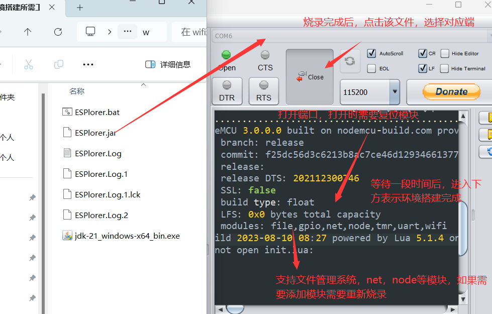
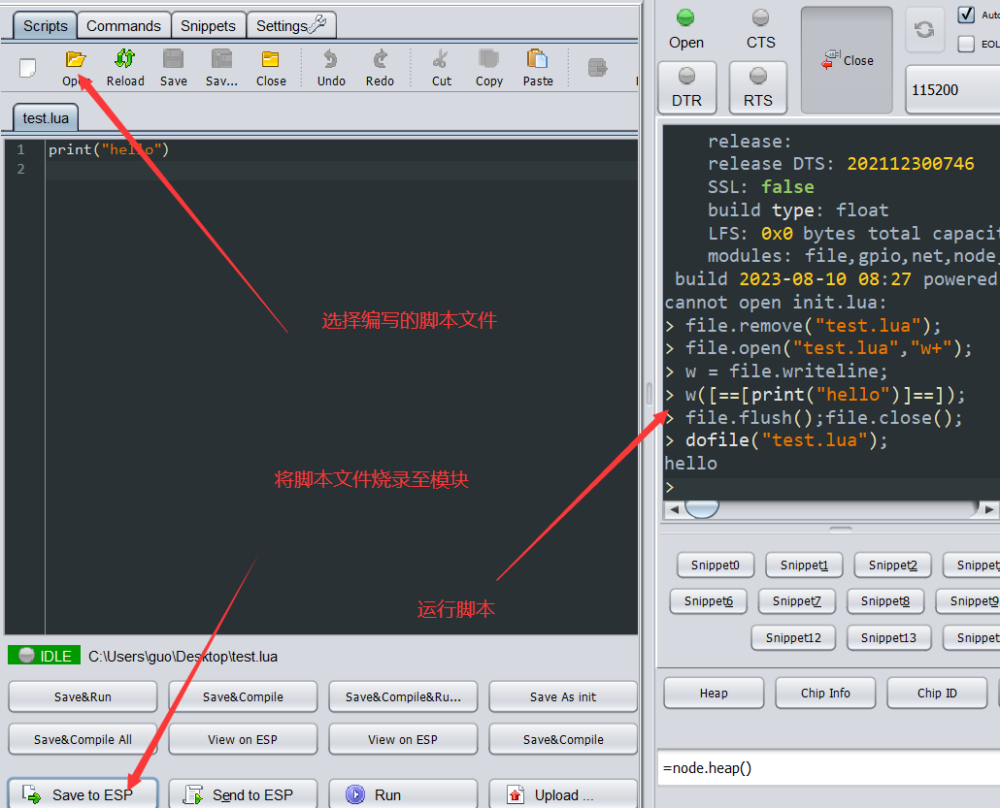
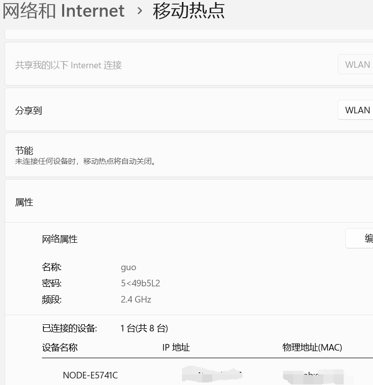

# WIFI环境搭建

注意：这里烧录的是nodemcu，所以后续可以根据nodemcu进行开发




# 使用lua脚本

```lua
//编写一个名为test.lua的脚本
print("hello")
```




## 连接符

```lua
print("hello"..2024)
//会将字符串拼接
//烧录结果为 hello2024

a=100
print("hello"..a)
//烧录结果为 hello100
```


## 赋值

```lua
//可以连续赋值
a,b,c=140,100,200
print(a+b)
print(a-b)
print(a/b)
print(a*b)
```


## if

```lua
if 判断条件 then
    执行代码
end

if 判断条件 then
    执行代码
elseif 判断条件 then
    执行代码
else
    执行代码
end
```

## for

```lua
for 变量名=起始值，终止值，步长 do
    循环内容
end


a,b,x= 10,20,30
--for 变量名=起始值，终止值，步长 do

for a=10,30,1 do
    b=b+1
    if b%2==0 then
        print(b)
    end
end

```

## while

```lua
while 条件 do
    循环代码
end

i=0
while i<15 do
    i=i+1
    print(i)
end
```

## 函数

```lua
i=0
function my_fun ()
    i=i+1
    print(i)
end

my_fun()

```

# 基于nodeMCU开发

[NodeMCU官方文档](https://nodemcu.readthedocs.io/en/release/)

## GPIO

所有访问均基于 NodeMCU 开发套件上的 I/O 索引号，而不是内部 GPIO 引脚。例如，开发工具包上的 D0 引脚映射到内部 GPIO 引脚 16。

| IO索引 | ESP8266针 | IO索引 | ESP8266针 |
| -----: | :-------- | -----: | :-------- |
|  0 [*] | GPIO16    |      7 | GPIO13    |
|      1 | GPIO5     |      8 | GPIO15    |
|      2 | GPIO4     |      9 | GPIO3     |
|      3 | GPIO0     |     10 | GPIO1     |
|      4 | GPIO2     |     11 | GPIO9     |
|      5 | GPIO14    |     12 | GPIO10    |
|      6 | GPIO12    |        |           |

### gpio可用API

| 函数                                                         | 功能                                                         |
| ------------------------------------------------------------ | ------------------------------------------------------------ |
| [gpio.mode（）](https://nodemcu.readthedocs.io/en/release/modules/gpio/#gpiomode) | 将引脚初始化为 GPIO 模式，设置引脚输入/输出方向，以及可选的内部弱上拉。 |
| [gpio.read（）](https://nodemcu.readthedocs.io/en/release/modules/gpio/#gpioread) | 读取数字GPIO引脚值。                                         |
| [gpio.serout（）](https://nodemcu.readthedocs.io/en/release/modules/gpio/#gpioserout) | 根据延迟时间序列（以 μs 为单位）序列序列化输出。             |
| [gpio.trig（）](https://nodemcu.readthedocs.io/en/release/modules/gpio/#gpiotrig) | 建立或清除回调函数以在引脚的中断时运行。                     |
| [gpio.write（）](https://nodemcu.readthedocs.io/en/release/modules/gpio/#gpiowrite) | 设置数字GPIO引脚值。                                         |
| [gpio.pulse](https://nodemcu.readthedocs.io/en/release/modules/gpio/#gpiopulse) | 这涵盖了一组 API，这些 API 允许生成具有精确定时的脉冲序列 多个引脚。 |
| [gpio.pulse.build](https://nodemcu.readthedocs.io/en/release/modules/gpio/#gpiopulsebuild) | 这将构建 gpio。                                              |
| [gpio.pulse:start](https://nodemcu.readthedocs.io/en/release/modules/gpio/#gpiopulsestart) | 这将启动输出操作。                                           |
| [gpio.pulse:getstate](https://nodemcu.readthedocs.io/en/release/modules/gpio/#gpiopulsegetstate) | 这将返回当前状态。                                           |
| [gpio.pulse:stop](https://nodemcu.readthedocs.io/en/release/modules/gpio/#gpiopulsestop) | 这将在将来的某个时间停止输出操作。                           |
| [gpio.pulse:cancel](https://nodemcu.readthedocs.io/en/release/modules/gpio/#gpiopulsecancel) | 这将立即停止输出操作。                                       |
| [gpio.pulse:adjust](https://nodemcu.readthedocs.io/en/release/modules/gpio/#gpiopulseadjust) | 这会增加（或减少）将在最小/最大延迟情况下使用的时间。        |
| [gpio.pulse:update](https://nodemcu.readthedocs.io/en/release/modules/gpio/#gpiopulseupdate) | 这可以更改输出程序中特定步骤的内容。                         |

### 点亮led灯

```lua
gpioPin=4
gpio.mode(gpioPin,gpio.OUTPUT);
function led(value) 
    if value==1 then
        gpio.write(gpioPin,gpio.LOW)
    elseif value==0 then
        gpio.write(gpioPin,gpio.HIGH)
    else
        print("err")
    end
end

led(1)
```


## 定时器tmr

### 可用API

- "."之前是模块
-  “：”之前是对象

|                                                              |                                                              |
| ------------------------------------------------------------ | ------------------------------------------------------------ |
| [tmr.create（）](https://nodemcu.readthedocs.io/en/release/modules/tmr/#tmrcreate) | ==创建动态计时器对象==;有关其方法表，请参见下文。            |
| [tmr.delay（）](https://nodemcu.readthedocs.io/en/release/modules/tmr/#tmrdelay) | Busyloops 处理器指定的微秒数。                               |
| [tmr.now（）](https://nodemcu.readthedocs.io/en/release/modules/tmr/#tmrnow) | 返回系统计数器，以微秒为单位计数。                           |
| [tmr.softwd（）](https://nodemcu.readthedocs.io/en/release/modules/tmr/#tmrsoftwd) | 提供一个简单的软件看门狗，需要在过期之前重新布防或禁用，否则系统将重新启动。 |
| [tmr.time（）](https://nodemcu.readthedocs.io/en/release/modules/tmr/#tmrtime) | 返回系统正常运行时间（以秒为单位）。                         |
| [tmr.wdclr（）](https://nodemcu.readthedocs.io/en/release/modules/tmr/#tmrwdclr) | 给系统看门狗喂食。                                           |
| [tmr.ccount（）](https://nodemcu.readthedocs.io/en/release/modules/tmr/#tmrccount) | 获取包含 CPU 刻度的 CPU CCOUNT 寄存器的值。                  |
| [Timer 对象方法](https://nodemcu.readthedocs.io/en/release/modules/tmr/#timer-object-methods) | 点击该连接可见，定时器对象的函数                             |

### led灯闪烁

```lua
gpioPin=4
ledStart=0
gpio.mode(gpioPin,gpio.OUTPUT);
function led(value) 
    if value==1 then
        gpio.write(gpioPin,gpio.LOW)
    elseif value==0 then
        gpio.write(gpioPin,gpio.HIGH)
    else
        print("err")
    end
end


local mytimer = tmr.create()
mytimer:register(1000, tmr.ALARM_AUTO, 
    function() 
        if ledStart==1 then
            led(0)
            ledStart=0
        else 
            led(1)
            ledStart=1
        end
    end
)
--注册的定时器需要启动，不需要了需要解注册
mytimer:start()
```


## wifi模块

**注意**：

WiFi 子系统由必须定期运行的后台任务维护。==任何耗时超过 15 毫秒（毫秒）的功能或任务都可能导致 WiFi 子系统崩溃==。为了避免这些潜在的崩溃，建议在执行任何超过此 15 毫秒准则的任务或功能之前，使用 [wifi.suspend（）](https://nodemcu.readthedocs.io/en/release/modules/wifi/#wifisuspend) 暂停 WiFi 子系统。

### 可用API

- [`wifi`](https://nodemcu.readthedocs.io/en/release/modules/wifi/#wifigetchannel)用于整体 WiFi 配置
- [`wifi.sta`](https://nodemcu.readthedocs.io/en/release/modules/wifi/#wifista-module) 用于站模式功能
- [`wifi.ap`](https://nodemcu.readthedocs.io/en/release/modules/wifi/#wifiap-module)用于无线接入点（WAP或简称AP）功能
- [`wifi.ap.dhcp`](https://nodemcu.readthedocs.io/en/release/modules/wifi/#wifiapdhcp-module) 用于 DHCP 服务器控制
- [`wifi.eventmon`](https://nodemcu.readthedocs.io/en/release/modules/wifi/#wifieventmon-module) 用于 wifi 事件监视器
- [`wifi.monitor`](https://nodemcu.readthedocs.io/en/release/modules/wifi_monitor/#wifimonitor-module) 用于 wifi 监控模式

| 函数                                                         | 功能                                                         |
| ------------------------------------------------------------ | ------------------------------------------------------------ |
| [wifi.getchannel（）](https://nodemcu.readthedocs.io/en/release/modules/wifi/#wifigetchannel) | 获取当前 WiFi 信道。                                         |
| [wifi.getcountry（）](https://nodemcu.readthedocs.io/en/release/modules/wifi/#wifigetcountry) | 获取当前国家/地区信息。                                      |
| [wifi.getdefaultmode（）](https://nodemcu.readthedocs.io/en/release/modules/wifi/#wifigetdefaultmode) | 获取默认 WiFi 操作模式。                                     |
| [wifi.getmode（）](https://nodemcu.readthedocs.io/en/release/modules/wifi/#wifigetmode) | 获取 WiFi 操作模式。                                         |
| [wifi.getphymode（）](https://nodemcu.readthedocs.io/en/release/modules/wifi/#wifigetphymode) | 获取 WiFi 物理模式。                                         |
| [wifi.nullmodesleep（）](https://nodemcu.readthedocs.io/en/release/modules/wifi/#wifinullmodesleep) | 配置 WiFi 是否在 NULL_MODE 中自动进入睡眠状态。              |
| [wifi.resume（）](https://nodemcu.readthedocs.io/en/release/modules/wifi/#wifiresume) | 从暂停状态唤醒 WiFi 或取消挂起的 wifi 暂停。                 |
| [wifi.setcountry（）](https://nodemcu.readthedocs.io/en/release/modules/wifi/#wifisetcountry) | 设置当前国家/地区信息。                                      |
| [wifi.setmode（）](https://nodemcu.readthedocs.io/en/release/modules/wifi/#wifisetmode) | 配置要使用的 WiFi 模式。                                     |
| [wifi.setphymode（）](https://nodemcu.readthedocs.io/en/release/modules/wifi/#wifisetphymode) | 设置 WiFi 物理模式。                                         |
| [wifi.setmaxtxpower（）](https://nodemcu.readthedocs.io/en/release/modules/wifi/#wifisetmaxtxpower) | 设置 WiFi 最大 TX 功率。                                     |
| [wifi.startsmart（）](https://nodemcu.readthedocs.io/en/release/modules/wifi/#wifistartsmart) | 开始自动配置，如果成功，自动设置SSID和密码。                 |
| [wifi.stopsmart（）](https://nodemcu.readthedocs.io/en/release/modules/wifi/#wifistopsmart) | 停止智能配置过程。                                           |
| [wifi.suspend（）](https://nodemcu.readthedocs.io/en/release/modules/wifi/#wifisuspend) | 暂停 Wifi 以减少电流消耗。                                   |
| [wifi.sta.autoconnect（）](https://nodemcu.readthedocs.io/en/release/modules/wifi/#wifistaautoconnect) | 在工作站模式下自动连接到 AP。                                |
| [wifi.sta.changeap（）](https://nodemcu.readthedocs.io/en/release/modules/wifi/#wifistachangeap) | 从 wifi 返回的列表中选择接入点。                             |
| [wifi.sta.clearconfig（）](https://nodemcu.readthedocs.io/en/release/modules/wifi/#wifistaclearconfig) | 清除当前保存的 WiFi station 配置，将其从闪存中擦除。         |
| [wifi.sta.config（）](https://nodemcu.readthedocs.io/en/release/modules/wifi/#wifistaconfig) | 设置 WiFi 站配置。                                           |
| [wifi.sta.connect（）](https://nodemcu.readthedocs.io/en/release/modules/wifi/#wifistaconnect) | 在工作站模式下连接到配置的 AP。                              |
| [wifi.sta.disconnect（）](https://nodemcu.readthedocs.io/en/release/modules/wifi/#wifistadisconnect) | 在工作站模式下断开与 AP 的连接。                             |
| [wifi.sta.getap（）](https://nodemcu.readthedocs.io/en/release/modules/wifi/#wifistagetap) | 将 AP 列表作为 Lua 表扫描到回调函数中。                      |
| [wifi.sta.getapindex（）](https://nodemcu.readthedocs.io/en/release/modules/wifi/#wifistagetapindex) | 获取存储在 AP 缓存中的当前接入点的索引。                     |
| [wifi.sta.getapinfo（）](https://nodemcu.readthedocs.io/en/release/modules/wifi/#wifistagetapinfo) | 获取 ESP8266 站缓存的 AP 信息。                              |
| [wifi.sta.getbroadcast（）](https://nodemcu.readthedocs.io/en/release/modules/wifi/#wifistagetbroadcast) | 获取电台模式下的广播地址。                                   |
| [wifi.sta.getconfig（）](https://nodemcu.readthedocs.io/en/release/modules/wifi/#wifistagetconfig) | 获取 WiFi 站配置。                                           |
| [wifi.sta.getdefaultconfig（）](https://nodemcu.readthedocs.io/en/release/modules/wifi/#wifistagetdefaultconfig) | 获取存储在闪存中的默认 WiFi 站配置。                         |
| [wifi.sta.gethostname（）](https://nodemcu.readthedocs.io/en/release/modules/wifi/#wifistagethostname) | 获取当前工作站主机名。                                       |
| [wifi.sta.getip（）](https://nodemcu.readthedocs.io/en/release/modules/wifi/#wifistagetip) | 在工作站模式下获取 IP 地址、网络掩码和网关地址。             |
| [wifi.sta.getmac（）](https://nodemcu.readthedocs.io/en/release/modules/wifi/#wifistagetmac) | 在工作站模式下获取 MAC 地址。                                |
| [wifi.sta.getrssi（）](https://nodemcu.readthedocs.io/en/release/modules/wifi/#wifistagetrssi) | 获取ESP8266站所连接的接入点的RSSI（接收信号强度指示器）。    |
| [wifi.sta.setaplimit（）](https://nodemcu.readthedocs.io/en/release/modules/wifi/#wifistasetaplimit) | 设置要存储在闪存中的最大接入点数。                           |
| [wifi.sta.sethostname（）](https://nodemcu.readthedocs.io/en/release/modules/wifi/#wifistasethostname) | 设置工作站主机名。                                           |
| [wifi.sta.setip（）](https://nodemcu.readthedocs.io/en/release/modules/wifi/#wifistasetip) | 在工作站模式下设置 IP 地址、网络掩码、网关地址。             |
| [wifi.sta.setmac（）](https://nodemcu.readthedocs.io/en/release/modules/wifi/#wifistasetmac) | 在工作站模式下设置MAC地址。                                  |
| [wifi.sta.sleeptype（）](https://nodemcu.readthedocs.io/en/release/modules/wifi/#wifistasleeptype) | 配置在工作站连接到接入点时使用的 WiFi 调制解调器睡眠类型。   |
| [wifi.sta.status（）](https://nodemcu.readthedocs.io/en/release/modules/wifi/#wifistastatus) | 获取工作站模式下的当前状态。                                 |
| [wifi.ap.config（）](https://nodemcu.readthedocs.io/en/release/modules/wifi/#wifiapconfig) | 在 AP 模式下设置 SSID 和密码。                               |
| [wifi.ap.deauth（）](https://nodemcu.readthedocs.io/en/release/modules/wifi/#wifiapdeauth) | 通过发送相应的IEEE802，将客户端从 ESP 接入点中移除（强制删除）。 |
| [wifi.ap.getbroadcast（）](https://nodemcu.readthedocs.io/en/release/modules/wifi/#wifiapgetbroadcast) | 获取 AP 模式下的广播地址。                                   |
| [wifi.ap.getclient（）](https://nodemcu.readthedocs.io/en/release/modules/wifi/#wifiapgetclient) | 获取在 AP 模式下连接到设备的客户端表。                       |
| [wifi.ap.getconfig（）](https://nodemcu.readthedocs.io/en/release/modules/wifi/#wifiapgetconfig) | 获取当前的 SoftAP 配置。                                     |
| [wifi.ap.getdefaultconfig（）](https://nodemcu.readthedocs.io/en/release/modules/wifi/#wifiapgetdefaultconfig) | 获取存储在闪存中的默认 SoftAP 配置。                         |
| [wifi.ap.getip（）](https://nodemcu.readthedocs.io/en/release/modules/wifi/#wifiapgetip) | 在 AP 模式下获取 IP 地址、网络掩码和网关。                   |
| [wifi.ap.getmac（）](https://nodemcu.readthedocs.io/en/release/modules/wifi/#wifiapgetmac) | 获取 AP 模式下的 MAC 地址。                                  |
| [wifi.ap.setip（）](https://nodemcu.readthedocs.io/en/release/modules/wifi/#wifiapsetip) | 在 AP 模式下设置 IP 地址、网络掩码和网关地址。               |
| [wifi.ap.setmac（）](https://nodemcu.readthedocs.io/en/release/modules/wifi/#wifiapsetmac) | 在 AP 模式下设置 MAC 地址。                                  |
| [wifi.ap.dhcp.config（）](https://nodemcu.readthedocs.io/en/release/modules/wifi/#wifiapdhcpconfig) | 配置 dhcp 服务。                                             |
| [wifi.ap.dhcp.start（）](https://nodemcu.readthedocs.io/en/release/modules/wifi/#wifiapdhcpstart) | 启动 DHCP 服务。                                             |
| [wifi.ap.dhcp.stop（）](https://nodemcu.readthedocs.io/en/release/modules/wifi/#wifiapdhcpstop) | 停止 DHCP 服务。                                             |
| [wifi.eventmon.register（）](https://nodemcu.readthedocs.io/en/release/modules/wifi/#wifieventmonregister) | 注册/注销 WiFi 事件监视器的回调。                            |
| [wifi.eventmon.unregister（）](https://nodemcu.readthedocs.io/en/release/modules/wifi/#wifieventmonunregister) | 取消注册 WiFi 事件监视器的回调。                             |
| [wifi.eventmon.reason](https://nodemcu.readthedocs.io/en/release/modules/wifi/#wifieventmonreason) | 包含断开连接原因的表。                                       |

### wifi模式

**Station**[【工作站模式】：

- Station （STA） 模式用于将ESP8266连接到接入点建立的 WiFi 网络。连接其他人的网络

**Soft Access Point**：

- 接入点 （AP） 是一种设备，它为其他设备（站）提供对 Wi-Fi 网络的访问，并将它们进一步连接到有线网络。ESP8266可以提供类似的功能，只是它没有与有线网络的接口。这种操作模式称为软接入点（soft-AP）。连接到软 AP 的最大站点数为 5 个。让其他的工作站连接

**Station+Soft Access Point**：

- 软AP模式的另一个方便的应用是设置[网状网络](https://en.wikipedia.org/wiki/Mesh_networking)。ESP 可以在软 AP 和 Station 模式下运行，因此它可以充当网状网络的节点。


### STA模式

#### 连接wifi

```lua
wifi.setmode(wifi.STATION) --将wIFI配置为工作站模式

station_cfg={}--建立名字为station_cfg的表

station_cfg.ssid="guo"
station_cfg.pwd="5<49b5L2"
station_cfg.save=false
wifi.sta.config(station_cfg)
wifi.sta.connect()  --连接wifi
```

烧录完成且配置好wifi后




#### 查询是否连接完成

```lua
gpioPin=4
gpio.mode(gpioPin,gpio.OUTPUT);
function led(value) 
    if value==1 then
        gpio.write(gpioPin,gpio.LOW)
    elseif value==0 then
        gpio.write(gpioPin,gpio.HIGH)
    else
        print("err")
    end
end


wifi.setmode(wifi.STATION)
station_cfg={}
station_cfg.ssid="guo"
station_cfg.pwd="5<49b5L2"
station_cfg.save=false
wifi.sta.config(station_cfg)

local mytimer = tmr.create()
mytimer:register(1000, tmr.ALARM_AUTO, 
    function() 
        ip=wifi.sta.getip()
        if ip==nil then
            print("正在连接")   
            led(0) 
        else
            print("连接完成"..ip) 
            led(1) 
            mytimer:stop()
        end
    end
)

wifi.sta.connect()
mytimer:start()
```

## net模块

### 可用API

| 函数                                                         | 功能                                              |
| ------------------------------------------------------------ | ------------------------------------------------- |
| [Constants](https://nodemcu.readthedocs.io/en/release/modules/net/#constants) | 用于其他函数的常量：net。                         |
| [net.createConnection（）](https://nodemcu.readthedocs.io/en/release/modules/net/#netcreateconnection) | 创建 TCP 客户端。                                 |
| [net.createServer（）](https://nodemcu.readthedocs.io/en/release/modules/net/#netcreateserver) | 创建 TCP 侦听套接字（服务器）。                   |
| [net.createUDPSocket（）](https://nodemcu.readthedocs.io/en/release/modules/net/#netcreateudpsocket) | 创建 UDP 套接字。                                 |
| [net.ifinfo（）](https://nodemcu.readthedocs.io/en/release/modules/net/#netifinfo) | 返回有关网络接口的信息，由 index 指定。           |
| [net.multicastJoin（）](https://nodemcu.readthedocs.io/en/release/modules/net/#netmulticastjoin) | 加入组播组。                                      |
| [net.multicastLeave（）](https://nodemcu.readthedocs.io/en/release/modules/net/#netmulticastleave) | 退出组播组。                                      |
| [net.server:close()](https://nodemcu.readthedocs.io/en/release/modules/net/#netserverclose) | 关闭服务器。                                      |
| [net.server：listen（）](https://nodemcu.readthedocs.io/en/release/modules/net/#netserverlisten) | 侦听来自 IP 地址的端口。                          |
| [net.server：getaddr（）](https://nodemcu.readthedocs.io/en/release/modules/net/#netservergetaddr) | 返回服务器本地地址/端口。                         |
| [net.socket:close()](https://nodemcu.readthedocs.io/en/release/modules/net/#netsocketclose) | 关闭套接字。                                      |
| [net.socket:connect()](https://nodemcu.readthedocs.io/en/release/modules/net/#netsocketconnect) | 连接到远程服务器。                                |
| [net.socket：dns（）](https://nodemcu.readthedocs.io/en/release/modules/net/#netsocketdns) | 为主机名提供 DNS 解析。                           |
| [net.socket：getpeer（）](https://nodemcu.readthedocs.io/en/release/modules/net/#netsocketgetpeer) | 检索远程对等体的端口和 IP。                       |
| [net.socket：getaddr（）](https://nodemcu.readthedocs.io/en/release/modules/net/#netsocketgetaddr) | 检索套接字的本地端口和 IP。                       |
| [net.socket：hold（）](https://nodemcu.readthedocs.io/en/release/modules/net/#netsockethold) | 通过发出阻止 TCP 接收功能的请求来限制数据接收。   |
| [net.socket：on（）](https://nodemcu.readthedocs.io/en/release/modules/net/#netsocketon) | 注册特定事件的回调函数。                          |
| [net.socket:send()](https://nodemcu.readthedocs.io/en/release/modules/net/#netsocketsend) | 将数据发送到远程对等方。                          |
| [net.socket：ttl（）](https://nodemcu.readthedocs.io/en/release/modules/net/#netsocketttl) | 更改或检索套接字上的生存时间值。                  |
| [net.socket：unhold（）](https://nodemcu.readthedocs.io/en/release/modules/net/#netsocketunhold) | 通过撤销之前的 hold（） 来取消阻止 TCP 接收数据。 |
| [net.udpsocket：close（）](https://nodemcu.readthedocs.io/en/release/modules/net/#netudpsocketclose) | 关闭 UDP 套接字。                                 |
| [net.udpsocket：listen（）](https://nodemcu.readthedocs.io/en/release/modules/net/#netudpsocketlisten) | 侦听来自 IP 地址的端口。                          |
| [net.udpsocket：on（）](https://nodemcu.readthedocs.io/en/release/modules/net/#netudpsocketon) | 注册特定事件的回调函数。                          |
| [net.udpsocket:send()](https://nodemcu.readthedocs.io/en/release/modules/net/#netudpsocketsend) | 将数据发送到特定的远程对等体。                    |
| [net.udpsocket：dns（）](https://nodemcu.readthedocs.io/en/release/modules/net/#netudpsocketdns) | 为主机名提供 DNS 解析。                           |
| [net.udpsocket：getaddr（）](https://nodemcu.readthedocs.io/en/release/modules/net/#netudpsocketgetaddr) | 检索套接字的本地端口和 IP。                       |
| [net.udpsocket：ttl（）](https://nodemcu.readthedocs.io/en/release/modules/net/#netudpsocketttl) | 更改或检索套接字上的生存时间值。                  |
| [net.dns.getdnsserver（）](https://nodemcu.readthedocs.io/en/release/modules/net/#netdnsgetdnsserver) | 获取用于解析主机名的 DNS 服务器的 IP 地址。       |
| [net.dns.resolve（）](https://nodemcu.readthedocs.io/en/release/modules/net/#netdnsresolve) | 将主机名解析为 IP 地址。                          |
| [net.dns.setdnsserver（）](https://nodemcu.readthedocs.io/en/release/modules/net/#netdnssetdnsserver) | 设置用于解析主机名的 DNS 服务器的 IP。            |

### UDP通讯

```lua
function UDP()
    UDPSocket=  net.createUDPSocket()
    UDPSocket:send(9000,"ipxxxxx","123")
    UDPSocket:close()
end
```


### UDP接收

```lua
net.socket:on(event, function())
    --event字符串，可以是“connection”、“reconnection”、“disconnection”、“receive”或“sent”
    --function(net.socket[, string])回调函数。可以删除回调。nil
    --如果 event 为 “receive”，则第二个参数是以字符串形式接收的数据。
    --如果事件是“断开连接”或“重新连接”，则第二个参数是错误代码。

    net.udpsocket:on()
    --语法和功能类似于    net.socket:on
    --但是，只有“receive”、“sent”和“dns”是受支持的事件。
    --回调参数只有receive,data,port,ip
```

```lua
gpioPin=4
gpio.mode(gpioPin,gpio.OUTPUT);
function led(value) 
    if value==1 then
        gpio.write(gpioPin,gpio.LOW)
    elseif value==0 then
        gpio.write(gpioPin,gpio.HIGH)
    else
        print("err")
    end
end

function UDP()
    UDPSocket=  net.createUDPSocket()
    UDPSocket:send(9000,"192.168.3.107","123")
    UDPSocket:on("receive", 
    function (receive,data,port,ip)
        print("ip:"..ip)
        print("port:"..port)
        print("data"..data)
        led(tonumber(data)) 
    end
    )
    
end
```

## 通过网络控制STM32

首先找到wifi模块的==TX==引脚【因为需要向内存发送数据】，在图形界面中设置接收数据的==RX引脚==，例如设置==PA3==为接收数据的引脚，使用杜邦线连接。


# 服务器与客户端

## 安装服务器与客户端

```makefile
#服务器
sudo apt-get install mosquitto 

#客户端
sudo apt-get install mosquitto-clients
```

## 命令行控制服务器

```makefile
#启动服务器
sudo /etc/init.d/mosquitto start

#重启服务器
sudo /etc/init.d/mosquitto restart

#停止服务器
sudo /etc/init.d/mosquitto stop
```

## 客户端订阅

```makefile
mosquitto_sub
# -c 指定客户端clean_session是否保存。
# -d 打印debug信息
# -h 指定要连接的域名 默认为localhost
# -i 指定客户端clientid
# -I 指定clientId前缀
# -k keepalive 每隔一段时间，发PING消息通知broker，仍处于连接状态。 默认为60秒.
# -q 指定希望接收到QoS为什么的消息 默认QoS为0
# -R 不显示陈旧的消息
# -t 订阅topic,即主题
# -v 打印消息
# -m 携带的消息
#--will-payload 指定一个消息，该消息当客户端与broker意外断开连接时发出。该参数需要与--will-topic一起使用

# --will-qos Will的QoS值。该参数需要与--will-topic一起使用
#--will-retain 指定Will消息被当做一个retain消息（即消息被广播后，该消息被保留起来）。该参数需要与--will-topic一起使用
#
# --will-topic 用户发送Will消息的topic
#
# 案例：
# mosquitto_sub -h 10.7.121.57 -t "QFEDU"

```

## 客户端发布

```makefile
 mosquitto_pub
# -d 打印debug信息
# -f 将指定文件的内容作为发送消息的内容
# -h 指定要连接的域名 默认为localhost
# -i 指定客户端clientid，默认为附加进程ID的mosquitto_pub_
# -I 指定clientId前缀
# -m 消息内容
# -n 发送一个空（null）消息
# -p 连接端口号
# -q 指定QoS的值（0,1,2）
# -t 指定topic
# -u 用户名
# -P 用户密码
# -V 指定MQTT协议版本
#--will-payload 指定一个消息，该消息当客户端与broker意外断开连接时发出。该参数需要与--willtopic一起使用
#
# --will-qos Will的QoS值。该参数需要与--will-topic一起使用
#--will-retain 指定Will消息被当做一个retain消息（即消息被广播后，该消息被保留起来）。该参数需要与--will-topic一起使 用
#
# --will-topic 用户发送Will消息的topic
#
# 案例
# mosquitto_pub -h 192.168.1.238 -t "" -m "你好"
# mosquitto_pub -h 10.7.121.57 -t "QFEDU" -m "你好"
```

例如：

```makefile
#在订阅给定ip以后，客户端发送你好，将会接收到 你好
mosquitto_sub -h 10.7.121.57 -t "QFEDU"

#-----------------------
mosquitto_pub -h 192.168.1.238 -t "" -m "你好"
```


# 固件构建

在MCU的固件构建中的云构建服务中，点击云构建，填入邮箱后，选择需要的模块。再点击构建【因为需要使用MQTT，所有需要使用MQTT模块，以及softUART模块（因为串口本质上就是有高低变化的电平，有时一个模块的电平驱动能力无法带动另一个模块的，导致无法稳定的收发，软串口如果波特率过高会导致电平反转不及时而乱码，一般使用9600）】。

# MQTT

注意：MQTT模式默认端口是1883

## 可用API

| 函数                                                         | 功能                                                         |
| ------------------------------------------------------------ | ------------------------------------------------------------ |
| [mqtt.Client()](https://nodemcu.readthedocs.io/en/release/modules/mqtt/#mqttclient) | 创建 MQTT 客户端。                                           |
| [mqtt.client：close（）](https://nodemcu.readthedocs.io/en/release/modules/mqtt/#mqttclientclose) | 计划对连接进行彻底拆解。                                     |
| [mqtt.client:connect()](https://nodemcu.readthedocs.io/en/release/modules/mqtt/#mqttclientconnect) | 连接到由给定主机、端口和安全选项指定的代理。                 |
| [mqtt.client：lwt（）](https://nodemcu.readthedocs.io/en/release/modules/mqtt/#mqttclientlwt) | 设置最后的遗嘱和遗嘱。也就是**允许客户端指定一条消息，当非预期的断开连接发生时，由代理（broker）代替它们自动发布出去** |
| [mqtt.client：on（）](https://nodemcu.readthedocs.io/en/release/modules/mqtt/#mqttclienton) | 注册事件的回调函数。                                         |
| [mqtt.client:publish()](https://nodemcu.readthedocs.io/en/release/modules/mqtt/#mqttclientpublish) | 发布消息。                                                   |
| [mqtt.client:subscribe()](https://nodemcu.readthedocs.io/en/release/modules/mqtt/#mqttclientsubscribe) | 订阅一个或多个主题。                                         |
| [mqtt.client:unsubscribe()](https://nodemcu.readthedocs.io/en/release/modules/mqtt/#mqttclientunsubscribe) | 取消订阅一个或多个主题。                                     |

在使用API时有一个参数Qos,如`mqtt:publish`中就有这个参数：

- qos=0， “至多一次”，消息发布完全依赖底层 TCP/IP 网络。会发生消息丢失或重复。
  - 这一级别可用于如下情 况，环境传感器数据，丢失一次读记录无所谓，因为不久后还会有第二次发送。
-  qos=1, “至少一次”，确保消息到达，但消息重复可能会发生。
-  qos=2 ,“只有一次”，确保消息到达一次。这一级别可用于如下情况，在计费系统中，消息重复或丢失会导致不正 确的结果。

## 向指定服务器发布消息

```lua
function UDP()
    UDPSocket=  mqtt.Client("guo", 120)
    UDPSocket:connect("ip","1883",false,
    function(client, reason)
        UDPSocket:publish("guo","你好",0,0)
    end
    )
    
end

wifi.setmode(wifi.STATION)
station_cfg={}
station_cfg.ssid="guo"
station_cfg.pwd="5<49b5L2"
station_cfg.save=false
wifi.sta.config(station_cfg)

local mytimer = tmr.create()
mytimer:register(1000, tmr.ALARM_AUTO, 
    function() 
        ip=wifi.sta.getip()
        if ip==nil then
            print("正在连接")              
        else
            print("连接完成"..ip) 
           
            UDP()
            mytimer:stop()
        end
    end
)

wifi.sta.connect()
mytimer:start()
```

## 订阅指定服务消息

```lua
unction mqttFN()
    mqttSocket=  mqtt.Client("guo", 120)
    mqttSocket:connect("192.168.3.178","1883",false,
    function(client, reason)
        mqttSocket:publish("guo","你好",0,0)
        --在连接成功后订阅 guo 主题的服务器
        mqttSocket:subscribe("guo", 0)
    end
    )
    mqttSocket:on("message",
    function(client, topic, message)
           print(topic)
           print(message)
    end
    )
end
--由此可以控制 舵机
--例如在终端中发送mosquitto_pub -h 192.168.3.178 -t "guo" -m "zl:start"
-- 可以控制舵机的开启
```

# softUART(软串口)

## 可用API

注意：SoftUART 不能用于 D0 引脚。

| 函数                                                         | 功能                     |
| ------------------------------------------------------------ | ------------------------ |
| [softuart.setup（）](https://nodemcu.readthedocs.io/en/release/modules/softuart/#softuartsetup) | 创建新的 SoftUART 实例。 |
| [softuart.port：on（）](https://nodemcu.readthedocs.io/en/release/modules/softuart/#softuartporton) | 设置回调函数以接收数据。 |
| [softuart.port:write()](https://nodemcu.readthedocs.io/en/release/modules/softuart/#softuartportwrite) | 传输它们的字节或序列。   |

## 软串口向外发送数据

```lua
softuartPin=softuart.setup(9600, 2, 3)


function mqttFN()
    mqttSocket=  mqtt.Client("guo", 120)
    mqttSocket:connect("192.168.3.178","1883",false,
    function(client, reason)
        mqttSocket:publish("guo","你好",0,0)
        mqttSocket:subscribe("guo", 0)
    end
    )
    mqttSocket:on("message",
    function(client, topic, message)
          --注意：发送时只能发送定量的数据，不可以是变量
        softuartPin:write("111")
    end
    )
end
```

## 软串口向外接收数据

```lua
softuartPin=softuart.setup(9600, 2, 3)


function mqttFN()
    mqttSocket=  mqtt.Client("guo", 120)
    mqttSocket:connect("192.168.3.178","1883",false,
        function(client, reason)
            mqttSocket:subscribe("guo", 0)
            --注册接收回调
            softuart.port:on("data",4, 
                function()
                    mqttSocket:publish("guo","你好",0,0)
                end
            )
        end
    )
    mqttSocket:on("message",
        function(client, topic, message)
            softuartPin:write("111")
        end
    )
end
```

## 软串口结合wifi控制舵机

```lua
softuartPin=softuart.setup(9600, 2, 3)


function mqttFN()
    mqttSocket=  mqtt.Client("guo", 120)
    mqttSocket:connect("192.168.3.178","1883",false,
    function(client, reason)
        mqttSocket:subscribe("guo", 0)
        softuartPin:on("data",4, 
        function()
            mqttSocket:publish("guo","你好",0,0)
        end
        )
    end
    )
    --当虚拟机通过wifi向模块发送消息后，触发回调，通过软串口向32发送数据
    mqttSocket:on("message",
    function(client, topic, message)
        print(message)
        softuartPin:write("zl:start\r\n")
    end
    )
end

wifi.setmode(wifi.STATION)
station_cfg={}
station_cfg.ssid="guo"
station_cfg.pwd="5<49b5L2"
station_cfg.save=false
wifi.sta.config(station_cfg)

local mytimer = tmr.create()
mytimer:register(1000, tmr.ALARM_AUTO, 
    function() 
        ip=wifi.sta.getip()
        if ip==nil then
            print("正在连接")   
           
        else
            print("连接完成"..ip) 
           
            mqttFN()
            mytimer:stop()
        end
    end
)

wifi.sta.connect()
mytimer:start()
```

# MQTT的C编程

## 环境配置

```makefile
sudo apt install libmosquitto-dev
```

mosquitto库函数API查询

网址：[mosquitto.h](https://mosquitto.org/api/files/mosquitto-h.html)

## c环境接收

```c
#include "mosquitto.h"
#include "stdio.h"

void myMsgBack(struct mosquitto *myMosquitto, void *data, const struct mosquitto_message *message)
{
    printf("topic=%s\r\n", (char *)message->topic);
    printf("payload=%s\r\n", (char *)message->payload);
}

int main(int argc, char const *argv[])
{
    // 初始化库
    if (mosquitto_lib_init() == MOSQ_ERR_UNKNOWN)
    {
        perror("mosquitto_lib_init");
        return 0;
    }

    // 建立客户端
    //这里的第三个参数"guoobj，将会传递给其他的回调函数，例如myMsgBack函数中的data参数接收的就是"guoobj"
    struct mosquitto *mosquittoUser = mosquitto_new("guoID", true, "guoobj");

    // 连接服务器
    mosquitto_connect(mosquittoUser, "192.168.3.178", 1883, 120);

    // 订阅主题
    int num = 0;
    mosquitto_subscribe(mosquittoUser, &num, "guo", 0);

    // 接收数据
    //--设置接收到消息时的回调函数
    mosquitto_message_callback_set(mosquittoUser, myMsgBack);

    //---开启网络线程
    mosquitto_loop_start(mosquittoUser);
    //--阻塞至网络线程完成，并停止
    mosquitto_loop_stop(mosquittoUser, false);
   
    // 销毁客户端
    mosquitto_destroy(mosquittoUser);

    // 清理库
    mosquitto_lib_cleanup();
    return 0;
}

```

## c环境发送

```c
#include "mosquitto.h"
#include "stdio.h"
#include "string.h"
int main(int argc, char const *argv[])
{
    // 初始化库
    if (mosquitto_lib_init() == MOSQ_ERR_UNKNOWN)
    {
        perror("mosquitto_lib_init");
        return 0;
    }

    // 建立客户端
    //这里的第三个参数"guoobj，将会传递给其他的回调函数，例如myMsgBack函数中的data参数接收的就是"guoobj"
    struct mosquitto *mosquittoUser = mosquitto_new("guoID", true, "guoobj");

    // 连接服务器
    mosquitto_connect(mosquittoUser, "192.168.3.178", 1883, 120);

    //发送数据
    char msg[128]="888";
    mosquitto_publish(mosquittoUser,NULL,"guosend",strlen(msg),msg,0,true);

    // 销毁客户端
    mosquitto_destroy(mosquittoUser);

    // 清理库
    mosquitto_lib_cleanup();
    return 0;
}

```

# 云平台

## thingscloud

选择创建设备，点击连接，找到对应的连接说明，这里使用mqtt，因为需要连接云服务器需要使用账户密码，所以在创建连接时，需要将这些可选参数填上。

```lua
   mqttSocket=  mqtt.Client("guo", 120,"云用户","云密码")
    mqttSocket:connect("云域名","云端口",false,
    function(client, reason)
             --。。。。。。
    end
    )
```


### 设备向云平台发送数据

接收和发送数据需要主题【在连接处 点击详情可见】

| 消息类型           | 主题                  |
| ------------------ | --------------------- |
| 设备上报属性值     | attributes            |
| 设备获取当前属性值 | attributes/get/`<id>` |
| 设备上报事件       | event/report/`<id>`   |
| 设备回复命令       | command/reply/`<id>`  |
| 设备自定义数据上报 | data/`<identifier>`   |

```lua
--设定我这里需要接收温度temp，这是一种属性，因此使用attributes主题

mqttSocket=  mqtt.Client("guo", 120,"云用户","云密码")
mqttSocket:connect("云域名","云端口",false,
    function(client, reason)
        mqttSocket:subscribe("attributes", 0)
        --。。。。。。。
    end
)
```

#### 发布消息需要按照规定格式进行组包

消息内容必须是 `JSON` 格式，如果不是 `JSON` 格式的消息，设备会被云平台主动断开连接。

```lua
mqttSocket=  mqtt.Client("guo", 120,"9gpmloahwx0zd7yb","0iJESLQuvc")
mqttSocket:connect("sh-1-mqtt.iot-api.com","1883",false,
    function(client, reason)
        mqttSocket:publish("attributes","{\"temp\":28,\"time\":88}",0,0)
    )
end
)
```

#### 使用JSON模块组包

```lua
mqttSocket=  mqtt.Client("guo", 120,"9gpmloahwx0zd7yb","0iJESLQuvc")
mqttSocket:connect("sh-1-mqtt.iot-api.com","1883",false,
    function(client, reason)
        ok,json=pacll(sjson.encode, {temp=28,time:14})
        if ok then
            print(json)
        else
            print("failed to encode!")
        end
        mqttSocket:publish("attributes",json,0,0)
        --    mqttSocket:publish("attributes","{\"temp\":28,\"time\":88}",0,0)
    )
end
)
```


### 云平台向设备发送数据

**主题**：

| 消息类型           | 主题                      |
| ------------------ | ------------------------- |
| 接收属性上报的响应 | attributes/response       |
| 接收属性获取的响应 | attributes/get/response/+ |
| 接收下发的属性     | attributes/push           |
| 接收事件上报的响应 | event/response/+          |
| 接收下发的命令     | command/send/+            |
| 接收命令回复的响应 | command/reply/response/+  |
| 接收自定义数据下发 | data/`<identifier>`/set   |

```lua
mqttSocket=  mqtt.Client("guo", 120,"9gpmloahwx0zd7yb","0iJESLQuvc")
mqttSocket:connect("sh-1-mqtt.iot-api.com","1883",false,
    function(client, reason)
        --订阅下发主题
        mqttSocket:subscribe("attributes/push", 0)
    end
)
mqttSocket:on("message",
    function(client, topic, message)
        --在云服务器下发属性后，打印下发的消息
        print(message)
        softuartPin:write("zl:stop\r\n")
    end
)
```

#### 使用JSON模块解包

由于云服务器发送的数据是JSON格式，不方便解包，因此可以使用SJSON模块解包，该模块需要固件构建


```lua
--云端下发json
--{
--    "temp": 88,
--    "swirw": 68
--}
function mqttFN()
    mqttSocket=  mqtt.Client("guo", 120,"9gpmloahwx0zd7yb","0iJESLQuvc")
    mqttSocket:connect("sh-1-mqtt.iot-api.com","1883",false,
    function(client, reason)
        mqttSocket:subscribe("attributes/push", 0)
    end
    )
    mqttSocket:on("message",
    function(client, topic, message)
        print(message)
        t=sjson.decode(message)
        print(t.temp)  --打印88
        softuartPin:write("zl:stop\r\n")
    end
    )
end
```

## 阿里云平台

搜索物联网平台，点击进入，开通公共实例(用于学习测试)。

点击产品文档，选择物联网平台可见 使用文档

### 创建设备

先创建一个产品，再在设备中 将该产品添加，

点击查看设备，跳转的页面中有 MQTT连接参数，点击可见连接所需数据

### 连接设备

使用设备中给出的参数 同thingscloud一样连接即可

### 云平台主题

在产品中 点击查看

然后选择topic类列表可见各种主题表格

主要分为 基础通信、物模型、自定义

### 添加属性

在产品中的查看中选择 **功能定义**，这里有设备的属性

点击 前往**编辑草稿**，==添加自定义属性==，填写将要上报的属性 各选设置，

点击 **发布上线**。

### 模拟数据

1. 当设备离线时，可以使用**设备模拟器**， 模拟数据的收发
2. 选择属性上报
3. 填入一个属性值，点击**发送指令**。
4. 右侧==设备端日志==，会出现云平台接收到的JSON格式的数据包【也就是==设备到云平台消息==】
5. 这就是需要封装的数据格式【也可以通过看使用手册，自行组包】

```json
publish topic=/sys/k1l45am9Di9/xbiXz4covdMuj8dTicF4/thing/event/property/post, payload={"id":1721274428302,"params":{"temp":12},"version":"1.0","method":"thing.event.property.post"}
--其中payload就是需要使用到的JSON格式
```


### 设备向云平台发送数据

```lua
clientID="云ID"
pwd="云密码"
user="云用户名"
url="云域名"
port=1883


function mqttFN()
    mqttSocket=  mqtt.Client(clientID, 120,user,pwd)
    mqttSocket:connect(url,port,false,
        function(client, reason)
            json="{\"id\":xxx,\"params\":{\"temp\":12},\"version\":\"1.0\",\"method\":\"thing.event.property.post\"}"
            mqttSocket:publish("上报主题",json,0,0)
        end
    )
end
```


### 云平台向设备发送数据

```lua
clientID="云ID"
pwd="云密码"
user="云用户名"
url="云域名"
port=1883


function mqttFN()
    mqttSocket=  mqtt.Client(clientID, 120,user,pwd)
    mqttSocket:connect(url,port,false,
        function(client, reason)
            json="{\"id\":xxx,\"params\":{\"temp\":12},\"version\":\"1.0\",\"method\":\"thing.event.property.post\"}"
            mqttSocket:publish("上报主题",json,0,0)
        end
    )

    mqttSocket:on("message",
        function(client, topic, message)
            t=sjson.decode(message)
            if t.params~=nil then
                print(t.params.temp)
            end
            softuartPin:write("zl:stop\r\n")
        end
    )
end
```

## ONENET

进入物联网平台，点击**产品开发**，再选择**创建**，填入相关信息。

添加物模型

**注意**：oneNet的密码并不能像其他平台一样直接复制过来使用，而需要经过 计算获得 详见【[安全鉴权](https://open.iot.10086.cn/doc/v5/fuse/detail/913)】。
