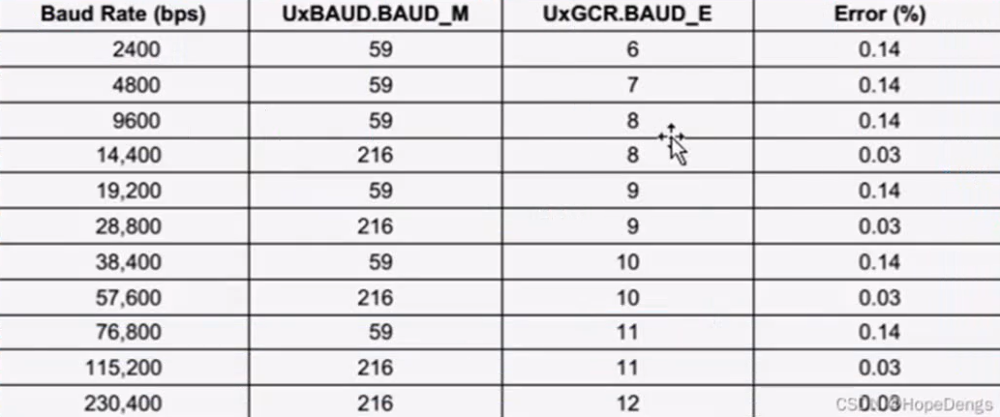
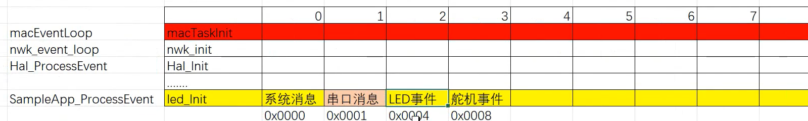

# 点亮LED灯

```c
void ledInit(){
    //设置输入输出模式
    //寄存器P1SEL的低两位（0，1）控制的是p1 1 和p1 0 的功能选择
    //将p1 0 与 p1 1 设置为0，也就是都设置为通用I/O输出口，详见手册
    P1SEL &=0xfc;
    //将p1 0 与 p1 1 配置为输出,低两位置1
    P1DIR|=0x03;
    P1_1=1;
    P1_0=1;
    //设置高低电平
}
```

# 按键轮询控制

```c
#include <iocc2530.h>

void btnInit(){
    //设置输入输出模式
      P0SEL &=0xfe;  //配置为通用IO
      P0DIR &=0xfe;  //配置为输入模式
      P0INP &=0xfe;  //配置为上拉下拉模式
}

//按键扫描
int btnCan(){
  if(P0_0==0){  //低电平表示按下
    while(P0_0==1);
    return 1;
  }
   return 0;
}

void ledInit(){
    //设置输入输出模式
  //寄存器P1SEL的低两位（0，1）控制的是p1 1 和p1 0 的功能选择
  //将p1 0 与 p1 1 设置为0，也就是都设置为通用I/O输出口，详见手册
      P1SEL &=0xfc;
      //将p1 0 与 p1 1 配置为输出,低两位置1
      P1DIR|=0x03;
       //设置高低电平
      P1_1=1;
      P1_0=1;
   
}

int main(int argc, char const *argv[])
{
   btnInit();
  ledInit();
  while(1){
    if( btnCan()){
       P1_0=~  P1_0;
    }
  }

    return 0;
}

```

# 中断控制

```c
#include <iocc2530.h>

//这种写法表示接下来要指定中断服务函数
//也就是给vector向量指定中断服务函数，编译器编译到这里以后
//就会知道接下来的这一个函数不会直接在当前函数进行编译
//而是如果执行了P0INT_VECTOR这个向量表中的中断事件
//就会执行下方的中断服务函数函数
#pragma vector= 0x6B   //P0INT_VECTOR
__interrupt void P0_ISR(void){
    P1_0 = ~P1_0;
    P0IFG=0x00;//清除P0_0对应的中断标志位  
    P0IF=0;//清除P0_0对应的中断标志4  的中断标志位   
}


void btnInit(){
    //开启P0的第0位的中断模式
    P0IEN|=0x01; 
    //设置下降沿
    PICTL|=0x01;  // PICTL最低位控制，7到0输入模式下的中断配置。该位为所有端口0的输入选择中断请求条件
    //开启P0的中断模式
    IEN1|=0x20;  
    //P0IE=1;//也同效果
    P0IFG=0x00;//清除P0_0对应的中断标志位  
    //允许所有的中断模式
    IEN0|=0x80; 
    //EA=1; //也同效果
}


void ledInit(){
    //设置输入输出模式
    //寄存器P1SEL的低两位（0，1）控制的是p1 1 和p1 0 的功能选择
    //将p1 0 与 p1 1 设置为0，也就是都设置为通用I/O输出口，详见手册
    P1SEL &=0xfc;
    //将p1 0 与 p1 1 配置为输出,低两位置1
    P1DIR|=0x03;
    //设置高低电平
    P1_1=0;
    P1_0=0;

}

int main(int argc, char const *argv[])
{
    btnInit();
    ledInit();
    while(1);

    return 0;
}

```

# 多按键中断控制

```c
#include <iocc2530.h>

//这种写法表示接下来要指定中断服务函数
//也就是给vector向量指定中断服务函数，编译器编译到这里以后
//就会知道接下来的这一个函数不会直接在当前函数进行编译
//而是如果执行了P0INT_VECTOR这个向量表中的中断事件
//就会执行下方的中断服务函数函数
#pragma vector= 0x6B   //P0INT_VECTOR
__interrupt void P0_ISR(void){
    if( P0IFG&0x01){
        P1_0 =1;
        P1_1 =1;
        P0IFG &= ~0x01;//清除P0_0对应的中断标志位    
    }else if(P0IFG&0x02){
        P1_0 =0;
        P1_1 =0;
        P0IFG &= ~0x02;//清除P0_0对应的中断标志位  
    }
    P0IF=0;//清除P0_0对应的中断标志4  的中断标志位  

}


void btnInit(){
    //开启P0的第0、1位的中断模式
    P0IEN|=0x03; 
    //设置下降沿
    PICTL|=0x01;  // PICTL最低位控制，7到0输入模式下的中断配置。该位为所有端口0的输入选择中断请求条件
    //开启P0的中断模式
    // IEN1|=0x20;  
    P0IE=1;//也同效果
    P0IFG=0x00;//清除P0_0对应的中断标志位  
    //允许所有的中断模式
    // IEN0|=0x80; 
    EA=1; //也同效果
}


void ledInit(){
    //设置输入输出模式
    //寄存器P1SEL的低两位（0，1）控制的是p1 1 和p1 0 的功能选择
    //将p1 0 与 p1 1 设置为0，也就是都设置为通用I/O输出口，详见手册
    P1SEL &=0xfc;
    //将p1 0 与 p1 1 配置为输出,低两位置1
    P1DIR|=0x03;
    //设置高低电平
    P1_1=0;
    P1_0=0;

}

int main(int argc, char const *argv[])
{
    btnInit();
    ledInit();
    while(1);

    return 0;
}

```

# 16位定时器

cc2530给定的时钟频率是32MHZ

## 分频T1CTL以及模式

| 位   | 名称        | 复位 | R/W  | 描述                                                         |
| ---- | ----------- | ---- | ---- | ------------------------------------------------------------ |
| 7：4 |             |      |      | 保留                                                         |
| 3：2 | DIV[1:0] 00 | 00   | R/W  | 分频器划分值。产生主动的时钟边缘用来更新计数器，如下： <br/>00： 标记频率/1 <br>01： 标记频率/8 <br/>10： 标记频率/32 <br/>11： 标记频率/128 |
| 1:0  | MODE[1:0]   | 00   | R/W  | 选择定时器1模式。定时器操作模式通过下列方式选择：<br/> 00： 暂停运行。 <br/>01： 自由运行，从0x0000到0xFFFF反复计数。 <br/>10： 模，从 0x0000到T1CC0反复计数【也就是自定义捕获值】。 <br/>11： 正计数/倒计数，从 0x0000到T1CC0反复计数并且从T1CC0倒计数到0x0000。 |

```c
#include <iocc2530.h>

//初始化tim
void timeInit(){
      // T1CTL=0x01;  //1分频自由计数
    T1CTL=0x0D;  //128分频自由计数

}

void ledInit(){
    //设置输入输出模式
    //寄存器P1SEL的低两位（0，1）控制的是p1 1 和p1 0 的功能选择
    //将p1 0 与 p1 1 设置为0，也就是都设置为通用I/O输出口，详见手册
    P1SEL &=0xfc;
    //将p1 0 与 p1 1 配置为输出,低两位置1
    P1DIR|=0x03;
    //设置高低电平
    P1_1=0;
    P1_0=0;

}

int main(int argc, char const *argv[])
{
    btnInit();
    ledInit();
    timeInit();
    while(1){
        //这里如果没有分频，那么 每次计数位1/32MHz  *  65535 与等于每次完成一次计数时间约0.002秒
        if( T1IF==1){
            T1IF=0;
            P1_0 = !P1_0;
        }
    }

    return 0;
}

```

## 定时器中断 

```c
//初始化tim
void timeInit(){
  // T1CTL=0x01;  //1分频自由计数
    T1CTL=0x0D;  //128分频自由计数
    T1IE=1; //IEN1开启定时器1中断
    EA=1;//开启所有的中断   
}

#pragma vector=0x4B
__interrupt void T1_ISR(void){
   T1IF=0; // 清除中断标志位    //IRCON.T1IF
   T1STAT &=0xdf;  //T1STAT.OVFIF 
       P1_0 = !P1_0;
}
```

# 串口

## 配置波特率

**波特率公式**：
$$
波特率=\frac{(256+BAUD\_M)*2^{BAUD\_E}}{2^{28}}
$$


```c
void uartInit(){
    //配置引脚

    //配置串口寄存器
    U0CSR|=0x80;
    //U0UCR由于默认状态就是这里需要的状态因此不配置
    //根据公式U0GCR的低五位【4：0】与U0BAUD共同配置比特率
    U0GCR|=0x0b;
    U0BAUD=0xd8;
} 
```

## 配置引脚（外设寄存器）

详见手册 `外设I/O`

```c

void uartInit(){
    //配置引脚
    //PERCFG  因为这里用的就是备用位置1，所以不需要额外配置
    //PERCFG  取位置0，p0 2 ,p0 3,并设置为外设功能
    P0SEL |=0x0c;

    //端口P2DIR优先级这里默认使用UART0最优先即可


    //配置串口寄存器
    U0CSR|=0x80;
    //U0UCR由于默认状态就是这里需要的状态因此不配置
    //根据公式U0GCR的低五位【4：0】与U0BAUD共同配置比特率
    U0GCR|=0x0b;
    U0BAUD=0xd8;
} 
```

## 串口发送

```c

void uartInit(){
    //配置引脚
    //PERCFG  因为这里用的就是备用位置1，所以不需要额外配置
    //PERCFG  取位置0，p0 2 ,p0 3,并设置为外设功能
    P0SEL |=0x0c;

    //端口P2DIR优先级这里默认使用即可


    //配置串口寄存器
    U0CSR|=0x80;
    //U0UCR由于默认状态就是这里需要的状态因此不配置
    //根据公式U0GCR的低五位【4：0】与U0BAUD共同配置比特率
    U0GCR|=0x0b;
    U0BAUD=0xd8;
} 


void  uartSend(char *data,int len){
    for(int i=0;i<len;i++){
        //将要发送的字节放入UxBUF  ,这里放入U0BUF寄存器,放入该寄存器的数据会被发送出去
        U0DBUF=*data++; 
        while(UTX0IF==0);  //当发送完成时，中断标志位为置1
        UTX0IF=0;
    }
}

int main(int argc, char const *argv[])
{   //如果不设置，会导致波特率不正确
    CLKCONCMD &= ~0x40;  //设置系统时钟源为32MHZ
    while(CLKCONSTA&0x40);  //等待系统主时钟晶振稳定
    CLKCONCMD &= ~0x47;    //摄入在系统时钟源为32MHZ
    btnInit();
    ledInit();
    timeInit();
    uartInit();
    uartSend("1245",sizeof("1245"));
    while(1);

    return 0;
}

```

## 串口中断

```c
void uartInit(){

    P0SEL |=0x0c;

    U0CSR|=0x80;

    U0GCR|=0x0b;
    U0BAUD=0xd8;

    //允许接收
    U0CSR |=0x40;
    //打开串口接收中断
    EA=1;
    URX0IE=1;
} 

void  uartSend(char *Data,int len){
    for(int i=0;i<len;i++){
        U0DBUF=*Data++; 
        while(UTX0IF==0);  
        UTX0IF=0;
    }
}


unsigned short  USART_RX_STA = 0; 
char USART_RX_BUF[128]; 


#pragma vector= 0x13  
__interrupt void UART0_ISR(void){
    URX0IF=0;
    char rxData=U0DBUF;
    if((USART_RX_STA & 0x8000) == 0) {
        if(USART_RX_STA & 0x4000) 
        {
            if(rxData != 0x0a)  
            {
                USART_RX_STA = 0; 
            }
            else
            {
                USART_RX_STA |= 0x8000; 
            }
        }
        else      
        {
            if(rxData == 0x0d)
            {
                USART_RX_STA |= 0x4000; 
            }
            else
            {
                USART_RX_BUF[USART_RX_STA & 0X3FFF] = rxData;  
                USART_RX_STA++;
                if(USART_RX_STA > (128 - 1)) {
                    USART_RX_STA =0;     
                }       
            }
        }
    }

    if (USART_RX_STA & 0x8000){
        uartSend(USART_RX_BUF,sizeof(USART_RX_BUF));
        USART_RX_STA=0;
    }

}


```

# 延时函数

```c
void Delay_us() //延时1 us
{
    asm("nop");
    asm("nop");
    asm("nop");
    asm("nop");
    asm("nop");    
    asm("nop");
    asm("nop");
    asm("nop");    
    asm("nop"); 
}

void Delay_10us() //延时10 us
{
  #if 0  
  Delay_us();
  Delay_us();
  Delay_us();
  Delay_us();
  Delay_us();
  Delay_us();
  Delay_us();
  Delay_us();
  Delay_us();
  Delay_us();  
  #else
    int i = 10;
    while(i--);  
#endif  
}

void Delay_ms(int Time)
{
    unsigned char i;
    while(Time--)
    {
        for(i=0;i<100;i++)
            Delay_10us();
    }
}
```

# DH11驱动

```c
#include "dth11.h"


char Data[5]={0x00,0x00,0x00,0x00,0x00};

void Delay_us() 
{
    asm("nop");
    asm("nop");
    asm("nop");
    asm("nop");
    asm("nop");    
    asm("nop");
    asm("nop");
    asm("nop");    
    asm("nop"); 
}

void Delay_10us()
{
  #if 0  
  Delay_us();
  Delay_us();
  Delay_us();
  Delay_us();
  Delay_us();
  Delay_us();
  Delay_us();
  Delay_us();
  Delay_us();
  Delay_us();  
  #else
    int i = 10;
    while(i--);  
#endif  
}

void Delay_ms(int Time)
{
    unsigned char i;
    while(Time--)
    {
        for(i=0;i<100;i++)
            Delay_10us();
    }
}


char DHT_read_byte(void)
{
  char temp;
  char read_byte;
  char i;
  char hp=0;
  for(i=0;i<8;i++)
    {
    
      while((!P0_6)&&hp<100)
           {
               Delay_us();
               hp++;
            }
      
       Delay_10us();
       Delay_10us();
       Delay_10us();
       Delay_10us();
     
       if(P0_6)
       {
         temp=1;
       }
       else temp=0;
		
      
		
       hp=0;
       while((P0_6)&&hp<100)
       {
         Delay_us();
         hp++;
       }
      
       read_byte <<=1;
       read_byte |=temp;	
       }
   return read_byte;
}


char DHT_read(void)
{
  char hp=0;
  char i;
 
  P0DIR |=0X40;
  P0_6=0;
  Delay_ms(18);

  P0_6=1;  
  Delay_10us();
  Delay_10us();

	

  P0DIR &= ~0X40;
  Delay_10us();
  Delay_10us();
  //??????
  
  if(!P0_6)
{
   while((!P0_6)&&hp<100)
{
   Delay_us(); 
   hp++; 
}
   hp=0;
   while((P0_6)&&hp<100)
{
   Delay_us(); 
   hp++;  
}
   hp=0;	

   for(i=0;i<5;i++)
   {
      Data[i]=DHT_read_byte();
   }
  Delay_10us();
  Delay_10us();  
  Delay_10us();
  Delay_10us();
  Delay_10us();
  int sum=Data[0]+Data[1]+Data[2]+Data[3];
  if((sum)==Data[4])
  {
    return 1;
  }		
}
  else return 0;
}

//-------------------
#ifndef __DTH11_H_
#define __DTH11_H_

#include <iocc2530.h>

char DHT_read(void);
void Delay_ms(int Time);
#endif
```


# zigbee协议栈

工程路径

```makefile
ZStack-CC2530-2.3.0-1.4.0\Projects\zstack\Samples\SampleApp\CC2530DB
```

## 引入文件

- 首先在`OSAL_SampleApp.c`引入编写的任务头文件，如 ` led.h`【在`ZMain.c`从`osal_init_system()`函数跳转至`OSAL.c`文件，在`OSAL.c`中的`osalInitTasks();`可跳转至`OSAL_SampleApp.c`文件】
- 并在`App`文件下添加 编写的任务文件，如`led.c`

## 注册任务

在主函数`ZMain.c`中的 `osalInitTasks`函数中注册任务

将原本任务注释使用自己的任务


```c
void osalInitTasks( void )
{
    uint8 taskID = 0;

    tasksEvents = (uint16 *)osal_mem_alloc( sizeof( uint16 ) * tasksCnt);
    osal_memset( tasksEvents, 0, (sizeof( uint16 ) * tasksCnt));

    macTaskInit( taskID++ );
    nwk_init( taskID++ );
    Hal_Init( taskID++ );
    #if defined( MT_TASK )
    MT_TaskInit( taskID++ );
    #endif
    APS_Init( taskID++ );
    #if defined ( ZIGBEE_FRAGMENTATION )
    APSF_Init( taskID++ );
    #endif
    ZDApp_Init( taskID++ );
    #if defined ( ZIGBEE_FREQ_AGILITY ) || defined ( ZIGBEE_PANID_CONFLICT )
    ZDNwkMgr_Init( taskID++ );
    #endif
    //SampleApp_Init( taskID );
    LED_Init( taskID );
}
```

### 修改对应的处理事件

```c
const pTaskEventHandlerFn tasksArr[] = {
    macEventLoop,
    nwk_event_loop,
    Hal_ProcessEvent,
    #if defined( MT_TASK )
    MT_ProcessEvent,
    #endif
    APS_event_loop,
    #if defined ( ZIGBEE_FRAGMENTATION )
    APSF_ProcessEvent,
    #endif
    ZDApp_event_loop,
    #if defined ( ZIGBEE_FREQ_AGILITY ) || defined ( ZIGBEE_PANID_CONFLICT )
    ZDNwkMgr_event_loop,
    #endif
    //SampleApp_ProcessEvent
    LED_ProcessEvent
};

```

## 编写任务处理文件

引入头文件

```c
#ifndef __LED_H_
#define __LED_H_
#include "iocc2530.h"
#include "hal_types.h"
#include "ZComDef.h"

UINT16 LED_ProcessEvent(byte task_id, UINT16 events);

void LED_Init( uint8 taskID);

#endif
```

可以模仿其他的任务文件进行编写，如`LED_ProcessEvent`可以模仿系统给出的`ZDNwkMgr_event_loop`的写法，只需要跳转过去复制修改即可

```c
UINT16 LED_ProcessEvent( byte task_id, UINT16 events ){
   
}
```

## 实际处理置位

当事件发生时会从`macTaskInit`开始一位一位的向下轮询，直到自定义任务轮询完成为止，如果发现了对应的位置出现置位的情况【为1】，就会触发对应的处理函数，比如 `串口消息` 置为则 触发`SampleApp_ProcessEvent`函数处理事件，因此可以通过 系统传入的事件参数`UINT16 events`来确定是否是对应的置位，比如`串口消息`置位时，会向处理函数传递 `0x001`



## 点灯

```c
osal_set_event(taskID,LED_EVENT); //可对事件进行置位
```

```c
#ifndef __LED_H_
#define __LED_H_
#include "iocc2530.h"
#include "hal_types.h"
#include "ZComDef.h"
#include "OSAL.h"
#define LED_EVENT 0x004    //LED事件对应第二位占位

UINT16 LED_ProcessEvent(byte task_id, UINT16 events);
void LED_Init( uint8 taskID);

#endif
//-----------------------

#include "led.h"

UINT16 LED_ProcessEvent(byte task_id, UINT16 events){
  if(LED_EVENT&events){
  
  }
    P1_1=1;
    P1_0=1;
   return 0;
}
void LED_Init( uint8 taskID){
  //将p1 0 与 p1 1 设置为0，也就是都设置为通用I/O输出口，详见手册
    P1SEL &=0xfc;
    //将p1 0 与 p1 1 配置为输出,低两位置1
    P1DIR|=0x03;
    P1_1=0;
    P1_0=0;
    
    //将事件置位
    osal_set_event(taskID,LED_EVENT);
    
}
```

## 延时置位

```c
UINT16 LED_ProcessEvent(byte task_id, UINT16 events){
  if(LED_EVENT&events){
     P1_1=~P1_1;
     osal_start_timerEx(task_id,LED_EVENT,1000);
  }
   return 0;
}
```

## 串口

MT文件夹下的函数主要用于监控串口层

其中`MT_UART.c`下的`MT_UartInit`就可以初始化串口以发送

注意：

- 在`MT_UART.c`文件中的`MT_UartInit`从`MT_UART_DEFAULT_OVERFLOW`进行跳转 将==流控==，修改为**FALSE**.

==流控==：正常来说串口通信只有 TX 和RX 两个引脚线，但是如果打开了流控，那么会多出两根线:RTX和CTX,这两根线的作用是表明 现在信号要开始传输了。

```c
MT_UartInit();//调用MT函数，初始化串口
HalUARTWrite(0,"guoshao\r\n",sizeof("guoshao\r\n"));//HAL硬件抽象层发送数据

//此时就可以使用串口直接发送消息了，但是这里MT由于其他地方有很多调用
//因此，如果直接修改容易出现bug，打乱整个协议栈
//但是调用MT时，会出现需要的条件与MT写好的条件不同,比如MT写好的波特率为38400，而需要的却是152000
//鉴于这种情况，只能通过硬件抽象层来初始化串口，并于模仿MT编写初始化串口，设定合适的数据
```

```c
#include "iocc2530.h"
#include "hal_types.h"
#include "ZComDef.h"
#include "OSAL.h"
#include "hal_uart.h"

#define LED_EVENT 0x004    //LED事件对应第二位占位
//---------------------------
void my_MT_UartInit(void)
{
  
  //定义结构体
  halUARTCfg_t uartConfig;

  //结构体赋值，这里只需要赋值前三个即可，其他保持默认
  uartConfig.configured           = TRUE;
  uartConfig.baudRate             = HAL_UART_BR_115200;
  uartConfig.flowControl          = FALSE;

  //将结构体应用与串口，具体的串口值可以在 hal_uart.h文件中找到
  HalUARTOpen (HAL_UART_PORT_0, &uartConfig);

}
```

```c
UINT16 LED_ProcessEvent(byte task_id, UINT16 events){
    if(LED_EVENT&events){
        P1_1=~P1_1;
        HalUARTWrite(0,"1111\r\n",sizeof("1111\r\n"));//HAL硬件抽象层发送数据
        osal_start_timerEx(task_id,LED_EVENT,1000);
    }
    return 0;
}
void LED_Init( uint8 taskID){
    //  MT_UartInit();//调用MT函数，初始化串口
    my_MT_UartInit();
    HalUARTWrite(0,"guoshao\r\n",sizeof("guoshao\r\n"));//HAL硬件抽象层发送数据
    //将p1 0 与 p1 1 设置为0，也就是都设置为通用I/O输出口，详见手册
    P1SEL &=0xfc;
    //将p1 0 与 p1 1 配置为输出,低两位置1
    P1DIR|=0x03;
    P1_1=0;
    P1_0=0;

    //将事件置位
    osal_set_event(taskID,LED_EVENT);

}
```

## DTH11

```c
#include "dth11.h"
#define DTH_EVENT 0x008
//------------
UINT16 LED_ProcessEvent(byte task_id, UINT16 events){
  if(LED_EVENT&events){
     P1_1=~P1_1;
     HalUARTWrite(0,"1111\r\n",sizeof("1111\r\n"));//HAL硬件抽象层发送数据
     osal_start_timerEx(task_id,LED_EVENT,1000);
  }
  else if(DTH_EVENT&events){
    
  }
   return 0;
}
```

## 协议栈回调函数

跳转至`halUARTCfg_t`结构体中，有成员`halUARTCBack_t      callBackFunc` ，可以通过`callBackFunc`来设置回调函数

```c
void my_UARTCBack_t (uint8 port, uint8 event){
  //if(event){  //可以通过事件类型过滤
 
  char buf[32];
  char len;
  len=HalUARTRead(port,buf,30);
  if(len){
    HalUARTWrite(port,buf,len);
    len=0;
  }
  // }
}

void my_MT_UartInit(void)
{

    //定义结构体
    halUARTCfg_t uartConfig;

    //结构体赋值，这里只需要赋值前三个即可，其他保持默认
    uartConfig.configured           = TRUE;
    uartConfig.baudRate             = HAL_UART_BR_115200;
    uartConfig.flowControl          = FALSE;
    uartConfig.callBackFunc=my_UARTCBack_t;
    //将结构体应用与串口，具体的串口值可以在 hal_uart.h文件中找到
    HalUARTOpen (HAL_UART_PORT_0, &uartConfig);

}
```

## 端点发送消息

### 目标地址结构体

```c
AF_DataRequest(
    afAddrType_t *dstAddr,//目标地址
    endPointDesc_t *srcEP,//源端点
    uint16 cID,//族命令ID,对于接收方可以通过该命令来区分数据包,可以自己约定，比如我现在设定1为温度命令，2为湿度命令，我这里就可以传1，来让接收方以此判断是那种命令
    uint16 len,//发送数据的长度
    uint8 *buf,//发送数据的起始地址
    uint8 *transID,//事务ID，可以是包计数器，用于信息确认
    uint8 options,//告知AF层做的一些预处理，一般为AF_DISCV_ROUTE
    uint8 radius //转发数据最多经过的路由深度,可以使用宏：AF_DEFAULT_RADIUS，即单趟15层，总共30层
);

typedef struct{
    union{
        uint16 shortAddr;//短地址
        ZLongAddr_t extAddr;//长地址
    }addr;
    afAddrMode_t addrMode;//地址模式
    uint8 endPoint;//端点号1-240
    uint16 panld;//网络ID
}afAddrType_t;

typedef enum{
    afAddrNotPresent,//绑定
    afAddr16Bit,//短地址
    afAddr64Bit,//长地址
    afAddrGroup,//组播
    afAddrBroadcast//广播
}afAddrMode_t;
```

### 参数

```c
afAddrType_t my_dstAddr;
endPointDesc_t my_srcEP;
//-------------
uint8  LED_transID=0;
  AF_DataRequest( 
                           &my_dstAddr,
                            &my_srcEP,
                          1, 
                          3,
                          "msg",
                          &LED_transID,
                           AF_DISCV_ROUTE, 
                           AF_DEFAULT_RADIUS );
   
   LED_transID++;
```


```c
 #define AF_ACK_REQUEST 0x10//需要ACK
 #define AF_DISCV_ROUTE 0x20//启用路由发现，网络层尝试新路径
 #define AF_EN_SECURITY 0x40//启用安全传输，数据帧加密
 #define AF_SKIP_ROUTING 0x80//使用已知路由进行发送
```

### 目标地址结构体赋值

`panld`参数需要在`tool`文件夹下的`f8wConfig.cfg`中的`-DZDAPP_CONFIG_PAN_ID=0x0001`进行赋值设置，这里设置为0001

```c
afAddrType_t my_dstAddr;
//配置目标地址
  my_dstAddr.addrMode=(afAddrMode_t )afAddrBroadcast;
  my_dstAddr.endPoint=23;
  my_dstAddr.addr.shortAddr=0xFFFF; //配置广播地址
```

### 源地址结构体

```c
typedef struct
{
  byte endPoint;
  byte *task_id;  // Pointer to location of the Application task ID.
  SimpleDescriptionFormat_t *simpleDesc;
  afNetworkLatencyReq_t latencyReq;
} endPointDesc_t;

typedef struct
{
  byte          EndPoint; //设备端点
  uint16        AppProfId; //应用配置文件id,定义设备行为和通信模式，比如家庭模式 是 0x0104
  uint16        AppDeviceId; //应用设备id,区分设备类型,自行约定
  byte          AppDevVer:4;  //应用设备版本，表示设备版本号
  byte          Reserved:4;             // AF_V1_SUPPORT uses for AppFlags:4。保留位，未来扩展
  byte          AppNumInClusters;  //输入集群的数量
  cId_t         *pAppInClusterList; //配置指向输入集群列表的指针，例如开、关，这是两个输入指令操作，这是数量是2
  byte          AppNumOutClusters; //输出集群的数量，也就是向外输出命令的数量
  cId_t         *pAppOutClusterList;//配置指向输出集群列表的指针
} SimpleDescriptionFormat_t;

typedef enum
{
  noLatencyReqs,
  fastBeacons,
  slowBeacons
} afNetworkLatencyReq_t;

```

### 源地址结构体赋值

```c
endPointDesc_t my_srcEP;
SimpleDescriptionFormat_t my_simpleDesc;
cId_t InClusterList[]={0x0001,0x0002};
//-------------------------------
my_srcEP.endPoint=23;
my_srcEP.task_id=&task_id;
my_simpleDesc.EndPoint=23;
my_simpleDesc.AppProfId=0x0104;
my_simpleDesc.AppDeviceId=0x1000;
my_simpleDesc.AppDevVer=0;
my_simpleDesc.Reserved=0;
my_simpleDesc.AppNumInClusters=2;
my_simpleDesc.pAppInClusterList=InClusterList;
my_simpleDesc.AppNumOutClusters=0;
my_simpleDesc.pAppOutClusterList=NULL;
my_srcEP.simpleDesc=(SimpleDescriptionFormat_t *)&my_simpleDesc;
my_srcEP.latencyReq=noLatencyReqs;
//注册终端号
afRegister(&my_srcEP);


//完成这一步之后就可以将“msg”广播出去，“msg”由目标地址结构体中赋值
```

## 端点接收消息

### zigbee网络消息结构体

```c
typedef struct
{
    osal_event_hdr_t hdr;     /* OSAL 消息头 */
    uint16 groupId;           /* 消息的组 ID - 如果未设置则为 0 */
    uint16 clusterId;         /* 消息的簇 ID */
    afAddrType_t srcAddr;     /* 源地址，如果端点是 STUBAPS_INTER_PAN_EP，则它是一个跨 PAN 消息 */
    uint16 macDestAddr;       /* MAC 头目的短地址 */
    uint8 endPoint;           /* 目的端点 */
    uint8 wasBroadcast;       /* 如果网络目的地址是广播地址，则为 TRUE */
    uint8 LinkQuality;        /* 接收数据帧的链路质量 */
    uint8 correlation;        /* 接收数据帧的原始相关值 */
    int8  rssi;               /* 以 dBm 为单位的接收射频功率 */
    uint8 SecurityUse;        /* 已弃用 */
    uint32 timestamp;         /* 来自 MAC 的接收时间戳 */
    afMSGCommandFormat_t cmd; /* 应用数据 */
} afIncomingMSGPacket_t;

typedef struct
{
    byte   TransSeqNumber;
    uint16 DataLength;               // Number of bytes in TransData
    byte  *Data;
} afMSGCommandFormat_t;

```

**注意**：==系统消息事件号 `SYS_EVENT_MSG` 是固定的 `0x8000`==.

```c
if(SYS_EVENT_MSG&events){
    AF_MSG= (afIncomingMSGPacket_t *)osal_msg_receive(task_id); //接收的消息类型是zigbee网络消息
    HalUARTWrite(HAL_UART_PORT_0, AF_MSG->cmd.Data,AF_MSG->cmd.DataLength);

}
```

